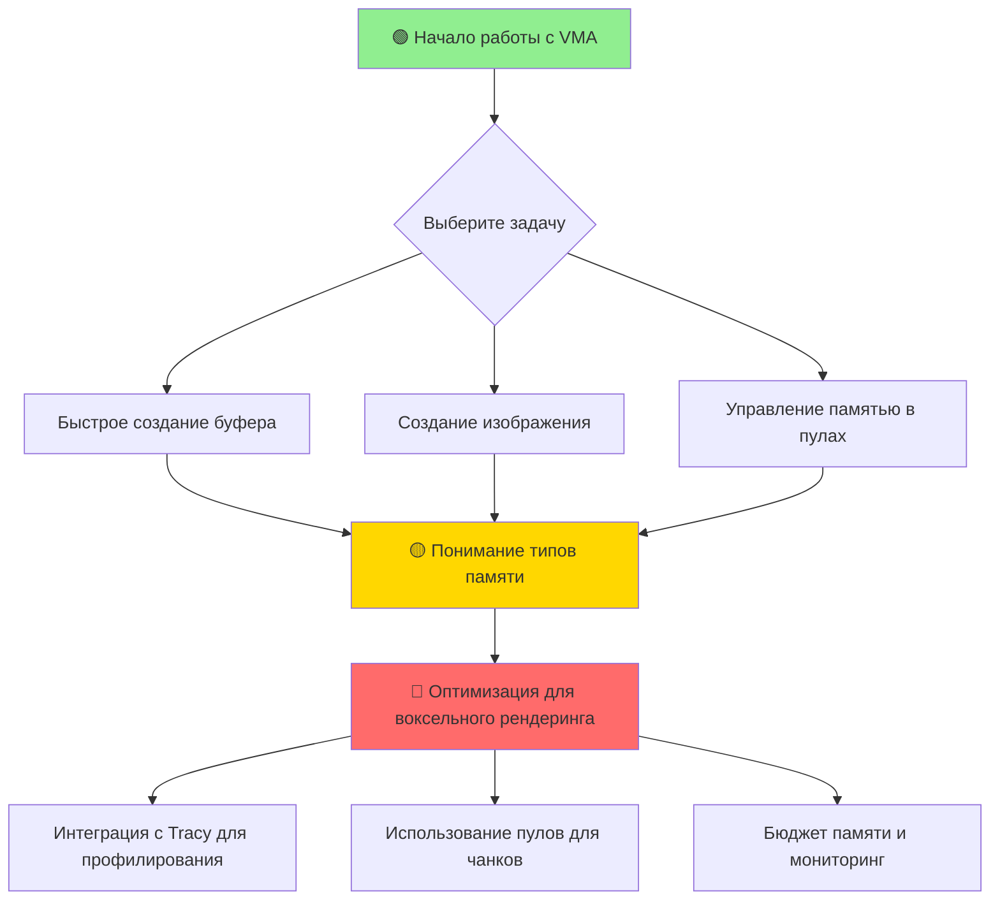

# Vulkan Memory Allocator (VMA)

**🟢 Уровень 1: Начинающий**

Vulkan Memory Allocator (VMA) — это библиотека, которая упрощает управление памятью в Vulkan. Она автоматически выбирает
подходящие типы памяти, управляет аллокациями, уменьшает фрагментацию и предоставляет расширенные возможности для
мониторинга и оптимизации.

**Исходный код:** [VulkanMemoryAllocator на GitHub](https://github.com/GPUOpen-LibrariesAndSDKs/VulkanMemoryAllocator)

---

## Путь обучения (Learning Path)

## Структура документации

| Раздел                                 | Уровень | Описание                                                                    |
|----------------------------------------|---------|-----------------------------------------------------------------------------|
| [Глоссарий](glossary.md)               | 🟢      | Термины: Allocator, Pool, Allocation, Memory Types                          |
| [Основные понятия](concepts.md)        | 🟡      | Типы памяти, паттерны использования (GPU-only, staging, persistent mapping) |
| [Быстрый старт](quickstart.md)         | 🟢      | Создание аллокатора, выделение буфера, запись данных                        |
| [Интеграция](integration.md)           | 🟡      | Подключение VMA к проекту, CMake, настройки для volk                        |
| [Справочник API](api-reference.md)     | 🔴      | Полное описание функций VMA                                                 |
| [Решение проблем](troubleshooting.md)  | 🟡      | Распространённые ошибки и их решение                                        |
| [Сценарии использования](use-cases.md) | 🟡      | Практические примеры для различных задач                                    |

---

## Быстрые ссылки по задачам

| Задача                               | Рекомендуемый раздел                                                                | Уровень |
|--------------------------------------|-------------------------------------------------------------------------------------|---------|
| Создание буфера для вершинных данных | [Быстрый старт](quickstart.md)                                                      | 🟢      |
| Загрузка текстур через staging буфер | [Основные понятия](concepts.md#паттерн-staging-загрузка-cpu--gpu)                   | 🟡      |
| Создание пула для множества объектов | [Сценарии использования](use-cases.md#пулы-для-оптимизации-множественных-аллокаций) | 🟡      |
| Мониторинг использования памяти      | [Интеграция](integration.md#бюджет-памяти-и-мониторинг)                             | 🔴      |
| Оптимизация для частых обновлений    | [Основные понятия](concepts.md#паттерн-persistent-mapping-часто-обновляемые-данные) | 🟡      |

---

## Рекомендуемый порядок изучения

1. **Начинающим** (🟢):
  - Начните с [Глоссария](glossary.md) для понимания терминов
  - Перейдите к [Быстрому старту](quickstart.md) для первого практического примера
  - Изучите базовую [Интеграцию](integration.md) для подключения к проекту

2. **Практикам** (🟡):
  - Углубитесь в [Основные понятия](concepts.md) для понимания типов памяти и паттернов
  - Изучите [Сценарии использования](use-cases.md) для решения конкретных задач
  - Ознакомьтесь с [Решение проблем](troubleshooting.md) для отладки

3. **Экспертам** (🔴):
  - Изучите полный [Справочник API](api-reference.md)
  - Оптимизируйте использование памяти через расширенные функции VMA
  - Интегрируйте мониторинг и профилирование памяти

---

## Требования

- **C++14** или новее
- **Vulkan 1.0** или новее (рекомендуется 1.1+ для расширенных функций)
- Совместимость с **volk** (рекомендуется для ProjectV)

---

## Проектно-специфичная информация

Для интеграции VMA с воксельным движком ProjectV, включая оптимизации для чанков, текстур и compute buffers, смотрите
отдельный файл:

**[projectv-integration.md](projectv-integration.md)** — Архитектура памяти для воксельного движка, управление чанками,
интеграция с Tracy и ECS, специализированные паттерны производительности.

---

## Следующие шаги

1. **Быстрый старт**: [Создайте первый буфер](quickstart.md#шаг-3-создание-буфера-host-visible-для-записи-с-cpu)
2. **Интеграция**: [Подключите VMA к вашему проекту](integration.md#1-cmake)
3. **Оптимизация
   **: [Изучите паттерны для воксельного рендеринга](concepts.md#оптимизация-производительности-для-воксельного-рендеринга)
