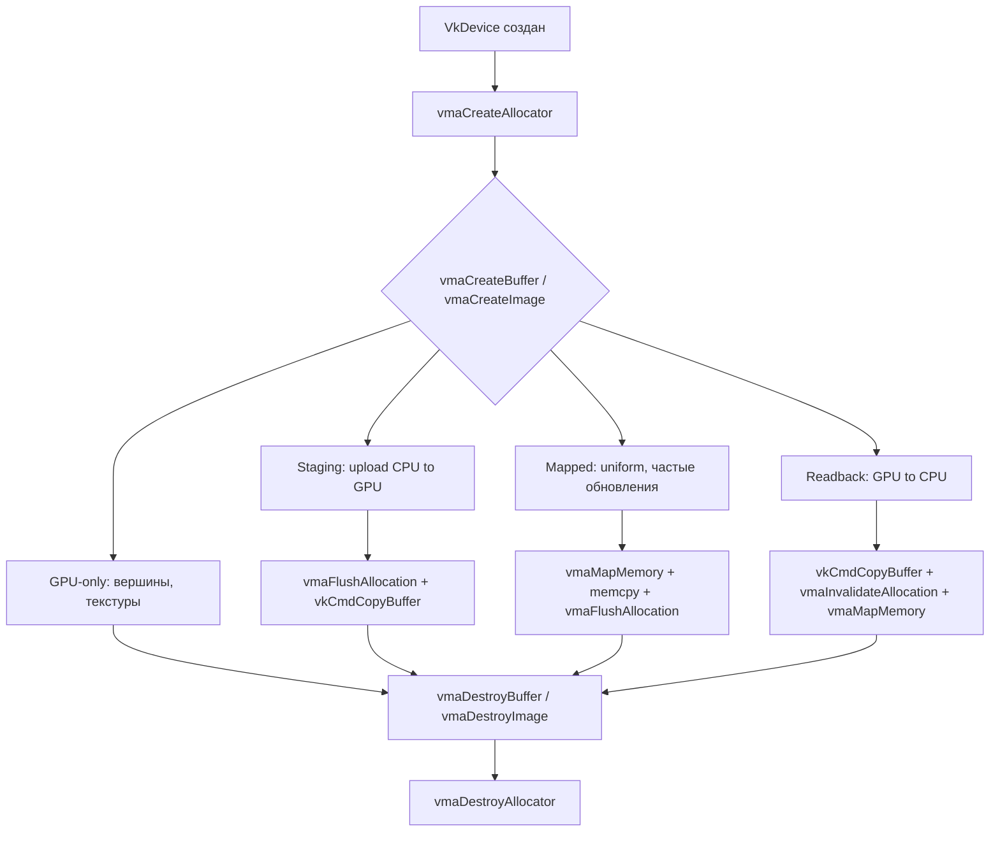

# Основные понятия

**🟡 Уровень 2: Средний**

Краткое введение в управление памятью Vulkan и паттерны VMA. Термины — в [глоссарии](glossary.md).

## Оглавление

- [Зачем VMA](#зачем-vma)
- [Память GPU и CPU](#память-gpu-и-cpu)
- [Host-coherent vs host-cached](#host-coherent-vs-host-cached)
- [Паттерн: GPU-only ресурс](#паттерн-gpu-only-ресурс)
- [Паттерн: Staging (загрузка CPU → GPU)](#паттерн-staging-загрузка-cpu--gpu)
- [Паттерн: Persistent mapping](#паттерн-persistent-mapping-часто-обновляемые-данные)
- [Паттерн: Readback (GPU → CPU)](#паттерн-readback-gpu--cpu)
- [Оптимизация производительности для воксельного рендеринга](#оптимизация-производительности-для-воксельного-рендеринга)
- [Стратегии аллокации: MIN_MEMORY vs MIN_TIME](#стратегии-аллокации-min_memory-vs-min_time)
- [Когда использовать dedicated allocation](#когда-использовать-dedicated-allocation)
- [Бюджет памяти](#бюджет-памяти)
- [Lazily allocated память](#lazily-allocated-память)
- [Дефрагментация](#дефрагментация)
- [Общая схема](#общая-схема)

---

## Зачем VMA

В Vulkan память выделяется вручную: вы создаёте буфер или изображение (`vkCreateBuffer` / `vkCreateImage`), запрашиваете
требования к памяти (`vkGetBufferMemoryRequirements`), выбираете тип памяти из `VkPhysicalDeviceMemoryProperties`,
выделяете блок (`vkAllocateMemory`), привязываете его к ресурсу (`vkBindBufferMemory`). Нужно разбираться в memory
types, heap'ах, выравниваниях и фрагментации.

**VMA** делает это за вас: одна функция `vmaCreateBuffer` или `vmaCreateImage` создаёт и ресурс, и подходящую память.
Библиотека выбирает тип памяти по подсказке использования (GPU-only, CPU→GPU и т.д.), при необходимости использует
dedicated allocation и расширения (VK_KHR_dedicated_allocation, VK_EXT_memory_budget), уменьшает фрагментацию и даёт
статистику по использованию памяти.

---

## Память GPU и CPU

Память видеокарты разделена на **типы** (memory types) с разными свойствами:

- **Device-local** — быстрая память на GPU. Идеальна для вершин, индексов, текстур, depth buffer. CPU к ней напрямую не
  обращается.
- **Host-visible** — память, которую CPU может отобразить через `vkMapMemory` и писать/читать. Обычно медленнее для GPU.
  Нужна для загрузки данных (staging) и для часто обновляемых uniform-буферов.

Часто данные загружают так: CPU пишет в **staging**-буфер (host-visible), затем одной командой копируют в **целевой**
буфер или изображение (device-local) через `vkCmdCopyBuffer` / `vkCmdCopyBufferToImage`. VMA упрощает создание обоих
буферов и выбор типов памяти.

---

## Host-coherent vs host-cached

Host-visible память может быть **host-coherent** (`VK_MEMORY_PROPERTY_HOST_COHERENT_BIT`) или **host-cached** (
`VK_MEMORY_PROPERTY_HOST_CACHED_BIT`):

- **Host-coherent** — кэш CPU и GPU синхронизирован автоматически. После записи с CPU данные видны на GPU без
  дополнительных вызовов; после записи GPU они видны на CPU. Ни flush, ни invalidate не нужны.
- **Host-cached** — память кэшируется для быстрого чтения с CPU. Обычно не coherent. После записи с CPU нужен
  `vmaFlushAllocation` перед использованием на GPU; перед чтением с CPU после доступа GPU нужен
  `vmaInvalidateAllocation`.

Если ни coherent, ни cached — тип «uncached»: может быть медленнее для CPU, но без flush/invalidate данные могут быть
некорректны. В любом случае при не-coherent памяти flush/invalidate обязательны.

---

## Паттерн: GPU-only ресурс

Ресурс только для GPU (вершинный/индексный буфер, текстура, depth attachment): CPU один раз заливает данные через
staging и больше к нему не обращается.

**Что делать:** создавать буфер/изображение с `VmaAllocationCreateInfo::usage = VMA_MEMORY_USAGE_AUTO` или
`VMA_MEMORY_USAGE_AUTO_PREFER_DEVICE`. При соответствующем `VkBufferUsageFlags` или `VkImageCreateInfo::usage` VMA
выберет device-local тип. Для буферов укажите, например,
`VK_BUFFER_USAGE_VERTEX_BUFFER_BIT | VK_BUFFER_USAGE_TRANSFER_DST_BIT` — целевой буфер для копирования. Данные на GPU
попадают копированием из staging-буфера в командном буфере (см. следующий раздел).

**Пример буфера (вершины):**

```cpp
VkBufferCreateInfo bufferInfo = {};
bufferInfo.sType = VK_STRUCTURE_TYPE_BUFFER_CREATE_INFO;
bufferInfo.size = vertexDataSize;
bufferInfo.usage = VK_BUFFER_USAGE_VERTEX_BUFFER_BIT | VK_BUFFER_USAGE_TRANSFER_DST_BIT;

VmaAllocationCreateInfo allocInfo = {};
allocInfo.usage = VMA_MEMORY_USAGE_AUTO;

VkBuffer buffer;
VmaAllocation allocation;
vmaCreateBuffer(allocator, &bufferInfo, &allocInfo, &buffer, &allocation, nullptr);
```

**Пример изображения (render target, GPU-only):**

```cpp
VkImageCreateInfo imgInfo = {};
imgInfo.sType = VK_STRUCTURE_TYPE_IMAGE_CREATE_INFO;
imgInfo.imageType = VK_IMAGE_TYPE_2D;
imgInfo.extent = { 1920, 1080, 1 };
imgInfo.mipLevels = 1;
imgInfo.arrayLayers = 1;
imgInfo.format = VK_FORMAT_R8G8B8A8_UNORM;
imgInfo.tiling = VK_IMAGE_TILING_OPTIMAL;
imgInfo.initialLayout = VK_IMAGE_LAYOUT_UNDEFINED;
imgInfo.usage = VK_IMAGE_USAGE_COLOR_ATTACHMENT_BIT | VK_IMAGE_USAGE_SAMPLED_BIT;
imgInfo.samples = VK_SAMPLE_COUNT_1_BIT;

VmaAllocationCreateInfo allocInfo = {};
allocInfo.usage = VMA_MEMORY_USAGE_AUTO;

VkImage image;
VmaAllocation allocation;
vmaCreateImage(allocator, &imgInfo, &allocInfo, &image, &allocation, nullptr);
```

---

## Паттерн: Staging (загрузка CPU → GPU)

Чтобы заполнить device-local буфер или изображение, обычно:

1. **Staging-буфер** — с `VK_BUFFER_USAGE_TRANSFER_SRC_BIT`, `VMA_MEMORY_USAGE_AUTO` и
   `VMA_ALLOCATION_CREATE_HOST_ACCESS_SEQUENTIAL_WRITE_BIT`. CPU пишет в него.
2. **Целевой буфер/изображение** — с `VK_BUFFER_USAGE_TRANSFER_DST_BIT` (и `VERTEX_BUFFER_BIT` / `INDEX_BUFFER_BIT` по
   необходимости) или `VK_IMAGE_USAGE_TRANSFER_DST_BIT`. Device-local, VMA выберет по usage.
3. Отобразить staging (`vmaMapMemory`), записать данные, при не-coherent — `vmaFlushAllocation`, затем `vmaUnmapMemory`.
4. В командном буфере: `vkCmdCopyBuffer` (буфер→буфер) или `vkCmdCopyBufferToImage` (буфер→изображение).
5. Уничтожить или переиспользовать staging после копирования.

Для `VMA_MEMORY_USAGE_AUTO` важен `VkBufferCreateInfo::usage`: staging должен иметь `TRANSFER_SRC_BIT`, целевой —
`TRANSFER_DST_BIT`.

Подробнее: [Быстрый старт](quickstart.md), [Справочник API](api-reference.md#vmacreatebuffer).

---

## Паттерн: Persistent mapping (часто обновляемые данные)

Uniform-буферы, динамические константы обновляются каждый кадр с CPU. Удобно держать буфер в host-visible памяти и *
*постоянно отображённым** (map один раз при создании, не unmap до уничтожения).

**Что делать:** при создании буфера указать `VMA_ALLOCATION_CREATE_MAPPED_BIT` и `VMA_MEMORY_USAGE_AUTO` с
`VMA_ALLOCATION_CREATE_HOST_ACCESS_SEQUENTIAL_WRITE_BIT` (или `VMA_ALLOCATION_CREATE_HOST_ACCESS_RANDOM_BIT` для
read/write). В `VmaAllocationInfo::pMappedData` получите указатель; перед отрисовкой пишете туда данные. Если память не
**host-coherent**, перед использованием на GPU нужно вызвать
`vmaFlushAllocation(allocator, allocation, 0, VK_WHOLE_SIZE)`. Не нужно вызывать map/unmap каждый кадр.

---

## Паттерн: Readback (GPU → CPU)

Буфер для данных, которые GPU пишет или копирует, а CPU читает (результаты вычислений, скриншот и т.д.).

**Что делать:** создать буфер с `VK_BUFFER_USAGE_TRANSFER_DST_BIT`, `VMA_MEMORY_USAGE_AUTO` и
`VMA_ALLOCATION_CREATE_HOST_ACCESS_RANDOM_BIT`. VMA выберет host-visible и обычно host-cached тип. После того как GPU
записал данные (через compute shader или `vkCmdCopyBuffer`), **перед чтением с CPU** вызвать
`vmaInvalidateAllocation(allocator, allocation, 0, VK_WHOLE_SIZE)` — иначе CPU может прочитать устаревшие данные из
кэша.

```cpp
VkBufferCreateInfo bufferInfo = {};
bufferInfo.sType = VK_STRUCTURE_TYPE_BUFFER_CREATE_INFO;
bufferInfo.size = dataSize;
bufferInfo.usage = VK_BUFFER_USAGE_TRANSFER_DST_BIT;

VmaAllocationCreateInfo allocInfo = {};
allocInfo.usage = VMA_MEMORY_USAGE_AUTO;
allocInfo.flags = VMA_ALLOCATION_CREATE_HOST_ACCESS_RANDOM_BIT;

VkBuffer buffer;
VmaAllocation allocation;
vmaCreateBuffer(allocator, &bufferInfo, &allocInfo, &buffer, &allocation, nullptr);

// ... GPU записал данные ...

void* ptr = nullptr;
vmaMapMemory(allocator, allocation, &ptr);
vmaInvalidateAllocation(allocator, allocation, 0, VK_WHOLE_SIZE);
// теперь можно читать через ptr
vmaUnmapMemory(allocator, allocation);
```

Упрощённая альтернатива: `vmaCopyAllocationToMemory` — делает invalidate, map, memcpy, unmap одной функцией.

---

## Оптимизация производительности для воксельного рендеринга

Воксельный движок ProjectV предъявляет особые требования к управлению памятью. Вот ключевые рекомендации по
использованию VMA для воксельного рендеринга:

### 1. Управление воксельными чанками

- **Используйте пулы (`VmaPool`)**: Для чанков фиксированного размера (например, 16KB или 64KB) создавайте отдельные
  пулы. Это уменьшает фрагментацию и ускоряет аллокации/освобождения.
- **Batch-аллокации**: Выделяйте память для нескольких чанков за один вызов через пулы, а не создавайте каждый буфер
  отдельно.
- **Рассмотрите стратегию `VMA_ALLOCATION_CREATE_STRATEGY_MIN_MEMORY_BIT`**: Для долгоживущих чанков, которые редко
  освобождаются.

### 2. Текстуры и атласы текстур

- **Device-local изображения**: Для текстур вокселей используйте `vmaCreateImage` с `VK_IMAGE_TILING_OPTIMAL` и
  `VMA_MEMORY_USAGE_AUTO`.
- **Staging один раз, использование много раз**: Загрузите все текстуры в атлас через staging буфер, затем копируйте в
  device-local изображение.
- **Mipmaps**: Генерируйте мипмапы на GPU через compute shaders или загружайте готовые через staging.

### 3. Compute buffers для воксельных алгоритмов

- **Storage buffers**: Для compute shaders (маркировка, генерация мешей) используйте
  `VK_BUFFER_USAGE_STORAGE_BUFFER_BIT`.
- **GPU-only для частых обновлений**: Если буфер обновляется каждые несколько кадров, используйте staging → copy подход.
- **Persistent mapping для частых обновлений**: Если данные обновляются каждый кадр (например, параметры генерации),
  используйте persistent mapping.

### 4. Uniform buffers для камеры и трансформаций

- **Triple buffering**: Для избежания конфликтов CPU-GPU используйте три буфера, чередуя их каждый кадр.
- **Persistent mapping с `VMA_ALLOCATION_CREATE_MAPPED_BIT`**: Избегайте вызовов `vmaMapMemory`/`vmaUnmapMemory` каждый
  кадр.
- **Выравнивание**: Учитывайте требования выравнивания uniform buffers (обычно 256 байт).

### 5. Мониторинг и отладка

- **Включите `VMA_ALLOCATOR_CREATE_EXT_MEMORY_BUDGET_BIT`**: Отслеживайте использование памяти через
  `vmaGetHeapBudgets`.
- **Интегрируйте с Tracy**: Используйте Tracy zones для профилирования аллокаций и освобождений.
- **Статистика пулов**: Регулярно проверяйте `vmaGetPoolStatistics` для пулов чанков.

---

## Стратегии аллокации: MIN_MEMORY vs MIN_TIME

VMA предоставляет две основные стратегии выбора блока памяти при аллокации:

### `VMA_ALLOCATION_CREATE_STRATEGY_MIN_MEMORY_BIT`

- **Цель**: Минимизировать расход памяти, выбирая самый маленький подходящий блок.
- **Преимущества**: Лучшая утилизация памяти, меньше фрагментация в долгосрочной перспективе.
- **Недостатки**: Медленнее поиск подходящего блока, может увеличить время аллокации.
- **Когда использовать**:
  - Долгоживущие ресурсы (текстуры, меши, воксельные чанки)
  - Системы с ограниченной видеопамятью
  - Когда важна минимальная фрагментация

### `VMA_ALLOCATION_CREATE_STRATEGY_MIN_TIME_BIT`

- **Цель**: Минимизировать время аллокации, выбирая первый подходящий блок.
- **Преимущества**: Быстрые аллокации, меньше накладных расходов CPU.
- **Недостатки**: Может увеличить фрагментацию, менее эффективное использование памяти.
- **Когда использовать**:
  - Временные ресурсы (staging буферы, frame resources)
  - Аллокации в реальном времени (каждый кадр)
  - Когда производительность CPU критична

### Рекомендации для ProjectV:

| Тип ресурса                   | Рекомендуемая стратегия       | Обоснование                                                     |
|-------------------------------|-------------------------------|-----------------------------------------------------------------|
| Воксельные чанки              | `MIN_MEMORY`                  | Долгоживущие, много объектов, важно минимизировать фрагментацию |
| Текстуры материалов           | `MIN_MEMORY`                  | Большие ресурсы, загружаются один раз                           |
| Uniform buffers (каждый кадр) | `MIN_TIME`                    | Частые аллокации/освобождения, важно быстродействие             |
| Staging буферы                | `MIN_TIME`                    | Временные, создаются/уничтожаются часто                         |
| Compute buffers               | Зависит от частоты обновления | `MIN_MEMORY` для статических, `MIN_TIME` для динамических       |

---

## Когда использовать dedicated allocation

Dedicated allocation — отдельный блок `VkDeviceMemory` под один ресурс. VMA может выбирать его автоматически (с
VK_KHR_dedicated_allocation) или вы можете принудить флагом `VMA_ALLOCATION_CREATE_DEDICATED_MEMORY_BIT`.

**Стоит рассмотреть для:**

- Больших ресурсов (например, текстуры 4K и выше)
- Render target'ов (swapchain, offscreen), которые часто пересоздаются при смене разрешения
- Ресурсов, где производительность критична и driver может лучше оптимизировать dedicated блок

Для обычных вершинных буферов и мелких текстур автоматический выбор VMA обычно достаточен.

---

## Бюджет памяти

При включённом расширении VK_EXT_memory_budget и флаге `VMA_ALLOCATOR_CREATE_EXT_MEMORY_BUDGET_BIT` можно вызывать
`vmaGetHeapBudgets(allocator, budgets)`. Передайте массив `VmaBudget budgets[VK_MAX_MEMORY_HEAPS]` — он будет заполнен
по каждому heap'у. В каждой структуре: `usage` (текущее использование в байтах), `budget` (доступный лимит в байтах).
Разница `budget - usage` — ориентир того, сколько ещё можно выделить без превышения бюджета. При превышении бюджета
возможны падения, TDR или миграция в системную память. Флаг `VMA_ALLOCATION_CREATE_WITHIN_BUDGET_BIT` при создании
аллокации заставляет VMA вернуть `VK_ERROR_OUT_OF_DEVICE_MEMORY`, если выделение превысит бюджет, вместо неопределённого
поведения.

---

## Lazily allocated память

На мобильных платформах для transient attachment (color/depth с `VK_IMAGE_USAGE_TRANSIENT_ATTACHMENT_BIT`) можно
использовать `VMA_MEMORY_USAGE_GPU_LAZILY_ALLOCATED` — память с `VK_MEMORY_PROPERTY_LAZILY_ALLOCATED_BIT`. На десктопе
такого типа памяти может не быть; аллокация вернёт ошибку. Используйте только если целевая платформа это поддерживает.

---

## Дефрагментация

VMA умеет перемещать аллокации внутри блоков, чтобы уменьшить фрагментацию (`vmaDefragment`,
`vmaBeginDefragmentationPass`, `vmaEndDefragmentationPass` и др.). Для простой игры можно обойтись без неё; полезно при
большом количестве мелких аллокаций и освобождений.

**Когда рассматривать дефрагментацию в ProjectV:**

- После освобождения множества воксельных чанков
- При заметной фрагментации (проверяйте через `vmaCalculateStatistics`)
- Перед загрузкой больших текстур или моделей

---

## Общая схема



---

## Дальше

- **[Быстрый старт](quickstart.md)** — минимальный пример: аллокатор, буфер, map/unmap.
- **[Интеграция](integration.md)** — CMake, VMA_IMPLEMENTATION, связка с volk в ProjectV.
- **[Справочник API](api-reference.md)** — vmaCreateAllocator, vmaCreateBuffer, vmaCreateImage, vmaMapMemory и др.
