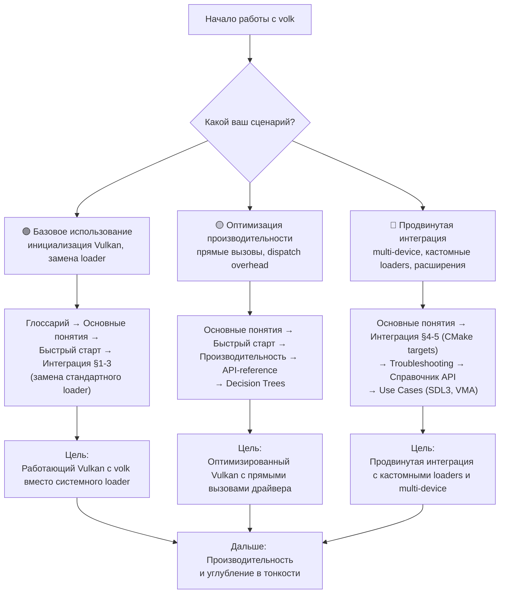
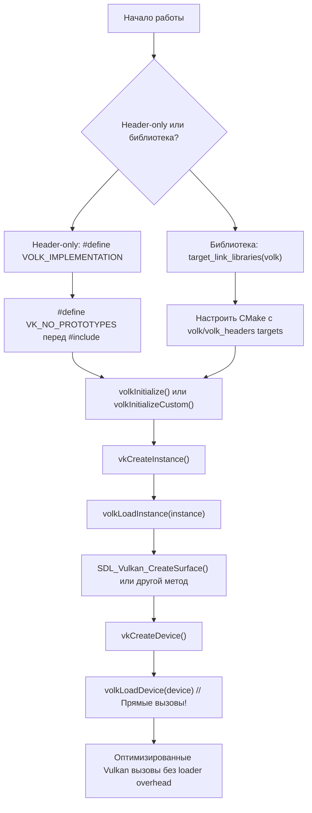

# volk

**🟢 Уровень 1: Начинающий** — Мета-загрузчик для Vulkan.

**volk** — библиотека для динамической загрузки функций Vulkan. Заменяет стандартный Vulkan loader на мета-загрузчик,
который позволяет:

- **Оптимизировать производительность**: Прямые вызовы к драйверу GPU минуя dispatch overhead
- **Контролировать инициализацию**: Самостоятельная загрузка Vulkan во время выполнения
- **Предотвращать конфликты**: Избегание конфликтов линковки с системным loader

Версия: **2.0+** (совместима с Vulkan 1.0–1.4).
Исходники: [zeux/volk](https://github.com/zeux/volk).

---

## Диаграмма обучения (Learning Path)

Выберите свой сценарий и следуйте по соответствующему пути:

---

## Содержание

### 🟢 Уровень 1: Начинающий

| Раздел                          | Описание                                                       | Уровень |
|---------------------------------|----------------------------------------------------------------|---------|
| [Глоссарий](glossary.md)        | Термины: Loader, Entrypoint, Dispatch, Мета-загрузчик          | 🟢      |
| [Основные понятия](concepts.md) | Архитектура Vulkan loader, зачем нужен volk, dispatch overhead | 🟢      |
| [Быстрый старт](quickstart.md)  | Инициализация volk, замена стандартного Vulkan loader          | 🟢      |
| [Интеграция](integration.md)    | CMake, настройка проекта, VK_NO_PROTOTYPES                     | 🟢      |

### 🟡 Уровень 2: Средний

| Раздел                                | Описание                                                               | Уровень |
|---------------------------------------|------------------------------------------------------------------------|---------|
| [Справочник API](api-reference.md)    | Функции volk: volkInitialize, volkLoadInstance, volkLoadDevice         | 🟡      |
| [Решение проблем](troubleshooting.md) | Ошибки линковки, конфликты с loader, диагностика                       | 🟡      |
| [Производительность](performance.md)  | Dispatch overhead, оптимизация прямых вызовов, бенчмарки               | 🟡      |
| [Decision Trees](decision-trees.md)   | Выбор между header-only и библиотекой, глобальные указатели vs таблицы | 🟡      |

### 🔴 Уровень 3: Продвинутый

| Раздел                                           | Описание                                                  | Уровень |
|--------------------------------------------------|-----------------------------------------------------------|---------|
| [Сценарии использования](use-cases.md)           | Универсальные сценарии: интеграция с SDL3, VMA, Tracy     | 🔴      |
| [Интеграция в ProjectV](projectv-integration.md) | Специфичные паттерны для воксельного движка (опционально) | 🔴      |

---

## Быстрые ссылки по задачам

| Задача                                            | Рекомендуемый раздел                                                                             | Уровень |
|---------------------------------------------------|--------------------------------------------------------------------------------------------------|---------|
| Инициализация Vulkan с volk                       | [Быстрый старт](quickstart.md)                                                                   | 🟢      |
| Замена стандартного Vulkan loader                 | [Интеграция](integration.md) → [Основные понятия](concepts.md)                                   | 🟢      |
| Настроить сборку с CMake                          | [Интеграция §1](integration.md#1-cmake)                                                          | 🟢      |
| Использовать с SDL3                               | [Сценарии использования](use-cases.md) → [ProjectV интеграция](projectv-integration.md)          | 🔴      |
| Оптимизировать производительность                 | [Производительность](performance.md) → [Основные понятия](concepts.md#dispatch-overhead)         | 🟡      |
| Решить конфликты линковки                         | [Решение проблем](troubleshooting.md)                                                            | 🟡      |
| Выбрать между header-only и библиотекой           | [Decision Trees](decision-trees.md) → [Интеграция](integration.md)                               | 🟡      |
| Работать с несколькими VkDevice                   | [Справочник API](api-reference.md) → [Decision Trees](decision-trees.md)                         | 🟡      |
| Интегрировать с VMA (Vulkan Memory Allocator)     | [Сценарии использования](use-cases.md) → [ProjectV интеграция](projectv-integration.md)          | 🔴      |
| Использовать кастомный loader (например, от SDL3) | [Справочник API](api-reference.md#volkinitializecustom) → [Сценарии использования](use-cases.md) | 🔴      |

---

## Жизненный цикл использования volk

---

## Рекомендуемый порядок чтения

1. **[Глоссарий](glossary.md)** — понять базовую терминологию Vulkan loader.
2. **[Основные понятия](concepts.md)** — изучить архитектуру Vulkan loader и преимущества volk.
3. **[Быстрый старт](quickstart.md)** — запустить минимальный пример с volk.
4. **[Интеграция](integration.md)** — настроить volk в своём проекте.
5. **[Решение проблем](troubleshooting.md)** — знать как диагностировать ошибки линковки.

После этого выбирайте разделы в зависимости от ваших задач.

---

## Требования

- **C89** или **C++** (любой стандарт)
- **Vulkan SDK** или **драйвер Vulkan** в системе
- Для сборки: **CMake 3.10+** (рекомендуется 3.15+)

### Поддерживаемые платформы

- Windows (Win32, UWP)
- Linux (X11, Wayland)
- macOS (MoltenVK)
- Android
- iOS (MoltenVK)
- Emscripten (WebAssembly через MoltenVK)

### Совместимость с Vulkan

- **Vulkan 1.0–1.4**: полная поддержка
- **Расширения**: автоматическая загрузка через `vkGetInstanceProcAddr`
- **Validation Layers**: полная совместимость

---

## Примеры кода в ProjectV

ProjectV содержит примеры интеграции volk:

| Пример                | Описание                                | Ссылка                                                     |
|-----------------------|-----------------------------------------|------------------------------------------------------------|
| Базовая инициализация | Минимальный пример инициализации volk   | [volk_init.cpp](../examples/volk_init.cpp)                 |
| SDL3 + Vulkan + volk  | Полная интеграция с SDL3 window surface | [sdl_window.cpp](../examples/sdl_window.cpp)               |
| VMA + volk            | Интеграция с Vulkan Memory Allocator    | [vma_buffer.cpp](../examples/vma_buffer.cpp)               |
| Vulkan triangle       | Полный рендерер с использованием volk   | [vulkan_triangle.cpp](../examples/old_vulkan_triangle.cpp) |

---

## Следующие шаги

### Для новых пользователей

1. **[Глоссарий](glossary.md)** — изучите базовую терминологию Vulkan loader
2. **[Основные понятия](concepts.md)** — поймите зачем нужен volk
3. **[Быстрый старт](quickstart.md)** — запустите первый пример

### Для интеграции в проект

1. **[Интеграция](integration.md)** — настройте CMake и `VK_NO_PROTOTYPES`
2. **[Решение проблем](troubleshooting.md)** — решите возможные конфликты линковки

### Для оптимизации производительности

1. **[Производительность](performance.md)** — изучите dispatch overhead
2. **[Decision Trees](decision-trees.md)** — выберите оптимальную конфигурацию
3. **[Справочник API](api-reference.md)** — используйте `volkLoadDevice` для прямых вызовов

### Для углублённого изучения

1. **[Сценарии использования](use-cases.md)** — изучите интеграцию с другими библиотеками
2. **[Справочник API](api-reference.md)** — изучите все функции volk
3. **[Интеграция в ProjectV](projectv-integration.md)** — специализированные паттерны для воксельного движка

---

## Связанные разделы

- [Vulkan](../vulkan/README.md) — графический API для рендеринга
- [SDL3](../sdl/README.md) — создание окон и Vulkan surface
- [VMA](../vma/README.md) — выделение памяти GPU
- [Tracy](../tracy/README.md) — профилирование Vulkan вызовов
- [Документация проекта](../README.md) — общая структура проекта

← [На главную документации](../README.md)
