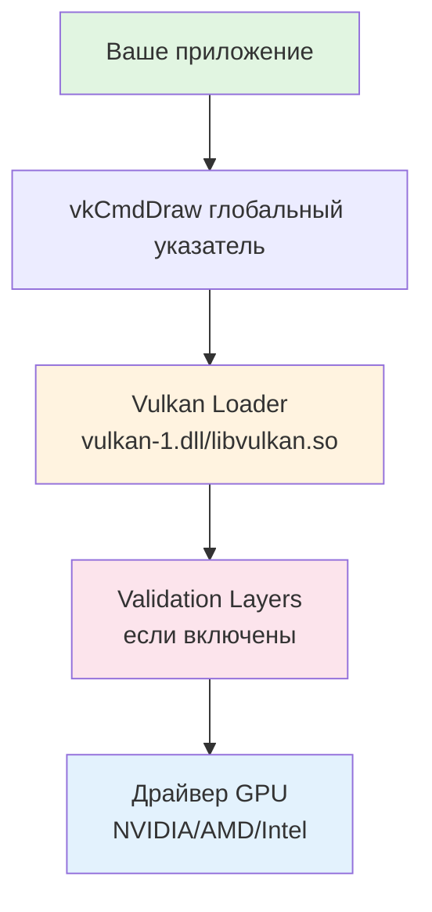
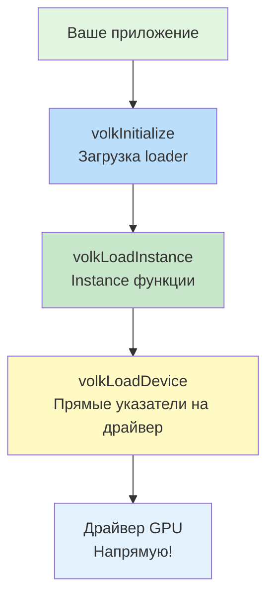

# Концепции volk: Архитектура мета-загрузчика Vulkan

**🟢 Уровень 1: Начинающий** — Фундаментальные концепции архитектуры мета-загрузчика Vulkan

## Почему volk существует?

Vulkan использует **динамическую загрузку функций** через loader (`vulkan-1.dll` / `libvulkan.so`). Традиционный подход:

1. Линковаться с loader (статически или динамически)
2. Вызывать `vkGetInstanceProcAddr` для получения указателей на функции
3. Работать через dispatch таблицы (неявно)

**Проблемы традиционного подхода:**

- **Dispatch overhead**: Каждый вызов проходит через loader → validation layers → драйвер
- **Жёсткая зависимость от loader**: Приложение не запустится без Vulkan loader
- **Сложная интеграция**: Конфликты при смешивании разных версий Vulkan

**Решение volk**: Мета-загрузчик, который:

1. **Самостоятельно загружает loader** во время выполнения
2. **Пропускает лишние dispatch уровни** (прямые вызовы к драйверу)
3. **Даёт контроль над моментом инициализации** Vulkan

---

## Архитектура Vulkan Loader: Без volk



**Каждый вызов проходит через:**

1. **Глобальный указатель** → 2. **Loader dispatch** → 3. **Layers dispatch** → 4. **Driver**

**Накладные расходы:** До 7% времени CPU в интенсивных рабочих нагрузках (device-intensive workloads).

---

## Архитектура с volk: Direct Driver Calls



**volk обходит loader dispatch:**

1. **`volkInitialize()`** → Загружает loader, получает `vkGetInstanceProcAddr`
2. **`volkLoadInstance(instance)`** → Загружает все instance-функции
3. **`volkLoadDevice(device)`** → Прямые указатели на функции драйвера

**Результат:** `vkCmdDraw` вызывается напрямую из драйвера, минуя loader и layers.

---

## Ключевые компоненты volk

### 1. Глобальные указатели функций

```c
// В volk.h
extern PFN_vkCreateInstance vkCreateInstance;
extern PFN_vkCmdDraw vkCmdDraw;
// ... все Vulkan функции
```

После инициализации эти указатели заполняются:

- `volkInitialize()` → базовые функции (vkCreateInstance, vkEnumerateInstanceExtensionProperties)
- `volkLoadInstance(instance)` → все instance-функции
- `volkLoadDevice(device)` → device-функции напрямую из драйвера

### 2. Таблицы функций (VolkDeviceTable)

Для поддержки нескольких `VkDevice`:

```c
struct VolkDeviceTable {
    PFN_vkCmdDraw vkCmdDraw;
    PFN_vkQueueSubmit vkQueueSubmit;
    // ... все device-функции
};

VolkDeviceTable deviceTable;
volkLoadDeviceTable(&deviceTable, device);
deviceTable.vkCmdDraw(...); // Вызов через таблицу
```

### 3. Header-only режим

```c
#define VOLK_IMPLEMENTATION
#include "volk.h"
// volk.c не компилируется отдельно
```

Все функции реализованы прямо в заголовке. Удобно для простых проектов.

---

## VK_NO_PROTOTYPES: Почему это важно

### Без VK_NO_PROTOTYPES

```c
#include <vulkan/vulkan.h> // Объявляет функции как extern
// Линкер ищет реализации в vulkan-1.dll
```

**Проблема:** Конфликт между объявлениями vulkan.h и указателями volk.

### С VK_NO_PROTOTYPES

```c
#define VK_NO_PROTOTYPES
#include "volk.h" // volk сам включает vulkan.h без прототипов
// Функции объявлены как extern указатели
```

**volk контролирует все объявления:** Нет конфликтов линковки.

---

## Dispatch цепочка: Технические детали

### Традиционный Vulkan dispatch

```c
// Внутри loader
VkResult vkCreateInstance(
    const VkInstanceCreateInfo* pCreateInfo,
    const VkAllocationCallbacks* pAllocator,
    VkInstance* pInstance)
{
    // 1. Проверить validation layers
    // 2. Вызвать layer dispatch chain
    // 3. Вызвать драйвер
    return real_driver_vkCreateInstance(pCreateInfo, pAllocator, pInstance);
}
```

**Каждый вызов:** 2-3 лишних перехода (loader → layers → драйвер).

### volk direct dispatch

```c
// После volkLoadDevice(device)
// vkCmdDraw указывает напрямую на функцию драйвера
void vkCmdDraw(VkCommandBuffer commandBuffer, ...)
{
    // Прямой вызов! Нет loader overhead
    driver_vkCmdDraw(commandBuffer, ...);
}
```

**Оптимизация:** Особенно важна для частых вызовов (`vkCmdDraw`, `vkCmdDispatch`).

---

## Интеграция с Validation Layers

**Миф:** volk не работает с validation layers.

**Реальность:** volk полностью совместим с layers:

```c
const char* layers[] = {"VK_LAYER_KHRONOS_validation"};
createInfo.ppEnabledLayerNames = layers;
createInfo.enabledLayerCount = 1;

vkCreateInstance(&createInfo, nullptr, &instance);
volkLoadInstance(instance); // Загружает функции через layers chain
```

**Как это работает:**

1. `volkLoadInstance` вызывает `vkGetInstanceProcAddr` через loader
2. Loader возвращает указатели на функции validation layers
3. Layers передают вызовы дальше (в другие layers или драйвер)

**Важно:** Производительность с layers ниже, но это ожидаемо (layers добавляют проверки).

---

## Производительность: Dispatch Overhead

### Теоретический анализ

Vulkan loader добавляет dispatch overhead на каждый вызов функции:

1. **Loader dispatch**: Переход через системный loader (`vulkan-1.dll` / `libvulkan.so`)
2. **Validation layers dispatch**: Если включены validation layers
3. **Driver dispatch**: Финальный переход к драйверу GPU

**volk устраняет первый уровень dispatch**, предоставляя прямые указатели на функции драйвера после `volkLoadDevice()`.

### Ожидаемое улучшение производительности

В тестах с интенсивными вызовами Vulkan функций (device-intensive workloads):

- **Device функций**: `vkCmdDraw`, `vkCmdDispatch`, `vkCmdCopyBuffer` — **до 7% ускорения**
- **Instance функций**: `vkCreateInstance`, `vkEnumerateDeviceExtensionProperties` — минимальный эффект
- **С validation layers**: Производительность ниже (ожидаемо), т.к. layers добавляют проверки

### Рекомендации по оптимизации

1. **Используйте `volkLoadDevice()`** для прямых вызовов device функций
2. **Отключайте validation layers в релизных сборках**
3. **Группируйте вызовы Vulkan** для минимизации dispatch overhead
4. **Используйте multi-draw и indirect drawing** для уменьшения количества вызовов

### Типичные сценарии, где volk наиболее эффективен

- **Compute shaders**: Частые вызовы `vkCmdDispatch`
- **Рендеринг множества объектов**: Множественные `vkCmdDraw*` вызовы
- **Частые передачи данных**: `vkCmdCopyBuffer`, `vkCmdUpdateBuffer`
- **Real-time рендеринг**: Непрерывные вызовы в основном цикле рендеринга

---

## Архитектурные решения volk

### 1. Глобальные указатели vs Таблицы

| Критерий            | Глобальные указатели          | VolkDeviceTable          |
|---------------------|-------------------------------|--------------------------|
| Простота            | ✅ Один вызов `vkCmdDraw(...)` | ❌ `table.vkCmdDraw(...)` |
| Несколько устройств | ❌ Только одно устройство      | ✅ Неограниченно          |
| Безопасность        | ❌ Легко ошибиться             | ✅ Чёткое разделение      |
| Производительность  | ✅ Максимальная                | ✅ Такая же               |

**Рекомендация для ProjectV:**

- **Основной рендеринг**: Глобальные указатели (одно устройство)
- **Async compute**: VolkDeviceTable для отдельного compute device

### 2. volkInitialize vs volkInitializeCustom

```c
// Вариант 1: Стандартная инициализация
volkInitialize();

// Вариант 2: Кастомная инициализация (с SDL3)
auto vkGetInstanceProcAddr = SDL_Vulkan_GetVkGetInstanceProcAddr();
volkInitializeCustom(vkGetInstanceProcAddr);
```

**Когда использовать Custom:**

- SDL3 уже загрузил loader (`SDL_WINDOW_VULKAN`)
- Другой код в приложении использует Vulkan loader
- Хотите гарантировать единый экземпляр loader

### 3. Header-only vs Библиотека

**Header-only:**

```cmake
target_link_libraries(ProjectV PRIVATE volk_headers)
```

**Библиотека:**

```cmake
add_subdirectory(external/volk)
target_link_libraries(ProjectV PRIVATE volk)
```

**Преимущества header-only:**

- Нет отдельной компиляции volk.c
- Можно задать платформенные defines в коде
- Проще для маленьких проектов

**Преимущества библиотеки:**

- Единая компиляция для всего проекта
- CMake управляет зависимостями
- Лучше для больших проектов (ProjectV)

---

## Внутреннее устройство volk.h

### Генерация указателей

```c
// volk.h использует макросы для генерации
#define VOLK_GEN_ENTRYPOINT(name) extern PFN_##name name;
#include "volk_entries.h" // Список всех Vulkan функций
#undef VOLK_GEN_ENTRYPOINT
```

**`volk_entries.h`** содержит все Vulkan функции. При обновлении Vulkan SDK:

1. Обновляется `volk_entries.h`
2. Перегенерируются все указатели
3. Добавляется поддержка новых расширений

### Загрузка функций

```c
VkResult volkInitialize(void)
{
    // 1. Загрузить vulkan-1.dll / libvulkan.so
    void* library = platform_load_library("vulkan-1");
    
    // 2. Получить vkGetInstanceProcAddr
    PFN_vkGetInstanceProcAddr getProc = 
        (PFN_vkGetInstanceProcAddr)platform_get_proc(library, "vkGetInstanceProcAddr");
    
    // 3. Загрузить глобальные функции
    vkCreateInstance = (PFN_vkCreateInstance)getProc(NULL, "vkCreateInstance");
    // ...
}
```

**Платформозависимый код** в `volk.c`: Windows (WinAPI), Linux (dlopen), macOS.

---

## Расширения Vulkan

volk автоматически загружает расширения:

```c
// После volkLoadInstance(instance)
if (deviceExtensions.VK_KHR_ray_tracing_pipeline) {
    // Функции расширения уже загружены!
    vkCmdTraceRaysKHR(...);
}
```

**Как это работает:**

1. `volkLoadInstance` сканирует доступные расширения
2. Загружает все функции расширений через `vkGetInstanceProcAddr`
3. Делает их доступными как глобальные указатели

**Для ProjectV важные расширения:**

- `VK_KHR_buffer_device_address` - Указатели на GPU память
- `VK_EXT_descriptor_indexing` - Динамические дескрипторы
- `VK_KHR_ray_query` - Ray tracing для вокселей

---

## Best Practices для ProjectV

### 1. Порядок инициализации

```cpp
// Правильный порядок для ProjectV
1. SDL_Init + SDL_CreateWindow(..., SDL_WINDOW_VULKAN)
2. volkInitialize() // или volkInitializeCustom с SDL
3. vkCreateInstance с расширениями от SDL_Vulkan_GetInstanceExtensions
4. volkLoadInstance(instance)
5. SDL_Vulkan_CreateSurface
6. vkCreateDevice
7. volkLoadDevice(device) // Прямые вызовы!
8. vmaImportVulkanFunctionsFromVolk(&vmaFunctions) // Для VMA
```

### 2. Многопоточность

**Проблема:** Глобальные указатели volk не thread-safe при инициализации.

**Решение:**

```cpp
// Инициализация в основном потоке
volkInitialize();
vkCreateInstance(...);
volkLoadInstance(instance);
vkCreateDevice(...);
volkLoadDevice(device);

// Рабочие потоки используют готовые указатели
// vkCmdDraw безопасен из любого потока после инициализации
```

### 3. Обработка ошибок

```cpp
VkResult result = volkInitialize();
if (result != VK_SUCCESS) {
    // Vulkan не установлен
    // Fallback: OpenGL или сообщение пользователю
    return false;
}

uint32_t version = volkGetInstanceVersion();
if (VK_VERSION_MAJOR(version) < 1 || VK_VERSION_MINOR(version) < 2) {
    // Vulkan 1.2+ требуется для ProjectV
    // Установите новый драйвер или Vulkan SDK
}
```

### 4. Профилирование с Tracy

```cpp
#include "tracy/TracyVulkan.hpp"

// После volkLoadDevice
TracyVkContext tracyVkContext = TracyVkContext(device, graphicsQueue, vkQueueSubmit, vkCmdBeginQuery, vkCmdEndQuery);

// В рендер-цикле
TracyVkZone(tracyVkContext, commandBuffer, "Voxel Render");
vkCmdDraw(...);
```

**volk совместим с Tracy:** Указатели функций передаются в Tracy контекст.

---

## Резюме

**volk — это не просто "ещё один Vulkan loader":**

1. **Архитектурное преимущество**: Прямые вызовы к драйверу минуя loader dispatch
2. **Контроль над инициализацией**: Загружайте Vulkan когда нужно, а не при запуске
3. **Интеграционная гибкость**: Header-only, библиотека, таблицы, глобальные указатели
4. **Производительность**: До 7% прироста в device-intensive workloads

**Для ProjectV volk обеспечивает:**

- **Быструю инициализацию** Vulkan (без зависимости от системного loader)
- **Оптимизированный рендеринг** вокселей через прямые вызовы драйвера
- **Гибкую интеграцию** со всем стеком библиотек (SDL3, VMA, Tracy)
- **Будущую расширяемость** для multi-GPU и advanced Vulkan features

← [Назад к README](README.md) | [Далее: Use Cases](use-cases.md) →