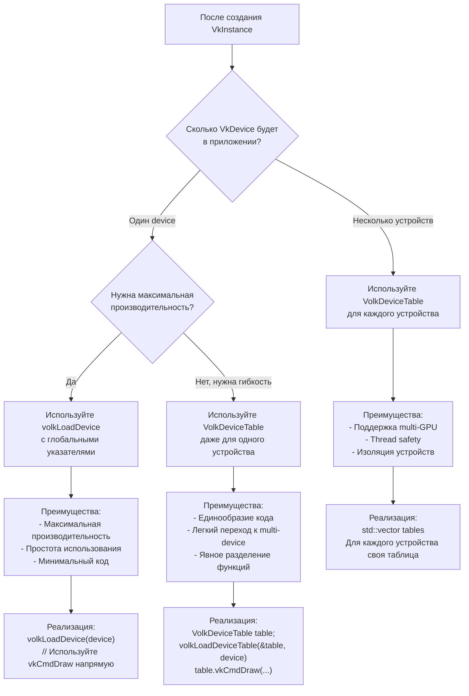
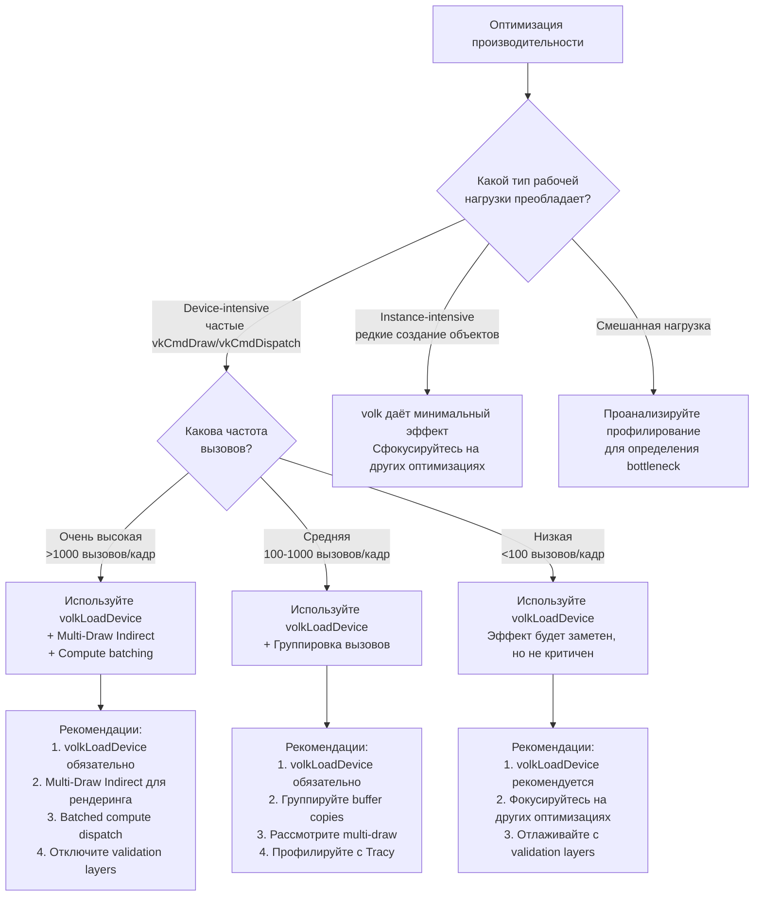
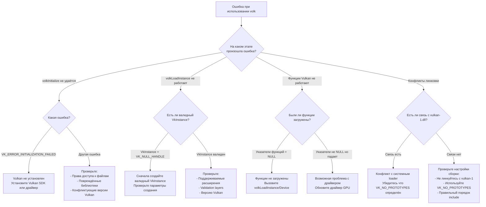

# Деревья решений volk

**🟡 Уровень 2: Средний** — Руководство по принятию архитектурных решений при использовании volk.

## Дерево решений 1: Выбор режима инициализации

```mermaid
flowchart TD
    Start["Начало работы с volk"] --> Q1{"Есть ли уже загруженный<br/>Vulkan loader в приложении?"}
    
    Q1 -->|Да, например SDL3/GLFW| Custom["Используйте volkInitializeCustom<br/>с существующим vkGetInstanceProcAddr"]
    Q1 -->|Нет, чистое приложение| Standard["Используйте volkInitialize<br/>для загрузки системного loader"]
    
    Custom --> CheckCustom{"vkGetInstanceProcAddr доступен?"}
    CheckCustom -->|Да| InitCustom[volkInitializeCustom(handler)]
    CheckCustom -->|Нет| Fallback["Вернитесь к volkInitialize<br/>или проверьте интеграцию"]
    
    Standard --> CheckSystem{"Vulkan установлен в системе?"}
    CheckSystem -->|Да| InitStandard[volkInitialize()]
    CheckSystem -->|Нет| Error["Vulkan не установлен<br/>Установите Vulkan SDK или драйвер"]
    
    InitCustom --> SuccessCustom["Успешная инициализация<br/>с кастомным loader"]
    InitStandard --> SuccessStandard["Успешная инициализация<br/>с системным loader"]
    
    SuccessCustom --> NextSteps["Перейдите к созданию VkInstance"]
    SuccessStandard --> NextSteps
```

## Дерево решений 2: Выбор между глобальными указателями и таблицами



## Дерево решений 3: Интеграция с другими библиотеками

```mermaid
flowchart TD
    Start["Интеграция volk с библиотеками"] --> Q1{"С какой библиотекой<br/>интегрируете?"}
    
    Q1 -->|Оконная библиотека<br/>(SDL3, GLFW)| WindowLib{"Библиотека загружает<br/>Vulkan loader?"}
    Q1 -->|Управление памятью<br/>(VMA)| MemoryLib["Передайте указатели функций<br/>из volk в VMA"]
    Q1 -->|Профилирование<br/>(Tracy)| ProfilingLib["Используйте указатели<br/>функций из volk"]
    Q1 -->|Другая Vulkan библиотека| OtherLib["Проверьте документацию<br/>на предмет интеграции с volk"]
    
    WindowLib -->|Да, например SDL3| UseCustom["Используйте volkInitializeCustom<br/>с SDL_Vulkan_GetVkGetInstanceProcAddr"]
    WindowLib -->|Нет, например GLFW| UseStandard["Используйте volkInitialize<br/>стандартным способом"]
    
    MemoryLib --> VMASteps["Шаги:<br/>1. Создайте VmaVulkanFunctions<br/>2. Заполните указателями из volk<br/>3. Передайте в VmaAllocatorCreateInfo"]
    
    ProfilingLib --> TracySteps["Шаги:<br/>1. Убедитесь в volkLoadDevice<br/>2. Создайте TracyVkContext<br/>с указателями из volk"]
    
    OtherLib --> CheckDocs["Проверьте:<br/>- Требует ли библиотека vkGetInstanceProcAddr?<br/>- Поддерживает ли кастомные указатели функций?<br/>- Есть ли примеры с volk?"]
```

## Дерево решений 4: Оптимизация производительности



## Дерево решений 5: Обработка ошибок и отладка



## Практические рекомендации

### Для новых проектов

1. **Начните с простого**: `volkInitialize()` → `vkCreateInstance()` → `volkLoadInstance()` → `vkCreateDevice()` →
   `volkLoadDevice()`
2. **Используйте глобальные указатели** если у вас одно устройство
3. **Добавьте интеграцию с оконной библиотекой** (SDL3/GLFW) по мере необходимости
4. **Профилируйте с Tracy** для измерения реального эффекта

### Для миграции существующих проектов

1. **Добавьте `VK_NO_PROTOTYPES`** во все места, где включается `vulkan.h`
2. **Замените `#include <vulkan/vulkan.h>` на `#include "volk.h"`**
3. **Добавьте вызовы volkInitialize и volkLoadInstance**
4. **Замените `volkLoadInstance` на `volkLoadDevice`** для device функций
5. **Протестируйте на всех платформах**

### Для продвинутых сценариев

1. **Multi-GPU приложения**: Используйте `VolkDeviceTable` для каждого устройства
2. **Многопоточность**: Инициализируйте volk в основном потоке, используйте готовые указатели в рабочих потоках
3. **Динамическая загрузка**: Используйте `volkInitializeCustom` при интеграции с другими загрузчиками
4. **Оптимизация**: Комбинируйте volk с multi-draw indirect и compute batching

## Частые ошибки и их решение

| Ошибка                                    | Причина                           | Решение                                                     |
|-------------------------------------------|-----------------------------------|-------------------------------------------------------------|
| `undefined reference to vkCreateInstance` | `VK_NO_PROTOTYPES` не определён   | Определите `VK_NO_PROTOTYPES` перед включением vulkan.h     |
| Конфликт символов с vulkan-1.dll          | Двойная линковка                  | Не линкуйтесь с vulkan-1, используйте только volk           |
| `volkInitialize` возвращает ошибку        | Vulkan не установлен              | Установите Vulkan SDK или драйвер GPU с поддержкой Vulkan   |
| Функции работают медленно                 | Не вызван `volkLoadDevice`        | Вызовите `volkLoadDevice(device)` после создания устройства |
| Несколько устройств конфликтуют           | Используются глобальные указатели | Перейдите на `VolkDeviceTable` для каждого устройства       |

← [Назад: Производительность](performance.md) | [Далее: Решение проблем](troubleshooting.md) →
