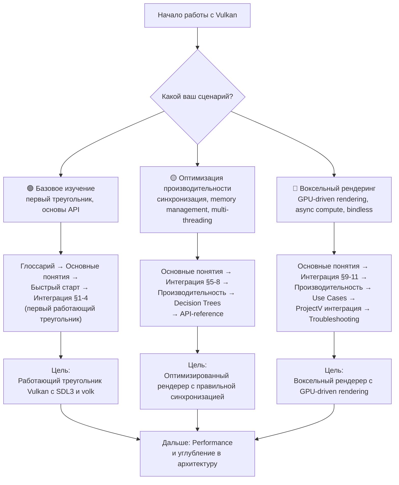
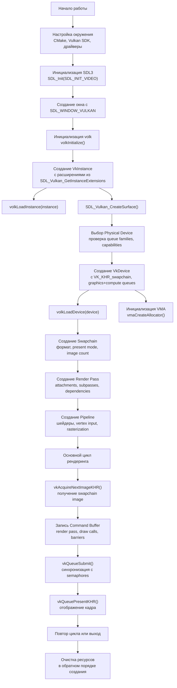

# Vulkan

**🟢 Уровень 1: Начинающий** — Низкоуровневый графический API для 3D-графики и вычислений.

**Vulkan** — кроссплатформенный API для высокопроизводительной 3D-графики, compute и ray tracing. Предоставляет тонкий
уровень абстракции над GPU, позволяющий полностью контролировать рендеринг и вычисления. В отличие от OpenGL, Vulkan
требует явного управления ресурсами, синхронизацией и памятью, что обеспечивает максимальную производительность за счёт
сложности API.

Основные возможности: GPU-driven rendering, async compute, ray tracing, mesh shading, bindless texturing.

---

## Диаграмма обучения (Learning Path)

Выберите свой сценарий и следуйте по соответствующему пути:

---

## Содержание

### 🟢 Уровень 1: Начинающий

| Раздел                                             | Описание                                                    | Уровень |
|----------------------------------------------------|-------------------------------------------------------------|---------|
| [Глоссарий](glossary.md)                           | Термины: Instance, Device, Swapchain, Pipeline, Render Pass | 🟢      |
| [Основные понятия](concepts.md)                    | Архитектура Vulkan, host/device модель, execution model     | 🟢      |
| [Быстрый старт](quickstart.md)                     | Создание первого треугольника Vulkan                        | 🟢      |
| [Интеграция](integration.md#1-настройка-окружения) | Настройка окружения, CMake, воркфлоу разработки             | 🟢      |

### 🟡 Уровень 2: Средний

| Раздел                                                            | Описание                                                          | Уровень |
|-------------------------------------------------------------------|-------------------------------------------------------------------|---------|
| [Интеграция](integration.md#5-инициализация-vulkan)               | Полная инициализация Vulkan: volk → instance → device → swapchain | 🟡      |
| [Справочник API](api-reference.md)                                | Функции и структуры Vulkan, SDL3 Vulkan API, volk API             | 🟡      |
| [Решение проблем](troubleshooting.md#-ошибки-инициализации-и-sdl) | Ошибки инициализации, SDL, validation layers, синхронизация       | 🟡      |
| [Decision Trees](decision-trees.md)                               | Выбор архитектуры рендеринга, синхронизации, управления памятью   | 🟡      |

### 🔴 Уровень 3: Продвинутый

| Раздел                                                           | Описание                                                        | Уровень |
|------------------------------------------------------------------|-----------------------------------------------------------------|---------|
| [Интеграция](integration.md#7-интеграция-воксельного-рендеринга) | Воксельный рендеринг, GPU-driven rendering, async compute       | 🔴      |
| [Производительность](performance.md)                             | Оптимизации для вокселей: GPU-driven, compute culling, bindless | 🔴      |
| [Сценарии использования](use-cases.md)                           | Compute shaders, ray tracing, mesh shading, post-processing     | 🔴      |
| [ProjectV интеграция](projectv-integration.md)                   | Специфичные паттерны для воксельного движка                     | 🔴      |

---

## Быстрые ссылки по задачам

| Задача                                     | Рекомендуемый раздел                                                                                                                       | Уровень |
|--------------------------------------------|--------------------------------------------------------------------------------------------------------------------------------------------|---------|
| Создать первый треугольник                 | [Быстрый старт](quickstart.md) → [Интеграция §1-4](integration.md#1-настройка-окружения)                                                   | 🟢      |
| Настроить окружение с CMake                | [Интеграция §1](integration.md#1-настройка-окружения)                                                                                      | 🟢      |
| Интегрировать с SDL3 и volk                | [Интеграция §2-3](integration.md#2-интеграция-sdl3) → [Интеграция §5](integration.md#5-инициализация-vulkan)                               | 🟡      |
| Правильная синхронизация (fence/semaphore) | [Основные понятия](concepts.md#синхронизация) → [Решение проблем](troubleshooting.md#-синхронизация-и-поверхностные-ошибки)                | 🟡      |
| Оптимизировать память с VMA                | [Интеграция §6](integration.md#6-управление-памятью-с-vma) → [Производительность](performance.md#memory-optimization)                      | 🟡      |
| GPU-driven rendering для вокселей          | [Интеграция §7](integration.md#7-интеграция-воксельного-рендеринга) → [Производительность](performance.md#gpu-driven-rendering)            | 🔴      |
| Async compute для параллельных вычислений  | [Производительность](performance.md#async-compute) → [Сценарии использования](use-cases.md#compute-shaders)                                | 🔴      |
| Bindless rendering с descriptor indexing   | [Производительность](performance.md#bindless-rendering) → [Решение проблем](troubleshooting.md#bindless-rendering-ошибки)                  | 🔴      |
| Отладка с validation layers                | [Решение проблем](troubleshooting.md#-ошибки-расширений-слоёв-и-validation) → [Интеграция §9](integration.md#9-обработка-ошибок-и-отладка) | 🟡      |
| Профилирование GPU с Tracy                 | [Производительность](performance.md#gpu-profiling-with-tracy) → [Решение проблем](troubleshooting.md#tracy-gpu-profiling-проблемы)         | 🔴      |

---

## Жизненный цикл Vulkan в ProjectV

---

## Рекомендуемый порядок чтения

1. **[Глоссарий](glossary.md)** — понять базовую терминологию Vulkan
2. **[Основные понятия](concepts.md)** — изучить архитектуру Vulkan, host/device модель
3. **[Быстрый старт](quickstart.md)** — запустить минимальный пример треугольника
4. **[Интеграция §1-4](integration.md#1-настройка-окружения)** — настроить окружение и интегрировать с SDL3+volk
5. **[Решение проблем](troubleshooting.md#-ошибки-инициализации-и-sdl)** — знать как диагностировать ошибки

После этого выбирайте разделы в зависимости от ваших задач.

---

## Требования

### Обязательные

- **C++11** или новее (рекомендуется C++17/C++20)
- **Vulkan SDK 1.3.250+** (рекомендуется последняя версия)
- **Совместимый GPU** с поддержкой Vulkan 1.2+ (для воксельного рендеринга)
- **Драйверы GPU** NVIDIA 470+, AMD 21.5.2+, Intel 27.20.100+

### Для ProjectV

- **SDL3** — создание окон и Vulkan surface
- **volk** — динамическая загрузка Vulkan функций
- **VMA (Vulkan Memory Allocator)** — управление памятью GPU
- **glm** — математическая библиотека
- **Tracy** — профилирование GPU (опционально)

### Поддерживаемые платформы

- **Windows 10/11** (Win32, DirectX 12 через Vulkan)
- **Linux** (X11, Wayland) с NVIDIA/AMD драйверами
- **macOS** (MoltenVK) с ограничениями

---

## Примеры кода в ProjectV

ProjectV содержит примеры интеграции Vulkan:

| Пример                                                               | Описание                                  | Уровень |
|----------------------------------------------------------------------|-------------------------------------------|---------|
| [vulkan_triangle.cpp](../examples/old_vulkan_triangle.cpp)           | Минимальный работающий треугольник Vulkan | 🟢      |
| [volk_init.cpp](../examples/volk_init.cpp)                           | Инициализация volk для Vulkan             | 🟢      |
| [sdl_window.cpp](../examples/sdl_window.cpp)                         | Создание окна SDL3 с Vulkan support       | 🟢      |
| [vma_buffer.cpp](../examples/vma_buffer.cpp)                         | Создание буферов через VMA                | 🟡      |
| [vulkan_compute_uniform.cpp](../examples/vulkan_compute_uniform.cpp) | Compute shader с uniform буферами         | 🟡      |
| [imgui_sdl_vulkan.cpp](../examples/imgui_sdl_vulkan.cpp)             | ImGui интеграция с SDL3+Vulkan            | 🟡      |

---

## Следующие шаги

### Для новых пользователей Vulkan

1. **[Глоссарий](glossary.md)** — изучите базовую терминологию
2. **[Основные понятия](concepts.md)** — поймите архитектуру Vulkan
3. **[Быстрый старт](quickstart.md)** — запустите первый треугольник
4. **[Интеграция §1-4](integration.md#1-настройка-окружения)** — настройте окружение

### Для интеграции Vulkan в ProjectV

1. **[Интеграция](integration.md)** — полная инициализация Vulkan
2. **[Решение проблем](troubleshooting.md)** — решите возможные ошибки
3. **[Производительность](performance.md)** — оптимизируйте для вокселей

### Для воксельного рендеринга

1. **[Интеграция §7](integration.md#7-интеграция-воксельного-рендеринга)** — GPU-driven rendering
2. **[Производительность](performance.md)** — оптимизации для миллионов вокселей
3. **[ProjectV интеграция](projectv-integration.md)** — специализированные паттерны
4. **[Сценарии использования](use-cases.md)** — compute shaders, ray tracing

### Для углублённого изучения

1. **[Справочник API](api-reference.md)** — изучите все функции Vulkan
2. **[Decision Trees](decision-trees.md)** — выберите оптимальную архитектуру
3. **[Производительность](performance.md)** — продвинутые оптимизации
4. **[Решение проблем](troubleshooting.md)** — отладка сложных проблем

---

## Связанные разделы

- [volk](../volk/README.md) — динамическая загрузка Vulkan функций
- [SDL3](../sdl/README.md) — создание окон и Vulkan surface
- [VMA](../vma/README.md) — выделение памяти GPU
- [glm](../glm/README.md) — математика для 3D графики
- [Tracy](../tracy/README.md) — профилирование Vulkan вызовов
- [fastgltf](../fastgltf/README.md) — загрузка 3D моделей
- [flecs](../flecs/README.md) — ECS для игровой логики
- [JoltPhysics](../joltphysics/README.md) — физика для воксельного мира
- [Документация проекта](../README.md) — общая структура проекта

← [На главную документации](../README.md)
