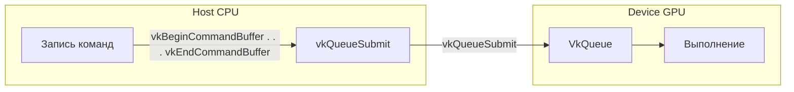
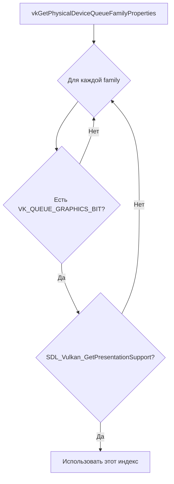
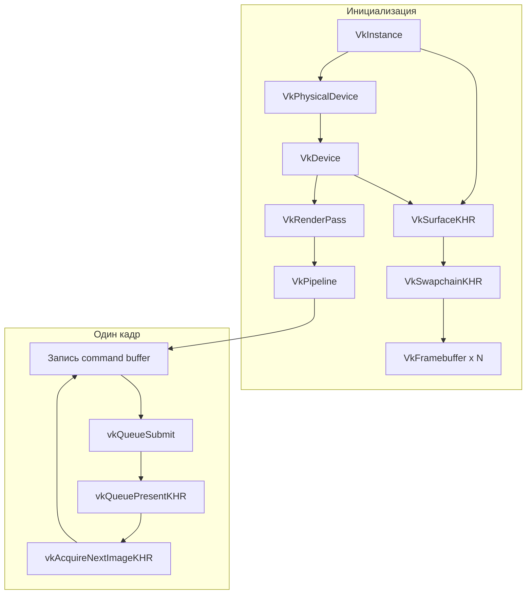

# Основные понятия Vulkan [🟢 Уровень 1]

**🟢 Уровень 1: Начинающий** — Фундаментальные концепции Vulkan API.

Краткое введение в Vulkan. Этот раздел объясняет фундаментальные концепции API, необходимые для понимания работы с
низкоуровневой графикой. Термины — в [глоссарии](glossary.md).

## Оглавление

- [Host и Device](#host-и-device)

- [Execution model: очереди и командные буферы](#execution-model-очереди-и-командные-буферы)
- [Жизненный цикл рендеринга](#жизненный-цикл-рендеринга)
- [Выбор Physical Device](#выбор-physical-device)
- [Swapchain](#swapchain)
- [Render Pass](#render-pass)
- [Синхронизация](#синхронизация)
- [Dynamic vs static state](#dynamic-vs-static-state)
- [Общая схема](#общая-схема)
- [Сходство с C++ и владение ресурсами](#сходство-с-c-и-владение-ресурсами)

---

## Host и Device

В Vulkan различают две среды выполнения:

| Среда      | Где выполняется | Примеры                                                      |
|------------|-----------------|--------------------------------------------------------------|
| **Host**   | CPU приложения  | `vkCreateInstance`, `vkCreateDevice`, запись command buffers |
| **Device** | GPU             | Отрисовка, compute-шейдеры, копирование буферов              |

Команды для GPU **не выполняются сразу** — они записываются в command buffer. Выполнение начинается только после
`vkQueueSubmit`. CPU может продолжать работу, пока GPU обрабатывает очередь.

---

## Execution model: очереди и командные буферы



- **VkQueue** — очередь команд. Приложение отправляет command buffers через `vkQueueSubmit`. GPU выполняет их
  асинхронно.
- **VkCommandBuffer** — буфер с записанными командами. Запись: `vkBeginCommandBuffer` → `vkCmd*` (draw, copy, barrier) →
  `vkEndCommandBuffer`.
- **Queue families** — группы очередей с разными возможностями (graphics, compute, transfer, present). Одна queue family
  обычно покрывает graphics + present для простой игры.

---

## Жизненный цикл рендеринга

Типичный порядок создания объектов:

1. **VkInstance** — подключение к Vulkan. Расширения: surface (VK_KHR_surface, VK_KHR_win32_surface), при необходимости
   debug (VK_EXT_debug_utils).
2. **VkPhysicalDevice** — выбор GPU (перечисление через `vkEnumeratePhysicalDevices`).
3. **VkDevice** — логическое устройство. Расширения: VK_KHR_swapchain.
4. **VkSurfaceKHR** — поверхность окна (SDL_Vulkan_CreateSurface). Создать до выбора queue family.
5. **VkSwapchainKHR** — цепочка изображений для вывода.
6. **VkRenderPass** — описание прохода рендеринга (attachments, subpasses).
7. **VkPipeline** — конфигурация GPU (шейдеры, vertex input и т.д.).
8. **VkFramebuffer** — image views для render pass (по одному на swapchain image).

Каждый кадр:

- `vkAcquireNextImageKHR` — получить индекс изображения для рисования.
- Записать команды в command buffer (begin render pass, bind pipeline, draw, end render pass).
- `vkQueueSubmit` — отправить на GPU.
- `vkQueuePresentKHR` — показать кадр на экран.

---

## Выбор Physical Device

**Physical Device** — GPU. Критерии выбора:

| Критерий          | Проверка                                                                            |
|-------------------|-------------------------------------------------------------------------------------|
| Graphics          | `vkGetPhysicalDeviceQueueFamilyProperties`: искать `VK_QUEUE_GRAPHICS_BIT`          |
| Present           | `SDL_Vulkan_GetPresentationSupport(instance, physicalDevice, queueFamilyIndex)`     |
| Swapchain форматы | `vkGetPhysicalDeviceSurfaceFormatsKHR`, `vkGetPhysicalDeviceSurfacePresentModesKHR` |
| Расширения        | `vkEnumerateDeviceExtensionProperties`, требуется `VK_KHR_swapchain`                |

**Выбор queue family** — нужен индекс, у которого есть graphics и present:



Шаги цикла:

1. Вызвать `vkGetPhysicalDeviceQueueFamilyProperties(physicalDevice, &count, nullptr)`.
2. Выделить массив `VkQueueFamilyProperties` и вызвать снова.
3. В цикле по индексам: проверить `(pProperties[i].queueFlags & VK_QUEUE_GRAPHICS_BIT)`.
4. Вызвать `SDL_Vulkan_GetPresentationSupport(instance, physicalDevice, i)`.
5. Если оба true — использовать `i` как `queueFamilyIndex` для Device и present.

---

## Swapchain

**Swapchain** — набор изображений для double/triple buffering. Приложение рисует в одно изображение, пока предыдущее
показывается на экране.

Перед созданием вызывают `vkGetPhysicalDeviceSurfaceCapabilitiesKHR` для получения ограничений:

| Поле capabilities                   | Описание                                                                  |
|-------------------------------------|---------------------------------------------------------------------------|
| `minImageCount`                     | Минимум изображений. Обычно 2; желаемое число ≥ этого.                    |
| `maxImageCount`                     | Максимум (0 = не ограничено).                                             |
| `minImageExtent` / `maxImageExtent` | Допустимый extent. `imageExtent` **должен** быть clamped в этот диапазон. |

| Параметр swapchain | Описание                                                                                                                                                                           |
|--------------------|------------------------------------------------------------------------------------------------------------------------------------------------------------------------------------|
| **minImageCount**  | От `caps.minImageCount` до `caps.maxImageCount` (если maxImageCount > 0). Типично 2 или 3.                                                                                         |
| **imageFormat**    | Из `vkGetPhysicalDeviceSurfaceFormatsKHR`, например `VK_FORMAT_B8G8R8A8_UNORM`.                                                                                                    |
| **presentMode**    | Из `vkGetPhysicalDeviceSurfacePresentModesKHR`: `VK_PRESENT_MODE_FIFO_KHR` — vsync; `VK_PRESENT_MODE_MAILBOX_KHR` — triple buffering; `VK_PRESENT_MODE_IMMEDIATE_KHR` — без vsync. |
| **extent**         | Размер в пикселях. Clamp по `minImageExtent`/`maxImageExtent`: `std::clamp(width, caps.minImageExtent.width, caps.maxImageExtent.width)`.                                          |

При изменении размера окна swapchain нужно **пересоздать** — старые image views станут невалидными.
Подробнее: [Решение проблем — Swapchain recreation](troubleshooting.md#swapchain-recreation-при-resize).

---

## Render Pass

**VkRenderPass** описывает, как используется framebuffer:

- **Attachments** — color (render target), depth. Для каждого: format, loadOp (CLEAR/LOAD/DONT_CARE), storeOp (
  STORE/DONT_CARE), initialLayout, finalLayout.
- **Subpasses** — логические этапы внутри прохода. Один subpass — минимальная конфигурация (один color attachment).
- **Subpass dependencies** — порядок и синхронизация между subpasses или с внешним миром.

Типичный render pass для треугольника на swapchain image:

- один color attachment (R8G8B8A8)
- loadOp = CLEAR (очистить перед рисованием)
- storeOp = STORE (сохранить для present)
- initialLayout = UNDEFINED, finalLayout = PRESENT_SRC_KHR

**Dynamic Rendering (Vulkan 1.3+):** В современных движках всё чаще используют **Dynamic Rendering** (
`VK_KHR_dynamic_rendering`) — рисование напрямую в image views без создания `VkRenderPass` и `VkFramebuffer`. Это
упрощает код; для обучения же RenderPass полезен, чтобы понимать классическую модель. При углублении в Vulkan 1.3+ стоит
ознакомиться с Dynamic Rendering.

---

## Синхронизация

В Vulkan три основных инструмента:

| Инструмент            | Назначение                                                                                                                                          |
|-----------------------|-----------------------------------------------------------------------------------------------------------------------------------------------------|
| **VkFence**           | Host ждёт Device. Один fence на кадр. Перед повторным использованием ресурсов кадра — `vkWaitForFences`.                                            |
| **VkSemaphore**       | Device-to-device или acquire/present. Сигнализирует завершение операции. Используется в `vkQueueSubmit` (wait/signal) и `vkQueuePresentKHR` (wait). |
| **VkPipelineBarrier** | Внутри command buffer. Обеспечивает порядок выполнения и видимость памяти. Обязателен при смене layout изображения.                                 |

### Современная синхронизация (Vulkan 1.3+)

**Timeline Semaphores (`VK_KHR_timeline_semaphore`)** — замена binary semaphores:

- Значение увеличивается монотонно (64-bit counter)
- Точный контроль над порядком выполнения
- Идеально для async compute и complex dependency chains

**Synchronization2 (`VK_KHR_synchronization2`)** — улучшенный API:

- Упрощённые структуры (`VkMemoryBarrier2`, `VkImageMemoryBarrier2`)
- Явные стадии выполнения (pipeline stages)
- Лучшая производительность и читаемость

**Типичный цикл кадра с современной синхронизацией:**

```cpp
// Timeline semaphores для точного контроля
uint64_t timelineValue = 1;

// Compute submit
VkSemaphoreSubmitInfo computeSignal = {
    VK_STRUCTURE_TYPE_SEMAPHORE_SUBMIT_INFO};
computeSignal.semaphore = timelineSemaphore;
computeSignal.value = timelineValue + 1;
computeSignal.stageMask = VK_PIPELINE_STAGE_COMPUTE_SHADER_BIT;

// Graphics wait на compute
VkSemaphoreSubmitInfo graphicsWait = {
    VK_STRUCTURE_TYPE_SEMAPHORE_SUBMIT_INFO};
graphicsWait.semaphore = timelineSemaphore;
graphicsWait.value = timelineValue + 1;
graphicsWait.stageMask = VK_PIPELINE_STAGE_VERTEX_INPUT_BIT;
```

**Layout transitions:** при первом использовании swapchain image как render target нужен барьер `UNDEFINED` →
`COLOR_ATTACHMENT_OPTIMAL`. При завершении render pass — `COLOR_ATTACHMENT_OPTIMAL` → `PRESENT_SRC_KHR` (часто через
subpass dependency).

**Оптимизация барьеров для воксельного рендеринга:**

- Объединение барьеров для минимизации stalls
- Использование `VK_PIPELINE_STAGE_ALL_COMMANDS_BIT` только когда необходимо
- Асинхронные барьеры между compute и graphics очередями

---

## Dynamic vs static state

**Static state** задаётся при создании pipeline (viewport, scissor, blend и т.д.) и не меняется.

**Dynamic state** — переключается в command buffer через `vkCmdSet*` без пересоздания pipeline. В
`VkPipelineDynamicStateCreateInfo` указывают, например:

- `VK_DYNAMIC_STATE_VIEWPORT`
- `VK_DYNAMIC_STATE_SCISSOR`

Тогда в командном буфере вызывают `vkCmdSetViewport`, `vkCmdSetScissor` перед draw. Удобно при изменении размера окна —
не нужно пересоздавать pipeline.

---

## Общая схема



---

## Сходство с C++ и владение ресурсами

**Handle как непрозрачный указатель.** `VkInstance`, `VkDevice`, `VkSwapchainKHR` и т.д. — это handle'ы. В C++ они ведут
себя как указатели, но **не разыменовываются** и **не освобождаются** через `delete`. Освобождение — только через
соответствующие `vkDestroy*` функции.

**Типы (uint32_t vs Uint32).** Vulkan использует `uint32_t`, SDL — `Uint32` и т.д. Оба — фиксированные размеры для
кросс-платформенности. Привод типов допустим при согласовании API.

**Const в API Vulkan.** Параметры вроде `const VkInstanceCreateInfo*` означают, что структура read-only. Указатели на
массивы (`const char* const*`) — массив не меняется; не пытайтесь освобождать то, что вам передали (например,
`ppEnabledExtensionNames` от SDL).

**Отсутствие RAII по умолчанию.** Vulkan не управляет временем жизни объектов. В C++ можно обернуть handle в класс с
деструктором или `std::unique_ptr` с custom deleter — тогда очистка произойдёт автоматически. Пример:
`std::unique_ptr<VkInstance, decltype(&vkDestroyInstance)>`.

**Кто владеет чем:**

| Ресурс                       | Владелец   | Примечание                                                                                            |
|------------------------------|------------|-------------------------------------------------------------------------------------------------------|
| Массив расширений instance   | SDL        | `SDL_Vulkan_GetInstanceExtensions` — не копировать, не освобождать                                    |
| VkSurfaceKHR                 | Приложение | `SDL_Vulkan_CreateSurface` создаёт; `SDL_Vulkan_DestroySurface` или `vkDestroySurfaceKHR` освобождает |
| Swapchain images             | Vulkan     | Получаем через `vkGetSwapchainImagesKHR`; не уничтожать вручную, они — часть swapchain                |
| Буферы/изображения через VMA | VMA        | `vmaCreateBuffer`/`vmaCreateImage` — освобождать через `vmaDestroyBuffer`/`vmaDestroyImage`           |

---

## 🧭 Навигация

### Следующие шаги

🟢 **[Быстрый старт Vulkan](quickstart.md)** — Практическое создание треугольника  
🟡 **[Интеграция Vulkan](integration.md)** — Настройка с SDL3, volk, VMA  
🔴 **[ProjectV Integration](projectv-integration.md)** — Специфичные для ProjectV подходы

🏠 **[К карте документации](../map.md)**  
*Общая структура и зависимости между библиотеками*

### Связанные разделы

🔗 **[Глоссарий терминов Vulkan](glossary.md)** — Определения всех ключевых терминов  
🔗 **[Справочник API Vulkan](api-reference.md)** — Полный список функций и структур  
🔗 **[Решение проблем Vulkan](troubleshooting.md)** — Отладка и типичные ошибки

← **[Назад к основной документации Vulkan](README.md)**
