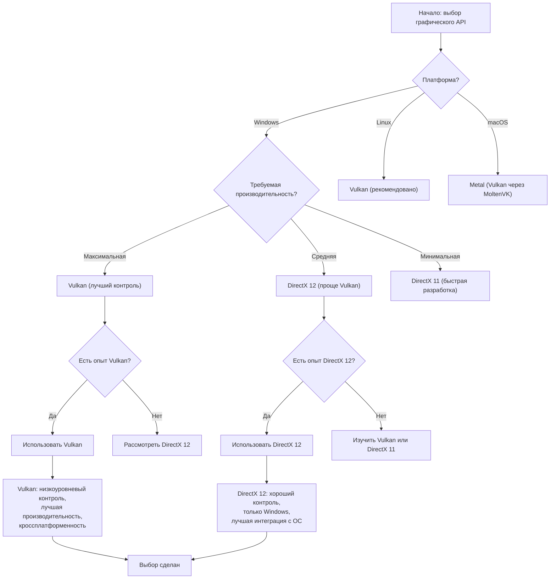
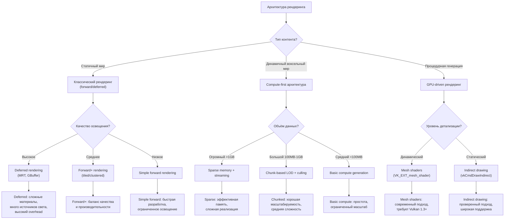
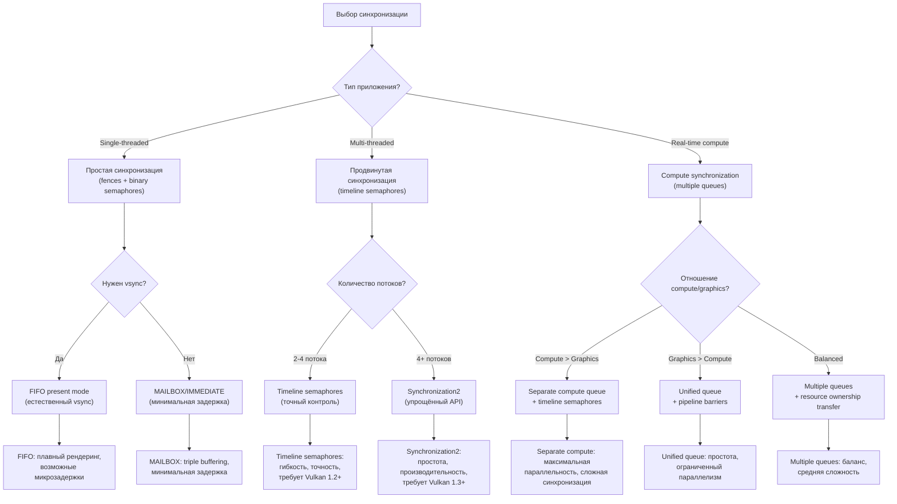
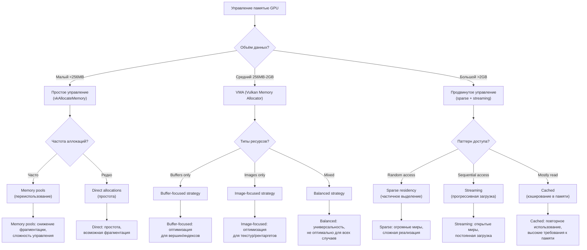
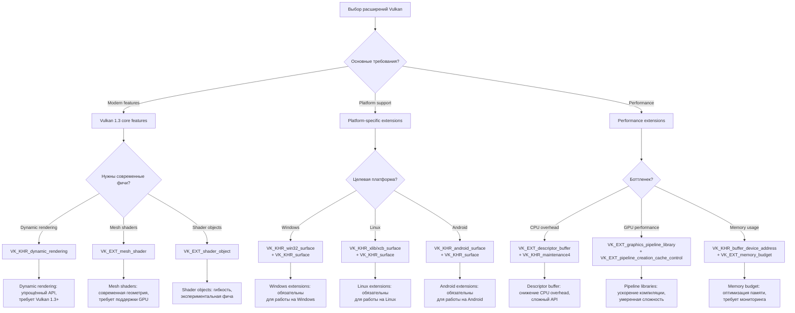
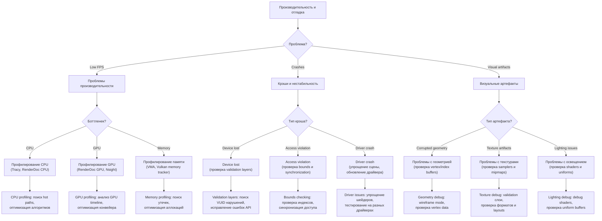

# Деревья решений Vulkan [🟡 Уровень 2]

**🟡 Уровень 2: Средний** — Выбор правильных подходов и архитектурных решений для различных задач Vulkan.

## Оглавление

- [Выбор графического API](#выбор-графического-api)
- [Выбор архитектуры рендеринга](#выбор-архитектуры-рендеринга)
- [Выбор синхронизации](#выбор-синхронизации)
- [Выбор управления памятью](#выбор-управления-памятью)
- [Выбор мультитрединга](#выбор-мультитрединга)
- [Выбор расширений](#выбор-расширений)
- [Производительность и отладка](#производительность-и-отладка)

---

## Выбор графического API



**Для ProjectV:** Vulkan — единственный вариант из-за требований кроссплатформенности, низкоуровневого контроля и
производительности для воксельного рендеринга.

---

## Выбор архитектуры рендеринга



**Рекомендации для ProjectV:**

1. **Compute-first архитектура** для генерации геометрии
2. **GPU Driven Rendering** для минимизации draw calls
3. **Async Compute** для параллельной обработки
4. **Timeline Semaphores** для синхронизации

---

## Выбор синхронизации



**Оптимальный выбор для ProjectV:**

- **Timeline semaphores** для точного контроля над асинхронными операциями
- **Synchronization2** для упрощённого API (если доступно)
- **Separate compute queue** для параллельной обработки вокселей

---

## Выбор управления памятью



**Рекомендации для ProjectV:**

1. **VMA** для основного управления памятью
2. **Sparse residency** для воксельных миров >4GB
3. **Memory pooling** для часто создаваемых ресурсов (чтобы снизить фрагментацию)

---

## Выбор мультитрединга

```mermaid
flowchart TD
    Start["Мультитрединг в Vulkan"] --> Q1{"Цель параллелизма?"}
    Q1 -->|Record commands| CmdParallelism["Параллельная запись команд"]
    Q1 -->|Resource creation| ResParallelism["Параллельное создание ресурсов"]
    Q1 -->|Frame processing| FrameParallelism["Параллельная обработка кадров"]
    
    CmdParallelism --> Q2{"Количество объектов?"}
    ResParallelism --> Q3{"Тип ресурсов?"}
    FrameParallelism --> Q4{"Задержка vs пропускная способность?"}
    
    Q2 -->|Много (>1000)| SecondaryBuffers["Secondary command buffers\n(параллельная запись)"]
    Q2 -->|Немного (<1000)| PrimaryBuffers["Primary command buffers\n(однопоточная запись)"]
    
    Q3 -->|Buffers| AsyncBuffer["Async buffer creation\n(отдельные потоки)"]
    Q3 -->|Images| AsyncImage["Async image creation\n(осторожно с layout transitions)"]
    Q3 -->|Pipelines| AsyncPipeline["Pipeline compilation\n(фоновые потоки)"]
    
    Q4 -->|Low latency| FrameParallel["Frame parallelism\n(каждый кадр в своём потоке)"]
    Q4 -->|High throughput| TaskParallel["Task parallelism\n(разделение работы)"]
    
    SecondaryBuffers --> FinalSecondary["Secondary CBs: высокая параллельность,\noverhead на submission"]
    PrimaryBuffers --> FinalPrimary["Primary CBs: простота,\nограниченный параллелизм"]
    
    AsyncBuffer --> FinalAsyncBuffer["Async buffers: безопасно,\nхорошая масштабируемость"]
    AsyncImage --> FinalAsyncImage["Async images: требует синхронизации,\nумеренная сложность"]
    AsyncPipeline --> FinalAsyncPipeline["Async pipelines: долгая компиляция,\nхороший кандидат для асинхронности"]
    
    FrameParallel --> FinalFrame["Frame parallel: минимальная задержка,\nвысокие требования к памяти"]
    TaskParallel --> FinalTask["Task parallel: максимальная пропускная способность,\nсложная синхронизация"]
```

**Для ProjectV:**

- **Secondary command buffers** для параллельной генерации команд для разных чанков
- **Async pipeline compilation** для компиляции шейдеров в фоне
- **Frame parallelism** для минимизации задержки ввода

---

## Выбор расширений



**Обязательные для ProjectV:**

1. **VK_KHR_swapchain** — вывод на экран
2. **VK_KHR_surface** + платформенно-специфичные — создание поверхности
3. **VK_EXT_descriptor_indexing** — bindless rendering для текстур вокселей
4. **VK_KHR_buffer_device_address** — прямой доступ к данным из шейдеров

**Рекомендуемые:**

1. **VK_KHR_timeline_semaphore** — продвинутая синхронизация
2. **VK_EXT_memory_budget** — мониторинг использования памяти
3. **VK_KHR_dynamic_rendering** — упрощённый рендеринг (Vulkan 1.3+)

---

## Производительность и отладка



**Инструменты для ProjectV:**

1. **Tracy** — профилирование CPU/GPU в реальном времени
2. **RenderDoc** — захват и анализ кадров
3. **Vulkan Validation Layers** — проверка корректности API вызовов
4. **VMA debugging** — отслеживание выделений памяти

---

## 🧭 Навигация

### Следующие шаги

🟢 **[Основные понятия Vulkan](concepts.md)** — Фундаментальные концепции Vulkan API  
🟡 **[Быстрый старт Vulkan](quickstart.md)** — Практическое создание треугольника  
🔴 **[Производительность Vulkan](performance.md)** — Оптимизация и продвинутые техники

### Связанные разделы

🔗 **[ProjectV Integration](projectv-integration.md)** — Специфичные для ProjectV подходы  
🔗 **[Решение проблем Vulkan](troubleshooting.md)** — Отладка и типичные ошибки  
🔗 **[Интеграция Vulkan](integration.md)** — Настройка с SDL3, volk, VMA

← **[Назад к основной документации Vulkan](README.md)**