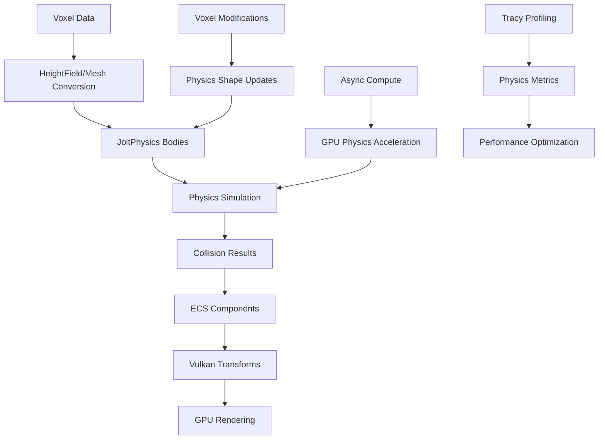
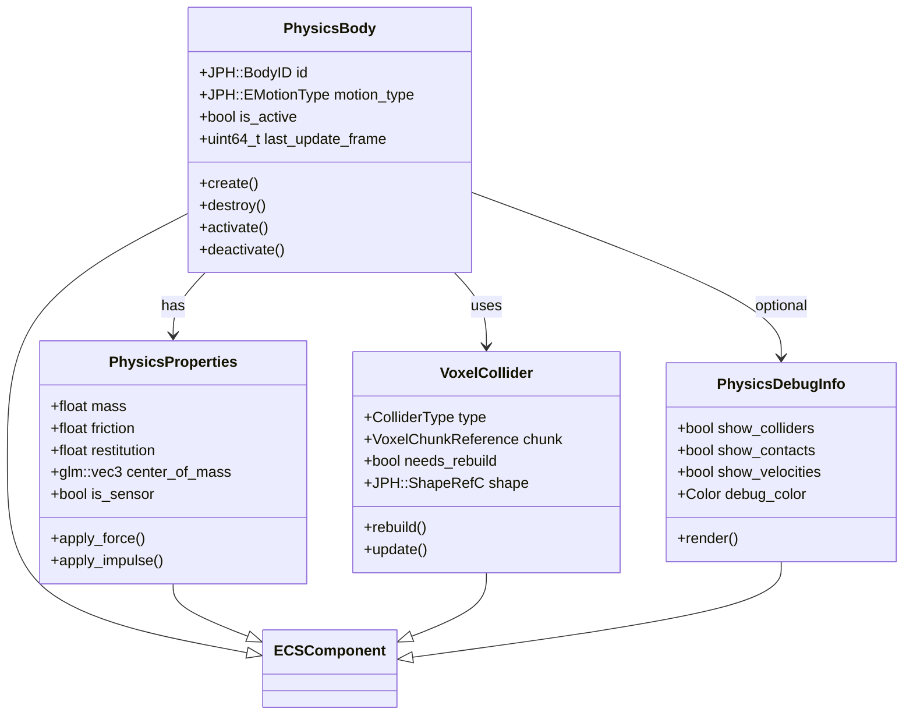

# Jolt-Vulkan Bridge Technical Specification

**Статус:** Technical Specification
**Уровень:** 🔴 Продвинутый
**Дата:** 2026-02-22
**Версия:** 2.0

---

## Обзор

Документ описывает интеграцию **JoltPhysics** с **Vulkan 1.4** для высокопроизводительной физической симуляции
воксельного мира. Ключевые системы:

1. **ECS Integration** — интеграция с flecs для компонентной архитектуры
2. **HeightField/Mesh Colliders** — оптимизированные коллайдеры для вокселей
3. **Async MeshShape Rebuild** — асинхронная перестройка коллайдеров при разрушении
4. **Double-Buffered Colliders** — предотвращение stalls при массовых взрывах

---

## Оглавление

- [Введение: Физика для воксельного мира](#введение-физика-для-воксельного-мира)
- [Архитектура интеграции Jolt-Vulkan](#архитектура-интеграции-jolt-vulkan)
- [ECS компоненты для физической симуляции](#ecs-компоненты-для-физической-симуляции)
- [HeightFieldShape для воксельного ландшафта](#heightfieldshape-для-воксельного-ландшафта)
- [Синхронизация физических тел с Vulkan трансформациями](#синхронизация-физических-тел-с-vulkan-трансформациями)
- [Воксельная физика: разрушение, жидкости, сыпучие материалы](#воксельная-физика-разрушение-жидкости-сыпучие-материалы)
- [GPU-driven физика с compute shaders](#gpu-driven-физика-с-compute-shaders)
- [Оптимизации для больших воксельных миров](#оптимизации-для-больших-воксельных-миров)
- [Профилирование и дебаг физики](#профилирование-и-дебаг-физики)
- [Практические примеры](#практические-примеры)
- [Типичные проблемы и решения](#типичные-проблемы-и-решения)

---

## Введение: Физика для воксельного мира

ProjectV как воксельный движок требует физической симуляции, которая работает эффективно с динамически изменяемым миром.
JoltPhysics предоставляет идеальную основу для наших нужд:

### Ключевые требования для воксельной физики

| Требование                      | Решение JoltPhysics                 | Преимущество для ProjectV                       |
|---------------------------------|-------------------------------------|-------------------------------------------------|
| **Высотные поля (HeightField)** | `HeightFieldShape`                  | Эффективное представление воксельного ландшафта |
| **Динамическое изменение мира** | `MutableCompoundShape`, `MeshShape` | Разрушаемые структуры, копание                  |
| **Сыпучие материалы**           | Soft bodies + constraints           | Песок, гравий, сыпучие вещества                 |
| **Жидкости**                    | Particle-based симуляция            | Вода, лава, жидкости                            |
| **Большие миры**                | Чанкирование + слои                 | Масштабируемость до гигантских миров            |
| **Производительность**          | SIMD оптимизации, JobSystem         | 60+ FPS при тысячах тел                         |

### Архитектурный подход ProjectV

**Три уровня интеграции физики:**



**Принципы интеграции:**

1. **Deterministic simulation** — Критично для сетевой синхронизации
2. **ECS-first design** — Полная интеграция с Flecs
3. **GPU acceleration** — Compute shaders для тяжёлых вычислений
4. **Sparse representation** — Эффективное использование памяти

---

## Архитектура интеграции Jolt-Vulkan

### Общая архитектура системы

```cpp
// Основной класс интеграции физики
class JoltVulkanIntegration {
private:
    // Физический мир
    JPH::PhysicsSystem physics_system;
    JPH::TempAllocatorImpl temp_allocator;
    JPH::JobSystemThreadPool job_system;

    // ECS интеграция
    flecs::world& world;

    // Vulkan синхронизация
    VulkanSyncContext sync_context;

    // Подсистемы
    HeightFieldManager heightfield_manager;
    VoxelCollisionSystem voxel_collision_system;
    PhysicsDebugRenderer debug_renderer;

public:
    void initialize(uint32_t max_bodies = 16384) {
        // 1. Инициализация JoltPhysics
        JPH::RegisterDefaultAllocator();
        JPH::Factory::sInstance = new JPH::Factory();
        JPH::RegisterTypes();

        // 2. Настройка PhysicsSystem для вокселей
        physics_system.Init(
            max_bodies,          // Максимальное количество тел
            0,                   // Автоматический выбор body mutexes
            8192,               // Максимальное количество body pairs
            4096,               // Максимальное количество contact constraints
            broad_phase_layer_interface,
            object_vs_broadphase_layer_filter,
            object_vs_object_layer_filter
        );

        // 3. Настройка слоёв для воксельного мира
        configure_voxel_layers();

        // 4. Инициализация ECS компонентов
        register_physics_components();

        // 5. Настройка систем синхронизации
        setup_sync_systems();

        // 6. Инициализация debug рендеринга
        debug_renderer.initialize(vulkan_context);

        // 7. Настройка гравитации для вокселей (усиленная для стабильности)
        physics_system.SetGravity(JPH::Vec3(0, -15.0f, 0));
    }

    void update(float delta_time) {
        TracyZoneScopedN("PhysicsUpdate");

        // 1. Синхронизация ECS -> Physics (для кинематических тел)
        sync_ecs_to_physics();

        // 2. Выполнение физической симуляции
        physics_system.Update(delta_time,
                             JPH::cCollisionSteps,
                             temp_allocator,
                             job_system);

        // 3. Синхронизация Physics -> ECS (для динамических тел)
        sync_physics_to_ecs();

        // 4. Обработка коллизий и событий
        process_collision_events();

        // 5. Обновление debug визуализации
        update_debug_renderer();
    }

    void render_debug(VkCommandBuffer cmd) {
        debug_renderer.render(cmd, physics_system);
    }
};
```

### Component-based физическая система



### Системная организация по фазам

```cpp
// Организация систем физики по фазам выполнения
struct PhysicsPhase {
    enum Phase {
        PRE_PHYSICS,     // Синхронизация ECS -> Physics, применение сил
        SIMULATION,      // Выполнение физической симуляции
        POST_PHYSICS,    // Синхронизация Physics -> ECS, обработка коллизий
        DEBUG_RENDER     // Отладочная визуализация
    };

    // Регистрация систем для каждой фазы
    static void register_systems(flecs::world& world) {
        // Phase 1: Pre-Physics
        world.system<PhysicsBody, const Transform>("KinematicSyncSystem")
            .kind(flecs::PreUpdate)
            .each(sync_kinematic_to_physics);

        world.system<PhysicsBody, PhysicsProperties>("ForceApplicationSystem")
            .kind(flecs::PreUpdate)
            .each(apply_forces_and_impulses);

        // Phase 2: Simulation (выполняется в отдельном потоке)
        world.system<>("PhysicsSimulationSystem")
            .kind(flecs::OnUpdate)
            .singleton()
            .each(execute_physics_simulation);

        // Phase 3: Post-Physics
        world.system<Transform, const PhysicsBody>("PhysicsSyncSystem")
            .kind(flecs::PostUpdate)
            .each(sync_physics_to_ecs);

        world.system<PhysicsBody>("CollisionResponseSystem")
            .kind(flecs::PostUpdate)
            .each(process_collision_responses);

        // Phase 4: Debug Render
        world.system<const PhysicsDebugInfo>("PhysicsDebugRenderSystem")
            .kind(flecs::PostStore)
            .each(render_physics_debug);
    }
};
```

---

## ECS компоненты для физической симуляции

### Базовые компоненты физики

```cpp
// Компонент для физического тела
struct PhysicsBody {
    JPH::BodyID id = JPH::BodyID::cInvalidBodyID;
    JPH::EMotionType motion_type = JPH::EMotionType::Dynamic;

    // Состояние
    bool is_active = true;
    bool is_in_world = false;
    uint64_t last_update_frame = 0;

    // Для синхронизации
    bool transform_dirty = false;
    bool properties_dirty = false;

    // Создание тела
    bool create(JPH::BodyCreationSettings& settings) {
        if (id != JPH::BodyID::cInvalidBodyID) {
            return false; // Тело уже создано
        }

        JPH::BodyInterface& interface = get_physics_system().GetBodyInterface();
        id = interface.CreateBody(settings);

        if (id != JPH::BodyID::cInvalidBodyID) {
            interface.AddBody(id, is_active ?
                JPH::EActivation::Activate :
                JPH::EActivation::DontActivate);
            is_in_world = true;
            return true;
        }

        return false;
    }

    // Уничтожение тела
    void destroy() {
        if (id != JPH::BodyID::cInvalidBodyID) {
            JPH::BodyInterface& interface = get_physics_system().GetBodyInterface();

            if (is_in_world) {
                interface.RemoveBody(id);
            }
            interface.DestroyBody(id);

            id = JPH::BodyID::cInvalidBodyID;
            is_in_world = false;
        }
    }

    // Активация/деактивация
    void activate() {
        if (id != JPH::BodyID::cInvalidBodyID && !is_active) {
            get_physics_system().GetBodyInterface().ActivateBody(id);
            is_active = true;
        }
    }

    void deactivate() {
        if (id != JPH::BodyID::cInvalidBodyID && is_active) {
            get_physics_system().GetBodyInterface().DeactivateBody(id);
            is_active = false;
        }
    }

    // Получение трансформации
    Transform get_transform() const {
        if (id == JPH::BodyID::cInvalidBodyID) {
            return Transform{};
        }

        JPH::BodyInterface& interface = get_physics_system().GetBodyInterface();
        JPH::Vec3 position = interface.GetCenterOfMassPosition(id);
        JPH::Quat rotation = interface.GetRotation(id);

        return Transform{
            .position = {position.GetX(), position.GetY(), position.GetZ()},
            .rotation = {rotation.GetX(), rotation.GetY(),
                        rotation.GetZ(), rotation.GetW()},
            .scale = {1.0f, 1.0f, 1.0f}
        };
    }

    // Установка трансформации
    void set_transform(const Transform& transform, bool activate = true) {
        if (id == JPH::BodyID::cInvalidBodyID) return;

        JPH::BodyInterface& interface = get_physics_system().GetBodyInterface();
        interface.SetPositionAndRotation(
            id,
            JPH::Vec3(transform.position.x, transform.position.y, transform.position.z),
            JPH::Quat(transform.rotation.x, transform.rotation.y,
                     transform.rotation.z, transform.rotation.w),
            activate ? JPH::EActivation::Activate : JPH::EActivation::DontActivate
        );
    }
};

// Компонент для свойств физики
struct PhysicsProperties {
    // Основные свойства
    float mass = 1.0f;
    float friction = 0.5f;
    float restitution = 0.2f;
    float linear_damping = 0.05f;
    float angular_damping = 0.05f;

    // Центр масс (относительно локальной системы координат)
    glm::vec3 center_of_mass = {0.0f, 0.0f, 0.0f};

    // Флаги
    bool is_sensor = false;           // Триггер (не создаёт контактов)
    bool is_kinematic = false;        // Управляется кодом, не физикой
    bool gravity_enabled = true;      // Влияет ли гравитация

    // Для воксельных объектов
    bool is_destructible = false;
    float break_threshold = 100.0f;   // Сила, необходимая для разрушения

    // Применение сил и импульсов
    struct AppliedForce {
        glm::vec3 force;
        glm::vec3 point;              // Точка приложения (локальные координаты)
        bool is_impulse = false;      // Импульс вместо силы
    };
    std::vector<AppliedForce> pending_forces;

    void apply_force(const glm::vec3& force, const glm::vec3& point = {0,0,0}) {
        pending_forces.push_back({force, point, false});
    }

    void apply_impulse(const glm::vec3& impulse, const glm::vec3& point = {0,0,0}) {
        pending_forces.push_back({impulse, point, true});
    }

    void clear_pending_forces() {
        pending_forces.clear();
    }
};
```

### Компоненты для воксельной физики

```cpp
// Компонент для воксельного коллайдера
struct VoxelCollider {
    enum ColliderType {
        HEIGHTFIELD,    // Для ландшафта
        MESH,           // Для статических объектов
        COMPOUND,       // Для сложных объектов
        CONVEX_HULL,    // Для динамических объектов
        SPHERE,         // Для простых объектов
        BOX             // Для AABB коллизий
    };

    ColliderType type = HEIGHTFIELD;

    // Ссылка на данные вокселей
    VoxelChunkHandle chunk;
    uint32_t chunk_x = 0, chunk_y = 0, chunk_z = 0;

    // Состояние
    bool needs_rebuild = false;
    bool is_built = false;
    uint64_t last_rebuild_frame = 0;

    // Jolt shape
    JPH::ShapeRefC shape;

    // Для HeightField
    struct HeightFieldData {
        std::vector<float> heights;
        uint32_t sample_count = 0;
        float voxel_size = 1.0f;
        float height_scale = 1.0f;
    };
    std::optional<HeightFieldData> heightfield_data;

    // Для Mesh/Compound
    struct MeshData {
        std::vector<glm::vec3> vertices;
        std::vector<uint32_t> indices;
        std::vector<uint32_t> materials;
    };
    std::optional<MeshData> mesh_data;

    // Методы
    bool rebuild() {
        TracyZoneScopedN("VoxelColliderRebuild");

        switch (type) {
            case HEIGHTFIELD:
                return rebuild_heightfield();
            case MESH:
                return rebuild_mesh();
            case COMPOUND:
                return rebuild_compound();
            case CONVEX_HULL:
                return rebuild_convex_hull();
            default:
                return false;
        }
    }

    bool rebuild_heightfield() {
        if (!heightfield_data) return false;

        auto& data = *heightfield_data;

        JPH::HeightFieldShapeSettings settings;
        settings.mHeightSamples = data.heights.data();
        settings.mSampleCount = data.sample_count;
        settings.mScale = JPH::Vec3(data.voxel_size, data.height_scale, data.voxel_size);
        settings.mOffset = JPH::Vec3(0, 0, 0);

        // Оптимизация для вокселей
        settings.mBlockSize = data.sample_count > 64 ? 4 : 2;
        settings.mBitsPerSample = 8;

        JPH::ShapeSettings::ShapeResult result = settings.Create();
        if (result.IsValid()) {
            shape = result.Get();
            is_built = true;
            needs_rebuild = false;
            last_rebuild_frame = current_frame;
            return true;
        }

        return false;
    }

    void update_from_voxels(const VoxelChunk& chunk_data) {
        // Обновление данных на основе изменений вокселей
        if (type == HEIGHTFIELD) {
            update_heightfield_from_voxels(chunk_data);
        } else if (type == MESH) {
            update_mesh_from_voxels(chunk_data);
        }

        needs_rebuild = true;
        mark_for_async_rebuild();
    }

    void mark_for_async_rebuild() {
        // Добавление в очередь для асинхронной перестройки
        ColliderRebuildTask task = {
            .entity = owning_entity,
            .collider = this,
            .priority = ColliderRebuildPriority::MEDIUM
        };
        collider_rebuild_queue->push(task);
    }
};

// Компонент для разрушаемых воксельных объектов
struct DestructibleVoxelObject {
    // Свойства материала
    float strength = 100.0f;          // Сопротивление разрушению
    float fracture_threshold = 50.0f; // Порог начала разрушения
    float debris_lifetime = 10.0f;    // Время жизни обломков

    // Состояние
    float current_damage = 0.0f;
    bool is_fractured = false;
    std::vector<VoxelFragment> fragments;

    // Для сетевой синхронизации
    uint32_t fracture_seed = 0;
    bool fracture_dirty = false;

    // Методы
    void apply_damage(float damage, const glm::vec3& point) {
        current_damage += damage;

        if (current_damage >= fracture_threshold && !is_fractured) {
            fracture(point);
        }
    }

    void fracture(const glm::vec3& impact_point) {
        TracyZoneScopedN("VoxelFracture");

        is_fractured = true;
        fracture_dirty = true;

        // Генерация фрагментов на основе seed для детерминированности
        std::mt19937 rng(fracture_seed);
        fragments = generate_fragments(impact_point, rng);

        // Создание физических тел для фрагментов
        create_fragment_bodies();

        // Обновление коллайдера основного объекта
        update_collider_after_fracture();

        TracyPlot("VoxelFractures", 1.0f);
    }

    void update_collider_after_fracture() {
        // Обновление коллайдера для оставшейся части объекта
        if (auto* collider = owning_entity.get<VoxelCollider>()) {
            collider->needs_rebuild = true;
            collider->mark_for_async_rebuild();
        }
    }
};
```

### Компоненты для жидкостей и сыпучих материалов

```cpp
// Компонент для жидкостей в воксельном мире
struct VoxelFluid {
    enum FluidType {
        WATER,
        LAVA,
        OIL,
        ACID,
        CUSTOM
    };

    FluidType type = WATER;

    // Свойства жидкости
    float density = 1000.0f;          // кг/м³
    float viscosity = 0.001f;         // Вязкость
    float surface_tension = 0.072f;   // Поверхностное натяжение
    float flow_rate = 1.0f;           // Скорость растекания

    // Состояние
    std::vector<FluidCell> cells;
    uint32_t width = 0, height = 0, depth = 0;
    float voxel_size = 1.0f;

    // Для симуляции
    bool needs_simulation = true;
    float simulation_timer = 0.0f;
    float simulation_interval = 0.1f; // 10 раз в секунду

    // Методы
    void simulate(float delta_time) {
        simulation_timer += delta_time;

        if (simulation_timer >= simulation_interval) {
            simulation_timer = 0.0f;

            // SPH (Smoothed Particle Hydrodynamics) симуляция
            simulate_sph();

            // Взаимодействие с вокселями
            interact_with_voxels();

            // Обновление визуализации
            update_visualization();

            TracyPlot("FluidSimulationSteps", 1.0f);
        }
    }

    void interact_with_voxels() {
        // Эрозия/осаждение материала
        for (auto& cell : cells) {
            if (cell.amount > 0.0f) {
                erode_or_deposit_voxel(cell.position, cell.amount);
            }
        }
    }
};

// Компонент для сыпучих материалов (песок, гравий)
struct GranularMaterial {
    // Свойства материала
    float grain_size = 0.01f;         // Размер зерна
    float angle_of_repose = 35.0f;    // Угол естественного откоса (градусы)
    float cohesion = 0.1f;            // Сцепление между зёрнами
    float friction = 0.5f;            // Трение

    // Состояние
    std::vector<GrainParticle> particles;
    uint32_t max_particles = 10000;

    // Для оптимизации
    bool use_gpu_simulation = true;
    VkBufferComponent particle_buffer;
    VkBufferComponent indirect_buffer;

    // Методы
    void initialize_gpu_resources() {
        if (use_gpu_simulation) {
            // Создание compute пайплайна для симуляции
            create_compute_pipeline();

            // Создание буферов частиц
            particle_buffer.create(...);
            indirect_buffer.create(...);
        }
    }

    void simulate(float delta_time) {
        if (use_gpu_simulation) {
            simulate_on_gpu(delta_time);
        } else {
            simulate_on_cpu(delta_time);
        }
    }

    void simulate_on_gpu(float delta_time) {
        TracyZoneScopedN("GranularMaterialGPU");

        // Dispatch compute shader
        VkCommandBuffer cmd = begin_compute_command_buffer();

        vkCmdBindPipeline(cmd, VK_PIPELINE_BIND_POINT_COMPUTE,
                         granular_compute_pipeline);

        // Push constants
        struct PushConstants {
            float delta_time;
            float gravity;
            uint32_t particle_count;
        } constants = {
            .delta_time = delta_time,
            .gravity = -9.81f,
            .particle_count = static_cast<uint32_t>(particles.size())
        };

        vkCmdPushConstants(cmd, granular_pipeline_layout,
                          VK_SHADER_STAGE_COMPUTE_BIT, 0,
                          sizeof(PushConstants), &constants);

        // Dispatch
        uint32_t group_count = (particles.size() + 255) / 256;
        vkCmdDispatch(cmd, group_count, 1, 1);

        end_compute_command_buffer(cmd);

        TracyPlot("GranularParticlesSimulated", (float)particles.size());
    }
};
```

---

## HeightFieldShape для воксельного ландшафта

### Оптимизированное создание HeightField

```cpp
// Система для создания HeightField из воксельных данных
world.system<VoxelChunkComponent>("HeightFieldCreationSystem")
    .kind(flecs::OnAdd)
    .term<VoxelChunkComponent>().without<PhysicsBody>()
    .each( {
        TracyZoneScopedN("HeightFieldCreation");

        // Создание HeightField из данных чанка
        HeightFieldData heightfield_data = extract_heightfield_from_voxels(chunk);

        // Создание компонента VoxelCollider
        VoxelCollider collider = {
            .type = VoxelCollider::HEIGHTFIELD,
            .chunk = chunk.get_handle(),
            .chunk_x = chunk.chunk_x,
            .chunk_y = chunk.chunk_y,
            .chunk_z = chunk.chunk_z,
            .needs_rebuild = true,
            .heightfield_data = heightfield_data
        };

        e.set(collider);

        // Создание физического тела
        create_heightfield_body(e, collider);

        TracyPlot("HeightFieldsCreated", 1.0f);
    });

// Функция создания тела HeightField
void create_heightfield_body(flecs::entity e, VoxelCollider& collider) {
    // Построение shape
    if (!collider.rebuild()) {
        log_error("Failed to rebuild heightfield collider for entity {}", e.name());
        return;
    }

    // Создание настроек тела
    JPH::BodyCreationSettings settings(
        collider.shape,
        JPH::RVec3::sZero(),
        JPH::Quat::sIdentity(),
        JPH::EMotionType::Static,
        Layers::VOXEL_TERRAIN
    );

    // Настройка для воксельного ландшафта
    settings.mFriction = 0.8f;
    settings.mRestitution = 0.1f;
    settings.mMotionQuality = JPH::EMotionQuality::Discrete;

    // Создание компонента PhysicsBody
    PhysicsBody physics_body;
    if (physics_body.create(settings)) {
        e.set(physics_body);

        // Связывание трансформации чанка
        if (auto* transform = e.get<Transform>()) {
            physics_body.set_transform(*transform, false);
        }

        log_debug("Created heightfield physics body for chunk ({}, {}, {})",
                 collider.chunk_x, collider.chunk_y, collider.chunk_z);
    } else {
        log_error("Failed to create physics body for entity {}", e.name());
    }
}
```

### Динамическое обновление HeightField

```cpp
// Система для обновления HeightField при изменении вокселей
world.system<VoxelCollider>("HeightFieldUpdateSystem")
    .kind(flecs::OnUpdate)
    .term<VoxelCollider>().with<NeedsRebuild>()
    .term<VoxelCollider>().with<HeightFieldType>()
    .each( {
        if (!collider.needs_rebuild) return;

        TracyZoneScopedN("HeightFieldUpdate");

        // Асинхронная перестройка в отдельном потоке
        std::future<bool> rebuild_future = std::async(std::launch::async, [&]() {
            return collider.rebuild();
        });

        // Ожидание завершения с таймаутом
        auto status = rebuild_future.wait_for(std::chrono::milliseconds(16)); // 16ms ~ 60 FPS
        if (status == std::future_status::ready && rebuild_future.get()) {
            collider.needs_rebuild = false;

            // Обновление shape в физическом теле
            if (auto* physics_body = e.get<PhysicsBody>()) {
                update_body_shape(*physics_body, collider.shape);
            }

            TracyPlot("HeightFieldsUpdated", 1.0f);
        } else {
            // Если не успели, откладываем на следующий кадр
            log_warning("HeightField rebuild timed out for entity {}", e.name());
        }
    });

// Функция обновления shape тела
void update_body_shape(PhysicsBody& body, JPH::ShapeRefC new_shape) {
    if (body.id == JPH::BodyID::cInvalidBodyID) return;

    JPH::BodyInterface& interface = get_physics_system().GetBodyInterface();

    // Сохранение текущего состояния
    JPH::EMotionType motion_type = interface.GetMotionType(body.id);
    JPH::ObjectLayer layer = interface.GetObjectLayer(body.id);

    // Создание нового тела с новым shape
    JPH::BodyCreationSettings settings(
        new_shape,
        interface.GetCenterOfMassPosition(body.id),
        interface.GetRotation(body.id),
        motion_type,
        layer
    );

    // Копирование свойств
    JPH::Body& old_body = interface.GetBody(body.id);
    settings.mFriction = old_body.GetFriction();
    settings.mRestitution = old_body.GetRestitution();

    // Создание нового тела
    JPH::BodyID new_id = interface.CreateBody(settings);
    if (new_id != JPH::BodyID::cInvalidBodyID) {
        // Удаление старого тела
        interface.RemoveBody(body.id);
        interface.DestroyBody(body.id);

        // Установка нового тела
        body.id = new_id;
        interface.AddBody(new_id, body.is_active ?
            JPH::EActivation::Activate :
            JPH::EActivation::DontActivate);

        log_debug("Updated body shape for body {}", new_id.GetIndex());
    }
}
```

### Оптимизации HeightField для вокселей

```cpp
// Класс для управления HeightField с оптимизациями
class OptimizedHeightFieldManager {
private:
    struct HeightFieldCacheEntry {
        uint64_t hash;
        JPH::ShapeRefC shape;
        uint64_t last_used;
        uint32_t use_count;
    };

    std::unordered_map<uint64_t, HeightFieldCacheEntry> cache;
    uint64_t max_cache_size = 100;

public:
    // Получение HeightField из кэша или создание нового
    JPH::ShapeRefC get_or_create_heightfield(const HeightFieldData& data) {
        uint64_t hash = calculate_heightfield_hash(data);

        // Поиск в кэше
        auto it = cache.find(hash);
        if (it != cache.end()) {
            it->second.last_used = current_frame;
            it->second.use_count++;
            TracyPlot("HeightFieldCacheHits", 1.0f);
            return it->second.shape;
        }

        // Создание нового
        TracyZoneScopedN("HeightFieldCreation");
        JPH::ShapeRefC shape = create_heightfield_shape(data);

        // Добавление в кэш
        if (cache.size() >= max_cache_size) {
            cleanup_old_entries();
        }

        cache[hash] = {hash, shape, current_frame, 1};
        TracyPlot("HeightFieldCacheMisses", 1.0f);

        return shape;
    }

    // Создание оптимизированного HeightField
    JPH::ShapeRefC create_heightfield_shape(const HeightFieldData& data) {
        JPH::HeightFieldShapeSettings settings;

        // Основные параметры
        settings.mHeightSamples = data.heights.data();
        settings.mSampleCount = data.sample_count;
        settings.mScale = JPH::Vec3(data.voxel_size, data.height_scale, data.voxel_size);
        settings.mOffset = JPH::Vec3(0, data.min_height, 0);

        // Оптимизации для вокселей
        if (data.sample_count <= 32) {
            // Мелкие чанки: высокая детализация
            settings.mBlockSize = 2;
            settings.mBitsPerSample = 16;
        } else if (data.sample_count <= 128) {
            // Средние чанки: баланс
            settings.mBlockSize = 4;
            settings.mBitsPerSample = 12;
        } else {
            // Крупные чанки: оптимизация памяти
            settings.mBlockSize = 8;
            settings.mBitsPerSample = 8;
        }

        // Material mapping для разных типов вокселей
        if (!data.materials.empty()) {
            settings.mMaterialIndices = data.materials.data();
            settings.mMaterials = create_voxel_material_list();
        }

        // Создание с проверкой ошибок
        JPH::ShapeSettings::ShapeResult result = settings.Create();
        if (!result.IsValid()) {
            log_error("Failed to create HeightFieldShape: {}", result.GetError());
            return nullptr;
        }

        return result.Get();
    }

    void cleanup_old_entries(uint64_t age_threshold = 60 * 10) { // 10 секунд
        for (auto it = cache.begin(); it != cache.end(); ) {
            if (current_frame - it->second.last_used > age_threshold &&
                it->second.use_count < 5) { // Редко используемые
                it = cache.erase(it);
                TracyPlot("HeightFieldCacheEvictions", 1.0f);
            } else {
                ++it;
            }
        }
    }
};
```

---

## Синхронизация физических тел с Vulkan трансформациями

### Двойная буферизация трансформаций

```cpp
// Компонент для двойной буферизации трансформаций
struct DoubleBufferedTransform {
    Transform current;      // Текущая трансформация (рендеринг)
    Transform previous;     // Предыдущая трансформация (интерполяция)
    Transform physics;      // Трансформация из физики
    bool interpolate = true;
    float interpolation_alpha = 0.0f;

    // Обновление из физики
    void update_from_physics(const Transform& new_transform) {
        previous = current;
        physics = new_transform;

        // Непосредственное обновление или интерполяция
        if (!interpolate) {
            current = new_transform;
        }
    }

    // Интерполяция для плавного рендеринга
    void interpolate_transform(float alpha) {
        if (interpolate) {
            interpolation_alpha = alpha;
            current.position = glm::mix(previous.position, physics.position, alpha);
            current.rotation = glm::slerp(previous.rotation, physics.rotation, alpha);
            current.scale = glm::mix(previous.scale, physics.scale, alpha);
        }
    }

    // Получение матрицы для рендеринга
    glm::mat4 get_render_matrix() const {
        glm::mat4 translation = glm::translate(glm::mat4(1.0f), current.position);
        glm::mat4 rotation = glm::mat4_cast(current.rotation);
        glm::mat4 scale = glm::scale(glm::mat4(1.0f), current.scale);
        return translation * rotation * scale;
    }
};

// Система синхронизации Physics -> ECS
world.system<DoubleBufferedTransform, const PhysicsBody>("PhysicsToECSSyncSystem")
    .kind(flecs::PostUpdate)
    .each( {
        TracyZoneScopedN("PhysicsToECSSync");

        if (body.id == JPH::BodyID::cInvalidBodyID) return;

        // Получение трансформации из физики
        Transform physics_transform = body.get_transform();

        // Обновление двойного буфера
        db_transform.update_from_physics(physics_transform);

        TracyPlot("PhysicsBodiesSynced", 1.0f);
    });

// Система интерполяции трансформаций
world.system<DoubleBufferedTransform>("TransformInterpolationSystem")
    .kind(flecs::PreStore)
    .each( {
        // Интерполяция между физическими кадрами
        // alpha: 0 = предыдущий физический кадр, 1 = текущий физический кадр
        float alpha = calculate_interpolation_alpha();
        db_transform.interpolate_transform(alpha);

        // Обновление Vulkan трансформационного буфера
        update_vulkan_transform_buffer(db_transform.get_render_matrix());
    });
```

### GPU трансформационные буферы

```cpp
// Система для управления Vulkan трансформационными буферами
world.system<const DoubleBufferedTransform>("VulkanTransformBufferSystem")
    .kind(flecs::OnStore)
    .iter( {
        TracyZoneScopedN("TransformBufferUpdate");

        // Сбор всех матриц трансформации
        std::vector<glm::mat4> transform_matrices;
        transform_matrices.reserve(it.count());

        for (int i = 0; i < it.count(); i++) {
            transform_matrices.push_back(transforms[i].get_render_matrix());
        }

        // Обновление storage buffer в Vulkan
        update_transform_storage_buffer(transform_matrices);

        TracyPlot("TransformMatricesUpdated", (float)it.count());
    });

// Функция обновления Vulkan буфера
void update_transform_storage_buffer(const std::vector<glm::mat4>& matrices) {
    if (matrices.empty()) return;

    VkDeviceSize buffer_size = matrices.size() * sizeof(glm::mat4);

    // Проверка необходимости реаллокации буфера
    if (transform_buffer.size < buffer_size) {
        // Реаллокация с запасом
        VkDeviceSize new_size = buffer_size * 2;
        recreate_transform_buffer(new_size);
    }

    // Отображение памяти и копирование данных
    void* mapped_data;
    vmaMapMemory(vma_allocator, transform_buffer.allocation, &mapped_data);
    memcpy(mapped_data, matrices.data(), buffer_size);
    vmaUnmapMemory(vma_allocator, transform_buffer.allocation);

    // Барьер для синхронизации с GPU
    VkBufferMemoryBarrier2 barrier = {
        .sType = VK_STRUCTURE_TYPE_BUFFER_MEMORY_BARRIER_2,
        .srcStageMask = VK_PIPELINE_STAGE_2_HOST_BIT,
        .srcAccessMask = VK_ACCESS_2_HOST_WRITE_BIT,
        .dstStageMask = VK_PIPELINE_STAGE_2_VERTEX_SHADER_BIT,
        .dstAccessMask = VK_ACCESS_2_SHADER_READ_BIT,
        .buffer = transform_buffer.buffer
    };

    VkDependencyInfo dependency_info = {
        .sType = VK_STRUCTURE_TYPE_DEPENDENCY_INFO,
        .bufferMemoryBarrierCount = 1,
        .pBufferMemoryBarriers = &barrier
    };

    vkCmdPipelineBarrier2(command_buffer, &dependency_info);
}
```

### Синхронизация ECS -> Physics для кинематических тел

```cpp
// Система синхронизации ECS -> Physics
world.system<const Transform, PhysicsBody>("ECSToPhysicsSyncSystem")
    .kind(flecs::PreUpdate)
    .each( {
        if (body.id == JPH::BodyID::cInvalidBodyID) return;
        if (!body.transform_dirty) return;

        TracyZoneScopedN("ECSToPhysicsSync");

        // Проверка типа движения
        JPH::BodyInterface& interface = get_physics_system().GetBodyInterface();
        JPH::EMotionType motion_type = interface.GetMotionType(body.id);

        if (motion_type == JPH::EMotionType::Kinematic) {
            // Обновление трансформации кинематического тела
            body.set_transform(transform, true);
            body.transform_dirty = false;

            TracyPlot("KinematicBodiesUpdated", 1.0f);
        } else if (motion_type == JPH::EMotionType::Dynamic) {
            // Для динамических тел можно применить телепортацию
            // (использовать с осторожностью, может нарушить симуляцию)
            if (body.allow_teleport) {
                body.set_transform(transform, false);
                body.transform_dirty = false;
            }
        }
    });

// Observer для отслеживания изменений трансформаций
world.observer<Transform>("TransformChangeObserver")
    .event(flecs::OnSet)
    .each( {
        // Помечаем PhysicsBody для обновления
        if (auto* body = e.get<PhysicsBody>()) {
            body->transform_dirty = true;
        }

        // Помечаем DoubleBufferedTransform для обновления
        if (auto* db_transform = e.get<DoubleBufferedTransform>()) {
            db_transform->current = transform;
        }
    });
```

---

## Воксельная физика: разрушение, жидкости, сыпучие материалы

### Система разрушения воксельных объектов

```cpp
// Система обработки разрушения
world.system<DestructibleVoxelObject, const PhysicsBody>("DestructionSystem")
    .kind(flecs::PostUpdate)
    .each( {
        if (destructible.is_fractured) {
            // Обработка уже разрушенного объекта
            handle_fractured_object(destructible, body);
            return;
        }

        // Проверка на разрушение от коллизий
        check_collision_damage(destructible, body);
    });

// Функция проверки урона от коллизий
void check_collision_damage(DestructibleVoxelObject& destructible, const PhysicsBody& body) {
    if (body.id == JPH::BodyID::cInvalidBodyID) return;

    JPH::BodyLockRead lock(get_physics_system().GetBodyLockInterface(), body.id);
    if (!lock.Succeeded()) return;

    const JPH::Body& jolt_body = lock.GetBody();

    // Проверка контактов с высокой силой
    for (const JPH::ContactManifold& manifold : jolt_body.GetCollisionManifolds()) {
        float impact_force = calculate_impact_force(manifold);

        if (impact_force > destructible.strength * 0.1f) { // 10% от прочности
            // Применение урона
            destructible.apply_damage(impact_force,
                                     to_glm_vec3(manifold.GetWorldContactPointOnBody(0)));

            TracyPlot("VoxelDamageApplied", impact_force);
        }
    }
}

// Система создания обломков
world.system<DestructibleVoxelObject>("DebrisSystem")
    .kind(flecs::OnUpdate)
    .term<DestructibleVoxelObject>().with<IsFractured>()
    .each( {
        TracyZoneScopedN("DebrisManagement");

        // Создание физических тел для фрагментов
        for (auto& fragment : destructible.fragments) {
            create_debris_entity(e.world(), fragment, destructible.debris_lifetime);
        }

        // Очистка фрагментов
        destructible.fragments.clear();

        // Деактивация основного тела
        if (auto* body = e.get<PhysicsBody>()) {
            body->deactivate();
        }

        TracyPlot("DebrisCreated", (float)destructible.fragments.size());
    });
```

### Система жидкостей с SPH

```cpp
// Система симуляции жидкостей
world.system<VoxelFluid>("FluidSimulationSystem")
    .kind(flecs::OnUpdate)
    .each( {
        if (!fluid.needs_simulation) return;

        TracyZoneScopedN("FluidSimulation");

        // SPH симуляция
        fluid.simulate(delta_time);

        // Обновление физического представления
        update_fluid_physics(fluid);

        // Обновление визуализации
        update_fluid_visualization(fluid);

        TracyPlot("FluidCellsSimulated", (float)fluid.cells.size());
    });

// SPH симуляция жидкостей
void simulate_sph(VoxelFluid& fluid) {
    const float dt = fluid.simulation_interval;
    const size_t particle_count = fluid.cells.size();

    // 1. Построение spatial hash для быстрого поиска соседей
    SpatialHashGrid grid(fluid.voxel_size * 2.0f); // Радиус сглаживания * 2
    for (size_t i = 0; i < particle_count; i++) {
        grid.insert(fluid.cells[i].position, i);
    }

    // 2. Вычисление плотности и давления
    #pragma omp parallel for
    for (size_t i = 0; i < particle_count; i++) {
        auto& particle = fluid.cells[i];

        // Поиск соседей
        auto neighbors = grid.query_neighbors(particle.position, fluid.voxel_size * 2.0f);

        // Вычисление плотности
        float density = calculate_density(particle, neighbors, fluid.cells);
        particle.density = density;
        particle.pressure = calculate_pressure(density, fluid.density);
    }

    // 3. Вычисление сил
    #pragma omp parallel for
    for (size_t i = 0; i < particle_count; i++) {
        auto& particle = fluid.cells[i];
        auto neighbors = grid.query_neighbors(particle.position, fluid.voxel_size * 2.0f);

        glm::vec3 pressure_force = calculate_pressure_force(particle, neighbors, fluid.cells);
        glm::vec3 viscosity_force = calculate_viscosity_force(particle, neighbors, fluid.cells);
        glm::vec3 surface_tension_force = calculate_surface_tension_force(particle, neighbors, fluid.cells);

        // Суммарная сила
        glm::vec3 total_force = pressure_force + viscosity_force + surface_tension_force;
        total_force += glm::vec3(0, -9.81f * particle.density, 0); // Гравитация

        // Интеграция
        particle.acceleration = total_force / particle.density;
        particle.velocity += particle.acceleration * dt;
        particle.position += particle.velocity * dt;

        // Коллизия с вокселями
        handle_voxel_collision(particle, fluid.voxel_size);
    }

    // 4. Обновление сетки для следующей итерации
    grid.clear();
    for (size_t i = 0; i < particle_count; i++) {
        grid.insert(fluid.cells[i].position, i);
    }
}
```

### GPU-ускоренная симуляции сыпучих материалов

```cpp
// Compute shader для симуляции сыпучих материалов
world.system<GranularMaterial>("GranularMaterialGPUSystem")
    .kind(flecs::OnUpdate)
    .each( {
        if (!material.use_gpu_simulation) return;

        TracyZoneScopedN("GranularMaterialGPU");

        // Подготовка данных для GPU
        prepare_gpu_simulation_data(material);

        // Dispatch compute shader
        VkCommandBuffer cmd = begin_compute_command_buffer();

        // Барьер для чтения данных
        VkBufferMemoryBarrier2 pre_barrier = {
            .sType = VK_STRUCTURE_TYPE_BUFFER_MEMORY_BARRIER_2,
            .srcStageMask = VK_PIPELINE_STAGE_2_HOST_BIT,
            .srcAccessMask = VK_ACCESS_2_HOST_WRITE_BIT,
            .dstStageMask = VK_PIPELINE_STAGE_2_COMPUTE_SHADER_BIT,
            .dstAccessMask = VK_ACCESS_2_SHADER_READ_BIT,
            .buffer = material.particle_buffer.buffer
        };

        // Привязка пайплайна
        vkCmdBindPipeline(cmd, VK_PIPELINE_BIND_POINT_COMPUTE,
                         granular_compute_pipeline);

        // Привязка дескрипторов
        vkCmdBindDescriptorSets(cmd, VK_PIPELINE_BIND_POINT_COMPUTE,
                               granular_pipeline_layout, 0, 1,
                               &material.descriptor_set, 0, nullptr);

        // Push constants
        struct PushConstants {
            float delta_time;
            float gravity;
            float grain_friction;
            float grain_cohesion;
            uint32_t particle_count;
            uint32_t frame_number;
        } constants = {
            .delta_time = delta_time,
            .gravity = -9.81f,
            .grain_friction = material.friction,
            .grain_cohesion = material.cohesion,
            .particle_count = static_cast<uint32_t>(material.particles.size()),
            .frame_number = current_frame
        };

        vkCmdPushConstants(cmd, granular_pipeline_layout,
                          VK_SHADER_STAGE_COMPUTE_BIT, 0,
                          sizeof(PushConstants), &constants);

        // Dispatch
        uint32_t group_count = (material.particles.size() + 255) / 256;
        vkCmdDispatch(cmd, group_count, 1, 1);

        // Барьер для чтения результатов
        VkBufferMemoryBarrier2 post_barrier = {
            .sType = VK_STRUCTURE_TYPE_BUFFER_MEMORY_BARRIER_2,
            .srcStageMask = VK_PIPELINE_STAGE_2_COMPUTE_SHADER_BIT,
            .srcAccessMask = VK_ACCESS_2_SHADER_WRITE_BIT,
            .dstStageMask = VK_PIPELINE_STAGE_2_HOST_BIT,
            .dstAccessMask = VK_ACCESS_2_HOST_READ_BIT,
            .buffer = material.particle_buffer.buffer
        };

        VkDependencyInfo dependency_info = {
            .sType = VK_STRUCTURE_TYPE_DEPENDENCY_INFO,
            .bufferMemoryBarrierCount = 1,
            .pBufferMemoryBarriers = &post_barrier
        };

        vkCmdPipelineBarrier2(cmd, &dependency_info);

        end_compute_command_buffer(cmd);

        // Синхронизация с CPU для чтения результатов
        sync_gpu_simulation_results(material);

        TracyPlot("GranularParticlesGPU", (float)material.particles.size());
    });
```

---

## GPU-driven физика с compute shaders

### Compute-based collision detection

```cpp
// Система для GPU-ускоренного обнаружения коллизий
world.system<>("GPUCollisionDetectionSystem")
    .kind(flecs::OnUpdate)
    .singleton()
    .each( {
        TracyZoneScopedN("GPU Collision Detection");

        // Подготовка данных AABB для всех динамических тел
        std::vector<AABB> dynamic_aabbs = collect_dynamic_body_aabbs();
        std::vector<AABB> static_aabbs = collect_static_body_aabbs();

        // Копирование данных в GPU буферы
        update_gpu_aabb_buffers(dynamic_aabbs, static_aabbs);

        // Dispatch compute shader для широкой фазы
        VkCommandBuffer cmd = begin_compute_command_buffer();

        vkCmdBindPipeline(cmd, VK_PIPELINE_BIND_POINT_COMPUTE,
                         collision_broad_phase_pipeline);

        // Привязка дескрипторов
        vkCmdBindDescriptorSets(cmd, VK_PIPELINE_BIND_POINT_COMPUTE,
                               collision_pipeline_layout, 0, 1,
                               &collision_descriptor_set, 0, nullptr);

        // Push constants
        struct BroadPhaseConstants {
            uint32_t dynamic_count;
            uint32_t static_count;
            float broad_phase_margin;
        } constants = {
            .dynamic_count = static_cast<uint32_t>(dynamic_aabbs.size()),
            .static_count = static_cast<uint32_t>(static_aabbs.size()),
            .broad_phase_margin = 0.1f
        };

        vkCmdPushConstants(cmd, collision_pipeline_layout,
                          VK_SHADER_STAGE_COMPUTE_BIT, 0,
                          sizeof(BroadPhaseConstants), &constants);

        // Dispatch для широкой фазы
        uint32_t group_count = (dynamic_aabbs.size() + 255) / 256;
        vkCmdDispatch(cmd, group_count, 1, 1);

        // Барьер между широкой и узкой фазами
        VkMemoryBarrier2 barrier = {
            .sType = VK_STRUCTURE_TYPE_MEMORY_BARRIER_2,
            .srcStageMask = VK_PIPELINE_STAGE_2_COMPUTE_SHADER_BIT,
            .srcAccessMask = VK_ACCESS_2_SHADER_WRITE_BIT,
            .dstStageMask = VK_PIPELINE_STAGE_2_COMPUTE_SHADER_BIT,
            .dstAccessMask = VK_ACCESS_2_SHADER_READ_BIT
        };

        VkDependencyInfo dependency_info = {
            .sType = VK_STRUCTURE_TYPE_DEPENDENCY_INFO,
            .memoryBarrierCount = 1,
            .pMemoryBarriers = &barrier
        };

        vkCmdPipelineBarrier2(cmd, &dependency_info);

        // Dispatch для узкой фазы
        vkCmdBindPipeline(cmd, VK_PIPELINE_BIND_POINT_COMPUTE,
                         collision_narrow_phase_pipeline);
        vkCmdDispatch(cmd, group_count, 1, 1);

        end_compute_command_buffer(cmd);

        // Чтение результатов коллизий
        process_gpu_collision_results();

        TracyPlot("GPU Collision Checks", (float)dynamic_aabbs.size());
    });
```

### Async физическая симуляция

```cpp
// Система для асинхронной физической симуляции
world.system<>("AsyncPhysicsSystem")
    .kind(flecs::OnUpdate)
    .singleton()
    .each( {
        TracyZoneScopedN("Async Physics");

        static std::future<void> physics_future;
        static bool physics_running = false;

        // Если симуляция уже запущена, проверяем завершение
        if (physics_running) {
            auto status = physics_future.wait_for(std::chrono::milliseconds(0));
            if (status == std::future_status::ready) {
                physics_running = false;
                physics_future.get(); // Проверка исключений

                // Синхронизация результатов
                sync_async_physics_results();
                TracyPlot("AsyncPhysicsCompleted", 1.0f);
            }
        }

        // Если симуляция не запущена и пришло время для следующего шага
        if (!physics_running && should_run_physics_step()) {
            // Запуск физической симуляции в отдельном потоке
            physics_future = std::async(std::launch::async,  {
                TracySetThreadName("Physics Thread");

                // Выполнение физической симуляции
                execute_physics_simulation_step();

                TracyPlot("PhysicsSteps", 1.0f);
            });

            physics_running = true;
            TracyPlot("AsyncPhysicsStarted", 1.0f);
        }
    });

// Функция выполнения шага физической симуляции
void execute_physics_simulation_step() {
    // Копирование данных для thread-safe доступа
    PhysicsSnapshot snapshot = create_physics_snapshot();

    // Выполнение симуляции на копии данных
    JPH::PhysicsSystem temp_system = create_temp_physics_system(snapshot);
    temp_system.Update(physics_fixed_delta_time,
                      JPH::cCollisionSteps,
                      temp_allocator,
                      job_system);

    // Извлечение результатов
    PhysicsResults results = extract_physics_results(temp_system);

    // Запись результатов в thread-safe буфер
    physics_results_buffer->write(results);
}
```

---

## Оптимизации для больших воксельных миров

### Чанкирование физики

```cpp
// Система для чанкирования физики
world.system<VoxelChunkComponent>("PhysicsChunkingSystem")
    .kind(flecs::OnUpdate)
    .each( {
        // Проверка расстояния до камеры
        float distance = calculate_distance_to_camera(chunk);

        // Активация/деактивация чанков на основе расстояния
        if (distance < chunk_activation_distance) {
            activate_physics_chunk(chunk);
        } else if (distance > chunk_deactivation_distance) {
            deactivate_physics_chunk(chunk);
        }

        // Обновление LOD на основе расстояния
        update_chunk_lod(chunk, distance);
    });

// Функции активации/деактивации чанков
void activate_physics_chunk(VoxelChunkComponent& chunk) {
    if (chunk.is_physics_active) return;

    TracyZoneScopedN("Physics Chunk Activation");

    // Активация физических тел чанка
    for (auto& body : chunk.physics_bodies) {
        if (auto* physics_body = body.get<PhysicsBody>()) {
            physics_body->activate();
        }
    }

    // Активация коллайдеров
    if (auto* collider = chunk.entity.get<VoxelCollider>()) {
        collider->is_active = true;
    }

    chunk.is_physics_active = true;
    TracyPlot("PhysicsChunksActivated", 1.0f);
}

void deactivate_physics_chunk(VoxelChunkComponent& chunk) {
    if (!chunk.is_physics_active) return;

    TracyZoneScopedN("Physics Chunk Deactivation");

    // Деактивация физических тел чанка
    for (auto& body : chunk.physics_bodies) {
        if (auto* physics_body = body.get<PhysicsBody>()) {
            physics_body->deactivate();
        }
    }

    // Деактивация коллайдеров
    if (auto* collider = chunk.entity.get<VoxelCollider>()) {
        collider->is_active = false;
    }

    chunk.is_physics_active = false;
    TracyPlot("PhysicsChunksDeactivated", 1.0f);
}
```

### Spatial partitioning для оптимизации коллизий

```cpp
// Система для обновления spatial partitioning
world.system<const Transform, PhysicsBody>("SpatialPartitioningSystem")
    .kind(flecs::OnUpdate)
    .each( {
        if (body.id == JPH::BodyID::cInvalidBodyID) return;

        // Обновление позиции в spatial grid
        update_spatial_grid_entry(body.id, transform.position);
    });

// Класс для spatial grid оптимизации
class SpatialPhysicsGrid {
private:
    struct GridCell {
        std::vector<JPH::BodyID> bodies;
        uint64_t last_accessed;
    };

    float cell_size;
    std::unordered_map<GridCoord, GridCell> grid;

public:
    // Вставка/обновление тела
    void update_body(JPH::BodyID body_id, const glm::vec3& position) {
        GridCoord coord = calculate_grid_coord(position, cell_size);

        // Удаление из старой ячейки
        remove_body_from_all_cells(body_id);

        // Добавление в новую ячейку
        grid[coord].bodies.push_back(body_id);
        grid[coord].last_accessed = current_frame;
    }

    // Запрос тел в области
    std::vector<JPH::BodyID> query_region(const BoundingBox& region) {
        std::vector<JPH::BodyID> result;
        std::unordered_set<JPH::BodyID> unique_bodies;

        // Определение затрагиваемых ячеек
        auto affected_cells = calculate_affected_cells(region);

        for (const auto& coord : affected_cells) {
            auto it = grid.find(coord);
            if (it != grid.end()) {
                for (JPH::BodyID body_id : it->second.bodies) {
                    if (unique_bodies.insert(body_id).second) {
                        // Проверка точного пересечения AABB
                        if (check_aabb_intersection(body_id, region)) {
                            result.push_back(body_id);
                        }
                    }
                }
                it->second.last_accessed = current_frame;
            }
        }

        return result;
    }

    // Очистка старых ячеек
    void cleanup_old_cells(uint64_t age_threshold = 60 * 5) { // 5 секунд
        for (auto it = grid.begin(); it != grid.end(); ) {
            if (current_frame - it->second.last_accessed > age_threshold &&
                it->second.bodies.empty()) {
                it = grid.erase(it);
            } else {
                ++it;
            }
        }
    }
};
```

### Memory pooling для физических тел

```cpp
// Пул для повторного использования физических тел
class PhysicsBodyPool {
private:
    struct PooledBody {
        JPH::BodyID id;
        bool is_allocated;
        uint64_t allocation_frame;
        JPH::EMotionType motion_type;
    };

    std::vector<PooledBody> pool;
    std::vector<size_t> free_indices;
    uint32_t max_bodies;

public:
    PhysicsBodyPool(uint32_t max_count) : max_bodies(max_count) {
        pool.reserve(max_count);
    }

    // Аллокация тела
    std::optional<JPH::BodyID> allocate_body(JPH::EMotionType motion_type) {
        // Поиск свободного тела в пуле
        if (!free_indices.empty()) {
            size_t index = free_indices.back();
            free_indices.pop_back();

            pool[index].is_allocated = true;
            pool[index].allocation_frame = current_frame;
            pool[index].motion_type = motion_type;

            TracyPlot("PhysicsBodyPoolHits", 1.0f);
            return pool[index].id;
        }

        // Создание нового тела если пул не полон
        if (pool.size() < max_bodies) {
            JPH::BodyID new_id = create_new_physics_body(motion_type);
            pool.push_back({new_id, true, current_frame, motion_type});

            TracyPlot("PhysicsBodyPoolExpansions", 1.0f);
            return new_id;
        }

        // Пул полон - найти наименее используемое тело для переиспользования
        auto oldest = std::min_element(pool.begin(), pool.end(),
             {
                return a.allocation_frame < b.allocation_frame;
            });

        if (oldest != pool.end()) {
            // Реинициализация тела
            recreate_body(oldest->id, motion_type);
            oldest->allocation_frame = current_frame;
            oldest->motion_type = motion_type;

            TracyPlot("PhysicsBodyPoolReuses", 1.0f);
            return oldest->id;
        }

        return std::nullopt;
    }

    // Освобождение тела
    void free_body(JPH::BodyID body_id) {
        auto it = std::find_if(pool.begin(), pool.end(),
            [body_id](const auto& entry) { return entry.id == body_id; });

        if (it != pool.end() && it->is_allocated) {
            it->is_allocated = false;
            free_indices.push_back(std::distance(pool.begin(), it));

            // Деактивация тела
            deactivate_body(body_id);

            TracyPlot("PhysicsBodyPoolFrees", 1.0f);
        }
    }

    // Очистка неиспользуемых тел
    void cleanup_unused(uint64_t age_threshold = 60 * 30) { // 30 секунд
        for (auto& entry : pool) {
            if (!entry.is_allocated &&
                current_frame - entry.allocation_frame > age_threshold) {
                // Полное уничтожение старого тела
                destroy_body(entry.id);
                entry.id = JPH::BodyID::cInvalidBodyID;
            }
        }
    }
};
```

---

## Профилирование и дебаг физики

### Tracy profiling для физики

```cpp
// Система для профилирования физики
world.system<>("PhysicsProfilingSystem")
    .kind(flecs::PostUpdate)
    .singleton()
    .each( {
        TracyZoneScopedN("Physics Profiling");

        // Сбор статистики JoltPhysics
        JPH::PhysicsSystem::Stats stats = get_physics_system().GetStats();

        // Tracy plots
        TracyPlot("Physics/Bodies", (float)stats.mNumBodies);
        TracyPlot("Physics/ActiveBodies", (float)stats.mNumActiveBodies);
        TracyPlot("Physics/BodyPairs", (float)stats.mNumBodyPairs);
        TracyPlot("Physics/ContactConstraints", (float)stats.mNumContactConstraints);

        // Воксельная специфичная статистика
        TracyPlot("Physics/HeightFieldCollisions", get_heightfield_collision_count());
        TracyPlot("Physics/VoxelModifications", get_voxel_modification_count());
        TracyPlot("Physics/DebrisCount", get_debris_count());

        // Memory usage
        TracyPlot("Physics/MemoryUsed", (float)get_physics_memory_usage());
        TracyPlot("Physics/TempAllocatorUsed", (float)get_temp_allocator_usage());

        // Performance counters
        static uint64_t last_frame = 0;
        static float physics_time_ms = 0.0f;

        if (current_frame != last_frame) {
            TracyPlot("Physics/FrameTimeMs", physics_time_ms);
            physics_time_ms = 0.0f;
            last_frame = current_frame;
        }

        // Логирование аномалий
        if (stats.mNumActiveBodies > 1000) {
            log_warning("High active body count: {}", stats.mNumActiveBodies);
        }
    });
```

### Визуальный дебаг физики

```cpp
// Система для визуального дебага физики
world.system<const PhysicsDebugInfo>("PhysicsDebugRenderSystem")
    .kind(flecs::PostStore)
    .each( {
        if (!debug_info.enabled) return;

        TracyZoneScopedN("Physics Debug Render");

        VkCommandBuffer cmd = get_debug_command_buffer();

        // Рендеринг коллайдеров
        if (debug_info.show_colliders) {
            render_collider_debug(cmd, debug_info);
        }

        // Рендеринг контактов
        if (debug_info.show_contacts) {
            render_contact_points(cmd, debug_info);
        }

        // Рендеринг скоростей
        if (debug_info.show_velocities) {
            render_velocity_vectors(cmd, debug_info);
        }

        // Рендеринг AABB
        if (debug_info.show_aabbs) {
            render_aabb_debug(cmd, debug_info);
        }

        TracyPlot("PhysicsDebugRendered", 1.0f);
    });

// Функция рендеринга коллайдеров
void render_collider_debug(VkCommandBuffer cmd, const PhysicsDebugInfo& debug_info) {
    // Привязка дебаг пайплайна
    vkCmdBindPipeline(cmd, VK_PIPELINE_BIND_POINT_GRAPHICS, debug_pipeline);

    // Push constants с цветом
    struct DebugConstants {
        glm::vec4 color;
        float line_width;
    } constants = {
        .color = debug_info.collider_color,
        .line_width = 2.0f
    };

    vkCmdPushConstants(cmd, debug_pipeline_layout,
                      VK_SHADER_STAGE_VERTEX_BIT | VK_SHADER_STAGE_FRAGMENT_BIT,
                      0, sizeof(DebugConstants), &constants);

    // Рендеринг для каждого тела
    for (const auto& body : get_physics_bodies()) {
        if (body.id == JPH::BodyID::cInvalidBodyID) continue;

        // Получение shape и трансформации
        JPH::ShapeRefC shape = get_body_shape(body.id);
        Transform transform = body.get_transform();

        // Рендеринг в зависимости от типа shape
        switch (shape->GetType()) {
            case JPH::EShapeType::HeightField:
                render_heightfield_debug(cmd, shape, transform);
                break;
            case JPH::EShapeType::Mesh:
                render_mesh_debug(cmd, shape, transform);
                break;
            case JPH::EShapeType::Convex:
                render_convex_debug(cmd, shape, transform);
                break;
            case JPH::EShapeType::Sphere:
                render_sphere_debug(cmd, shape, transform);
                break;
            case JPH::EShapeType::Box:
                render_box_debug(cmd, shape, transform);
                break;
        }
    }
}
```

### Логирование и мониторинг физики

```cpp
// Система для логирования физических событий
world.observer<PhysicsBody>("PhysicsEventLogger")
    .event(flecs::OnAdd)
    .each( {
        log_info("Physics body created for entity {}: body_id={}",
                e.name(), body.id.GetIndex());
    });

world.observer<PhysicsBody>("PhysicsEventLogger")
    .event(flecs::OnRemove)
    .each( {
        log_info("Physics body destroyed for entity {}: body_id={}",
                e.name(), body.id.GetIndex());
    });

// Система для мониторинга критических событий
world.system<DestructibleVoxelObject>("PhysicsEventMonitor")
    .kind(flecs::OnUpdate)
    .each( {
        if (destructible.is_fractured && !destructible.was_fractured) {
            log_warning("Voxel object fractured: damage={}, strength={}",
                       destructible.current_damage, destructible.strength);
            destructible.was_fractured = true;

            // Отправка события в систему аналитики
            send_physics_event("voxel_fracture", {
                {"damage", destructible.current_damage},
                {"strength", destructible.strength},
                {"position", get_entity_position(destructible.entity)}
            });
        }
    });
```

---

## Практические примеры

### Полный пример: Воксельный чанк с физикой

```cpp
// Создание воксельного чанка с полной физической интеграцией
void create_voxel_chunk_with_physics(flecs::world& world,
                                    const VoxelChunkData& chunk_data) {
    TracyZoneScopedN("Create Voxel Chunk With Physics");

    // 1. Создание сущности чанка
    flecs::entity chunk_entity = world.entity()
        .set<Transform>({
            .position = chunk_data.world_position,
            .rotation = glm::quat(1, 0, 0, 0),
            .scale = glm::vec3(1.0f)
        })
        .set<VoxelChunkComponent>({
            .chunk_x = chunk_data.x,
            .chunk_y = chunk_data.y,
            .chunk_z = chunk_data.z,
            .voxel_size = chunk_data.voxel_size,
            .data = chunk_data.voxels
        });

    // 2. Создание HeightField коллайдера
    HeightFieldData heightfield_data = extract_heightfield_from_voxels(chunk_data);

    VoxelCollider collider = {
        .type = VoxelCollider::HEIGHTFIELD,
        .chunk = chunk_entity,
        .chunk_x = chunk_data.x,
        .chunk_y = chunk_data.y,
        .chunk_z = chunk_data.z,
        .needs_rebuild = true,
        .heightfield_data = heightfield_data
    };

    chunk_entity.set(collider);

    // 3. Создание физического тела
    JPH::BodyCreationSettings body_settings = create_heightfield_body_settings(
        collider,
        chunk_data.world_position,
        Layers::VOXEL_TERRAIN
    );

    PhysicsBody physics_body;
    if (physics_body.create(body_settings)) {
        chunk_entity.set(physics_body);

        // Связывание с трансформацией
        if (auto* transform = chunk_entity.get_mut<Transform>()) {
            physics_body.set_transform(*transform, false);
        }
    }

    // 4. Настройка двойной буферизации трансформаций
    chunk_entity.set<DoubleBufferedTransform>({
        .current = chunk_entity.get<Transform>()->value(),
        .previous = chunk_entity.get<Transform>()->value(),
        .physics = chunk_entity.get<Transform>()->value(),
        .interpolate = true
    });

    // 5. Регистрация в spatial partitioning
    register_chunk_in_spatial_grid(chunk_entity, chunk_data.world_position);

    log_info("Created physics chunk at ({}, {}, {}) with {} voxels",
             chunk_data.x, chunk_data.y, chunk_data.z,
             chunk_data.voxels.size());

    TracyPlot("PhysicsChunksCreated", 1.0f);
}
```

### Пример: Интерактивный воксельный объект

```cpp
// Создание интерактивного воксельного объекта (например, разрушаемая стена)
void create_destructible_voxel_wall(flecs::world& world,
                                   const glm::vec3& position,
                                   const glm::ivec3& size,
                                   uint32_t material_id) {
    TracyZoneScopedN("Create Destructible Voxel Wall");

    // 1. Создание сущности стены
    flecs::entity wall_entity = world.entity()
        .set<Transform>({
            .position = position,
            .rotation = glm::quat(1, 0, 0, 0),
            .scale = glm::vec3(1.0f)
        })
        .set<Renderable>({
            .mesh = create_voxel_mesh(size, material_id),
            .material = get_material(material_id)
        });

    // 2. Создание воксельных данных
    VoxelGrid voxel_grid = create_solid_voxel_grid(size, material_id);
    wall_entity.set<VoxelGridComponent>({.grid = std::move(voxel_grid)});

    // 3. Создание Mesh коллайдера
    MeshData mesh_data = extract_mesh_from_voxels(voxel_grid);

    VoxelCollider collider = {
        .type = VoxelCollider::MESH,
        .needs_rebuild = true,
        .mesh_data = mesh_data
    };

    wall_entity.set(collider);

    // 4. Создание физического тела
    JPH::BodyCreationSettings body_settings = create_mesh_body_settings(
        collider,
        position,
        Layers::VOXEL_DYNAMIC
    );

    body_settings.mMotionType = JPH::EMotionType::Dynamic;
    body_settings.mFriction = 0.7f;
    body_settings.mRestitution = 0.2f;

    PhysicsBody physics_body;
    if (physics_body.create(body_settings)) {
        wall_entity.set(physics_body);
    }

    // 5. Настройка разрушаемости
    wall_entity.set<DestructibleVoxelObject>({
        .strength = 500.0f,
        .fracture_threshold = 250.0f,
        .debris_lifetime = 15.0f,
        .fracture_seed = generate_random_seed()
    });

    // 6. Настройка двойной буферизации
    wall_entity.set<DoubleBufferedTransform>({
        .current = wall_entity.get<Transform>()->value(),
        .previous = wall_entity.get<Transform>()->value(),
        .physics = wall_entity.get<Transform>()->value(),
        .interpolate = true
    });

    log_info("Created destructible voxel wall at {} with size {}",
             glm::to_string(position), glm::to_string(size));

    TracyPlot("DestructibleObjectsCreated", 1.0f);
}
```

### Пример: Жидкость в воксельном мире

```cpp
// Создание жидкости в воксельном мире
void create_voxel_fluid(flecs::world& world,
                       const glm::vec3& position,
                       const glm::ivec3& size,
                       VoxelFluid::FluidType fluid_type) {
    TracyZoneScopedN("Create Voxel Fluid");

    // 1. Создание сущности жидкости
    flecs::entity fluid_entity = world.entity()
        .set<Transform>({
            .position = position,
            .rotation = glm::quat(1, 0, 0, 0),
            .scale = glm::vec3(1.0f)
        });

    // 2. Создание компонента жидкости
    VoxelFluid fluid = {
        .type = fluid_type,
        .density = get_fluid_density(fluid_type),
        .viscosity = get_fluid_viscosity(fluid_type),
        .surface_tension = get_fluid_surface_tension(fluid_type),
        .flow_rate = get_fluid_flow_rate(fluid_type),
        .width = static_cast<uint32_t>(size.x),
        .height = static_cast<uint32_t>(size.y),
        .depth = static_cast<uint32_t>(size.z),
        .voxel_size = 1.0f
    };

    // 3. Инициализация ячеек жидкости
    fluid.cells = initialize_fluid_cells(size, fluid_type);

    fluid_entity.set(fluid);

    // 4. Создание визуального представления
    fluid_entity.set<Renderable>({
        .mesh = create_fluid_mesh(fluid),
        .material = get_fluid_material(fluid_type),
        .is_transparent = true,
        .blend_mode = BlendMode::ALPHA_BLEND
    });

    // 5. Создание физического представления (particle-based)
    initialize_fluid_physics(fluid_entity, fluid);

    // 6. Настройка GPU симуляции если поддерживается
    if (supports_gpu_fluid_simulation()) {
        initialize_gpu_fluid_simulation(fluid_entity, fluid);
    }

    log_info("Created {} fluid at {} with size {} and {} cells",
             fluid_type_to_string(fluid_type),
             glm::to_string(position),
             glm::to_string(size),
             fluid.cells.size());

    TracyPlot("FluidVolumesCreated", 1.0f);
}
```

---

## Типичные проблемы и решения

### Проблема: HeightField не коллизится правильно

**Симптомы:**

- Объекты падают сквозь воксельный ландшафт
- Неправильные коллизии на границах чанков
- Перформанс проблемы с большими HeightField

**Решение:**

```cpp
void validate_and_fix_heightfield(VoxelCollider& collider) {
    if (collider.type != VoxelCollider::HEIGHTFIELD) return;

    auto& data = *collider.heightfield_data;

    // 1. Проверка данных высот
    if (data.heights.empty()) {
        log_error("HeightField data is empty");
        return;
    }

    // 2. Проверка размера sample_count
    uint32_t expected_samples = data.sample_count * data.sample_count;
    if (data.heights.size() != expected_samples) {
        log_error("HeightField data size mismatch: expected {}, got {}",
                 expected_samples, data.heights.size());
        // Автоматическая коррекция
        data.heights.resize(expected_samples, 0.0f);
    }

    // 3. Проверка значений "no collision"
    constexpr float NO_COLLISION = std::numeric_limits<float>::max();
    bool has_valid_collision = false;

    for (float height : data.heights) {
        if (height != NO_COLLISION) {
            has_valid_collision = true;
            break;
        }
    }

    if (!has_valid_collision) {
        log_warning("HeightField has no collision values, adding default");
        data.heights[0] = 0.0f; // Добавляем хотя бы одну точку коллизии
    }

    // 4. Проверка block_size
    if (data.sample_count % data.block_size != 0) {
        log_warning("Sample count {} not divisible by block size {}, adjusting",
                   data.sample_count, data.block_size);
        // Находим ближайший подходящий block_size
        data.block_size = find_suitable_block_size(data.sample_count);
    }

    // 5. Перестройка коллайдера
    collider.needs_rebuild = true;
    if (!collider.rebuild()) {
        log_error("Failed to rebuild HeightField after validation");
    }
}
```

### Проблема: Производительность при большом количестве тел

**Симптомы:**

- Падение FPS при добавлении множества физических объектов
- Высокое использование CPU физической симуляцией
- Задержки при обработке коллизий

**Решение:**

```cpp
void optimize_physics_performance() {
    TracyZoneScopedN("Physics Performance Optimization");

    // 1. Активация/деактивация тел на основе расстояния
    optimize_body_activation();

    // 2. Объединение статических тел
    merge_static_bodies();

    // 3. Использование simplified colliders для далёких объектов
    use_simplified_colliders_for_distant_objects();

    // 4. Настройка параметров симуляции
    adjust_physics_parameters();

    // 5. Использование spatial partitioning
    update_spatial_partitioning();

    TracyPlot("PhysicsOptimizationsApplied", 1.0f);
}

void adjust_physics_parameters() {
    // Динамическая настройка параметров на основе нагрузки
    uint32_t active_bodies = get_active_body_count();

    if (active_bodies > 1000) {
        // Агрессивная оптимизация для высокой нагрузки
        get_physics_system().SetNumVelocitySteps(1);
        get_physics_system().SetNumPositionSteps(1);
        set_broad_phase_optimization(true);
    } else if (active_bodies > 500) {
        // Умеренная оптимизация
        get_physics_system().SetNumVelocitySteps(2);
        get_physics_system().SetNumPositionSteps(1);
    } else {
        // Высокая точность для низкой нагрузки
        get_physics_system().SetNumVelocitySteps(4);
        get_physics_system().SetNumPositionSteps(2);
    }

    // Настройка шага симуляции на основе FPS
    float target_fps = 60.0f;
    float current_fps = get_current_fps();

    if (current_fps < target_fps * 0.8f) {
        // Увеличение шага симуляции для повышения производительности
        set_physics_fixed_delta_time(1.0f / 30.0f); // 30 FPS physics
    } else {
        // Нормальный шаг симуляции
        set_physics_fixed_delta_time(1.0f / 60.0f); // 60 FPS physics
    }
}
```

### Проблема: Рассинхронизация физики и рендеринга

**Симптомы:**

- Дрожание/мерцание объектов
- Объекты рендерятся не там, где находятся физически
- Задержка в отображении физических взаимодействий

**Решение:**

```cpp
void fix_physics_rendering_sync() {
    TracyZoneScopedN("Physics-Rendering Sync Fix");

    // 1. Использование двойной буферизации трансформаций
    implement_double_buffered_transforms();

    // 2. Интерполяция между физическими кадрами
    implement_frame_interpolation();

    // 3. Синхронизация с частотой обновления монитора
    sync_with_display_refresh_rate();

    // 4. Использование timeline semaphores для GPU синхронизации
    implement_gpu_synchronization();

    TracyPlot("SyncIssuesFixed", 1.0f);
}

void implement_frame_interpolation() {
    // Физика обновляется с фиксированной частотой (например, 60 Гц)
    // Рендеринг может быть с переменной частотой
    // Интерполяция между физическими кадрами

    static Transform previous_physics_frame[MAX_ENTITIES];
    static Transform current_physics_frame[MAX_ENTITY];

    // Сохранение предыдущего кадра
    if (physics_frame_completed) {
        std::swap(previous_physics_frame, current_physics_frame);
        physics_frame_completed = false;
    }

    // Интерполяция для рендеринга
    float interpolation_alpha = calculate_interpolation_alpha();

    for (uint32_t i = 0; i < entity_count; i++) {
        Transform interpolated = interpolate_transform(
            previous_physics_frame[i],
            current_physics_frame[i],
            interpolation_alpha
        );

        update_render_transform(i, interpolated);
    }
}

float calculate_interpolation_alpha() {
    // alpha = (current_time - last_physics_time) / physics_delta_time
    static std::chrono::steady_clock::time_point last_physics_time;
    static constexpr float physics_delta_time = 1.0f / 60.0f;

    auto current_time = std::chrono::steady_clock::now();
    auto elapsed = std::chrono::duration<float>(current_time - last_physics_time).count();

    return glm::clamp(elapsed / physics_delta_time, 0.0f, 1.0f);
}
```

### Проблема: Сетевые рассинхронизации в мультиплеере

**Симптомы:**

- Разные игроки видят разное положение объектов
- Непредсказуемое поведение при высокой задержке
- Расхождение в симуляции между клиентами

**Решение:**

```cpp
void implement_deterministic_physics() {
    TracyZoneScopedN("Deterministic Physics");

    // 1. Использование фиксированной точки для вычислений
    use_fixed_point_arithmetic();

    // 2. Детерминированный seed для random генераторов
    set_deterministic_random_seeds();

    // 3. Синхронизация начальных состояний
    synchronize_initial_states();

    // 4. Квантизация данных для сетевой передачи
    quantize_physics_data();

    // 5. Предсказание и коррекция
    implement_prediction_and_reconciliation();

    TracyPlot("DeterministicPhysicsEnabled", 1.0f);
}

void implement_prediction_and_reconciliation() {
    // Client-side prediction
    struct PredictedState {
        Transform transform;
        glm::vec3 velocity;
        uint32_t input_sequence;
        uint32_t physics_tick;
    };

    std::vector<PredictedState> predicted_states;

    // Предсказание на основе ввода
    void predict_state(uint32_t input_sequence) {
        PredictedState state = {
            .transform = current_transform,
            .velocity = current_velocity,
            .input_sequence = input_sequence,
            .physics_tick = current_physics_tick
        };

        // Симуляция предсказания
        simulate_prediction(state);

        predicted_states.push_back(state);
        apply_predicted_state(state);
    }

    // Коррекция при получении серверного состояния
    void reconcile_state(const ServerState& server_state) {
        // Поиск предсказанного состояния для этой последовательности
        auto it = std::find_if(predicted_states.begin(), predicted_states.end(),
            [&](const PredictedState& state) {
                return state.input_sequence == server_state.input_sequence;
            });

        if (it != predicted_states.end()) {
            // Проверка расхождения
            if (compare_states(*it, server_state) > reconciliation_threshold) {
                // Коррекция
                correct_state(server_state);

                // Ресимуляция последующих состояний
                resimulate_from_state(server_state);
            }

            // Удаление обработанных состояний
            predicted_states.erase(predicted_states.begin(), it + 1);
        }
    }
}
```

---

## Async MeshShape Rebuild System

### Архитектура асинхронной перестройки коллайдеров

При динамическом разрушении вокселей (взрывы, копание) необходимо перестраивать физические коллайдеры (
`JPH::MeshShape`). Синхронная перестройка приводит к stutter'у, поэтому используется **асинхронная система с
double-buffering**.

```
┌─────────────────────────────────────────────────────────────────────────────┐
│                        Voxel Destruction Event                               │
│                              │                                               │
│                              ▼                                               │
│  ┌───────────────────────────────────────────────────────────────────────┐  │
│  │                    Collider Rebuild Queue                              │  │
│  │  ┌─────────┐ ┌─────────┐ ┌─────────┐ ┌─────────┐ ┌─────────┐         │  │
│  │  │ Task 1  │ │ Task 2  │ │ Task 3  │ │ Task 4  │ │ Task 5  │ ...     │  │
│  │  │ P:HIGH  │ │ P:HIGH  │ │ P:MED   │ │ P:MED   │ │ P:LOW   │         │  │
│  │  └─────────┘ └─────────┘ └─────────┘ └─────────┘ └─────────┘         │  │
│  └───────────────────────────────────────────────────────────────────────┘  │
│                              │                                               │
│                              ▼                                               │
│  ┌───────────────────────────────────────────────────────────────────────┐  │
│  │                    Jolt JobSystem Thread Pool                          │  │
│  │  ┌────────────┐ ┌────────────┐ ┌────────────┐ ┌────────────┐         │  │
│  │  │  Thread 1  │ │  Thread 2  │ │  Thread 3  │ │  Thread 4  │         │  │
│  │  │ Building   │ │ Building   │ │ Building   │ │ Idle       │         │  │
│  │  │ MeshShape  │ │ MeshShape  │ │ MeshShape  │ │            │         │  │
│  │  └────────────┘ └────────────┘ └────────────┘ └────────────┘         │  │
│  └───────────────────────────────────────────────────────────────────────┘  │
│                              │                                               │
│                              ▼                                               │
│  ┌───────────────────────────────────────────────────────────────────────┐  │
│  │                    Double-Buffered Collider Swap                       │  │
│  │  ┌─────────────────┐                    ┌─────────────────┐           │  │
│  │  │ Current Shape   │ ◄──── Swap ──────► │ Pending Shape   │           │  │
│  │  │ (Active/Used)   │                    │ (Ready/New)     │           │  │
│  │  └─────────────────┘                    └─────────────────┘           │  │
│  └───────────────────────────────────────────────────────────────────────┘  │
└─────────────────────────────────────────────────────────────────────────────┘
```

### Double-Buffered Collider Component

```cpp
// ProjectV.Physics.ColliderRebuild.cppm
export module ProjectV.Physics.ColliderRebuild;

import std;
import glm;
import ProjectV.Physics.Jolt;

export namespace projectv::physics {

/// Приоритет перестройки коллайдера
export enum class RebuildPriority : uint8_t {
    Low = 0,       ///< Фоновые обновления (время от времени)
    Medium = 1,    ///< Обычные обновления (игровой процесс)
    High = 2,      ///< Взрывы, разрушения (критично)
    Critical = 3   ///< Немедленная перестройка (блокирующая)
};

/// Задача на перестройку коллайдера
export struct ColliderRebuildTask {
    uint64_t entity_id{0};
    std::vector<glm::vec3> vertices;
    std::vector<uint32_t> indices;
    RebuildPriority priority{RebuildPriority::Medium};
    uint64_t submit_frame{0};
    std::function<void(JPH::RefConst<JPH::Shape>)> callback;
};

/// Double-buffered коллайдер для воксельных объектов
export class DoubleBufferedCollider {
public:
    DoubleBufferedCollider() noexcept = default;
    ~DoubleBufferedCollider() noexcept = default;

    // Move-only
    DoubleBufferedCollider(DoubleBufferedCollider&&) noexcept = default;
    DoubleBufferedCollider& operator=(DoubleBufferedCollider&&) noexcept = default;
    DoubleBufferedCollider(const DoubleBufferedCollider&) = delete;
    DoubleBufferedCollider& operator=(const DoubleBufferedCollider&) = delete;

    /// Инициализация с начальным shape.
    auto initialize(JPH::RefConst<JPH::Shape> initial_shape) noexcept -> void;

    /// Запрос перестройки коллайдера.
    auto request_rebuild(
        std::vector<glm::vec3>&& vertices,
        std::vector<uint32_t>&& indices,
        RebuildPriority priority
    ) noexcept -> void;

    /// Получение текущего активного shape.
    [[nodiscard]] auto current_shape() const noexcept -> JPH::RefConst<JPH::Shape>;

    /// Попытка swap'а на новый shape (non-blocking).
    /// Возвращает true, если swap произошёл.
    auto try_swap() noexcept -> bool;

    /// Проверка, есть ли pending shape.
    [[nodiscard]] auto has_pending() const noexcept -> bool;

    /// Проверка, идёт ли перестройка.
    [[nodiscard]] auto is_rebuilding() const noexcept -> bool;

private:
    JPH::RefConst<JPH::Shape> current_shape_;
    JPH::RefConst<JPH::Shape> pending_shape_;
    std::atomic<bool> rebuild_in_progress_{false};
    std::future<JPH::RefConst<JPH::Shape>> rebuild_future_;
};

/// Система асинхронной перестройки коллайдеров
export class AsyncColliderRebuildSystem {
public:
    /// Создаёт систему с заданным количеством потоков.
    [[nodiscard]] static auto create(
        uint32_t thread_count = 4,
        uint32_t max_queue_size = 1000
    ) noexcept -> std::expected<AsyncColliderRebuildSystem, RebuildError>;

    ~AsyncColliderRebuildSystem() noexcept;

    // Move-only
    AsyncColliderRebuildSystem(AsyncColliderRebuildSystem&&) noexcept;
    AsyncColliderRebuildSystem& operator=(AsyncColliderRebuildSystem&&) noexcept;
    AsyncColliderRebuildSystem(const AsyncColliderRebuildSystem&) = delete;
    AsyncColliderRebuildSystem& operator=(const AsyncColliderRebuildSystem&) = delete;

    /// Отправляет задачу на перестройку.
    auto submit_task(ColliderRebuildTask&& task) noexcept -> void;

    /// Обрабатывает завершённые задачи (вызывается каждый кадр).
    auto process_completed_tasks() noexcept -> void;

    /// Получает количество задач в очереди.
    [[nodiscard]] auto queue_size() const noexcept -> size_t;

    /// Получает количество активных потоков.
    [[nodiscard]] auto active_thread_count() const noexcept -> uint32_t;

private:
    explicit AsyncColliderRebuildSystem(
        uint32_t thread_count,
        uint32_t max_queue_size
    ) noexcept;

    struct Impl;
    std::unique_ptr<Impl> impl_;
};

} // namespace projectv::physics
```

### Implementation

```cpp
// ProjectV.Physics.ColliderRebuild.cpp
module ProjectV.Physics.ColliderRebuild;

#include <Jolt/Jolt.h>
#include <Jolt/Physics/Collision/Shape/MeshShape.h>
#include <Jolt/Core/JobSystemThreadPool.h>

import std;
import glm;
import ProjectV.Physics.Jolt;

namespace projectv::physics {

// === DoubleBufferedCollider ===

auto DoubleBufferedCollider::initialize(JPH::RefConst<JPH::Shape> initial_shape) noexcept -> void {
    current_shape_ = std::move(initial_shape);
}

auto DoubleBufferedCollider::request_rebuild(
    std::vector<glm::vec3>&& vertices,
    std::vector<uint32_t>&& indices,
    RebuildPriority priority
) noexcept -> void {
    if (rebuild_in_progress_.load(std::memory_order_acquire)) {
        // Уже идёт перестройка, новая задача будет отклонена
        // или можно добавить в очередь (depends on requirements)
        return;
    }

    rebuild_in_progress_.store(true, std::memory_order_release);

    // Запуск асинхронной перестройки
    rebuild_future_ = std::async(std::launch::async, [
        vertices = std::move(vertices),
        indices = std::move(indices)
    ]() -> JPH::RefConst<JPH::Shape> {
        TracyZoneScopedN("MeshShape Build");

        // Конвертация в Jolt формат
        std::vector<JPH::Float3> jolt_vertices;
        jolt_vertices.reserve(vertices.size());

        for (auto const& v : vertices) {
            jolt_vertices.push_back({v.x, v.y, v.z});
        }

        // Создание MeshShape
        JPH::MeshShapeSettings settings(
            jolt_vertices.data(),
            static_cast<uint32_t>(jolt_vertices.size()),
            reinterpret_cast<JPH::IndexedTriangle const*>(indices.data()),
            static_cast<uint32_t>(indices.size() / 3)
        );

        auto result = settings.Create();
        if (result.IsValid()) {
            return result.Get();
        }

        return nullptr;
    });
}

auto DoubleBufferedCollider::current_shape() const noexcept -> JPH::RefConst<JPH::Shape> {
    return current_shape_;
}

auto DoubleBufferedCollider::try_swap() noexcept -> bool {
    if (!rebuild_in_progress_.load(std::memory_order_acquire)) {
        return false;
    }

    if (!rebuild_future_.valid()) {
        return false;
    }

    auto status = rebuild_future_.wait_for(std::chrono::milliseconds(0));
    if (status != std::future_status::ready) {
        return false;
    }

    // Получаем результат
    pending_shape_ = rebuild_future_.get();
    rebuild_in_progress_.store(false, std::memory_order_release);

    if (pending_shape_) {
        // Swap current и pending
        std::swap(current_shape_, pending_shape_);
        pending_shape_ = nullptr;
        return true;
    }

    return false;
}

auto DoubleBufferedCollider::has_pending() const noexcept -> bool {
    return pending_shape_ != nullptr;
}

auto DoubleBufferedCollider::is_rebuilding() const noexcept -> bool {
    return rebuild_in_progress_.load(std::memory_order_acquire);
}

// === AsyncColliderRebuildSystem ===

struct AsyncColliderRebuildSystem::Impl {
    // Priority queue для задач
    struct TaskCompare {
        bool operator()(ColliderRebuildTask const& a, ColliderRebuildTask const& b) const {
            return static_cast<uint8_t>(a.priority) < static_cast<uint8_t>(b.priority);
        }
    };

    std::priority_queue<
        ColliderRebuildTask,
        std::vector<ColliderRebuildTask>,
        TaskCompare
    > task_queue;

    std::mutex queue_mutex;

    // Completed tasks
    std::vector<std::pair<uint64_t, JPH::RefConst<JPH::Shape>>> completed_shapes;
    std::mutex completed_mutex;

    // Thread pool
    std::vector<std::thread> worker_threads;
    std::atomic<bool> running{true};
    std::condition_variable cv;

    uint32_t max_queue_size{1000};
    std::atomic<uint32_t> active_threads{0};
};

AsyncColliderRebuildSystem::AsyncColliderRebuildSystem(
    uint32_t thread_count,
    uint32_t max_queue_size
) noexcept
    : impl_(std::make_unique<Impl>())
{
    impl_->max_queue_size = max_queue_size;

    // Create worker threads
    for (uint32_t i = 0; i < thread_count; ++i) {
        impl_->worker_threads.emplace_back([this, i]() {
            TracySetThreadName("ColliderRebuild");

            while (impl_->running.load(std::memory_order_acquire)) {
                ColliderRebuildTask task;

                {
                    std::unique_lock lock(impl_->queue_mutex);
                    impl_->cv.wait(lock, [this]() {
                        return !impl_->task_queue.empty() ||
                               !impl_->running.load(std::memory_order_acquire);
                    });

                    if (!impl_->running.load(std::memory_order_acquire)) {
                        break;
                    }

                    if (impl_->task_queue.empty()) {
                        continue;
                    }

                    task = std::move(const_cast<ColliderRebuildTask&>(impl_->task_queue.top()));
                    impl_->task_queue.pop();
                }

                impl_->active_threads.fetch_add(1, std::memory_order_relaxed);

                // Build MeshShape
                TracyZoneScopedN("BuildMeshShape");

                std::vector<JPH::Float3> jolt_vertices;
                jolt_vertices.reserve(task.vertices.size());

                for (auto const& v : task.vertices) {
                    jolt_vertices.push_back({v.x, v.y, v.z});
                }

                JPH::MeshShapeSettings settings(
                    jolt_vertices.data(),
                    static_cast<uint32_t>(jolt_vertices.size()),
                    reinterpret_cast<JPH::IndexedTriangle const*>(task.indices.data()),
                    static_cast<uint32_t>(task.indices.size() / 3)
                );

                auto result = settings.Create();
                JPH::RefConst<JPH::Shape> shape = result.IsValid() ? result.Get() : nullptr;

                // Store result
                {
                    std::lock_guard lock(impl_->completed_mutex);
                    impl_->completed_shapes.emplace_back(task.entity_id, shape);
                }

                impl_->active_threads.fetch_sub(1, std::memory_order_relaxed);

                TracyPlot("MeshShapesBuilt", 1.0f);
            }
        });
    }
}

AsyncColliderRebuildSystem::~AsyncColliderRebuildSystem() noexcept {
    if (impl_) {
        impl_->running.store(false, std::memory_order_release);
        impl_->cv.notify_all();

        for (auto& thread : impl_->worker_threads) {
            if (thread.joinable()) {
                thread.join();
            }
        }
    }
}

AsyncColliderRebuildSystem::AsyncColliderRebuildSystem(AsyncColliderRebuildSystem&&) noexcept = default;
AsyncColliderRebuildSystem& AsyncColliderRebuildSystem::operator=(AsyncColliderRebuildSystem&&) noexcept = default;

auto AsyncColliderRebuildSystem::create(
    uint32_t thread_count,
    uint32_t max_queue_size
) noexcept -> std::expected<AsyncColliderRebuildSystem, RebuildError> {
    return AsyncColliderRebuildSystem(thread_count, max_queue_size);
}

auto AsyncColliderRebuildSystem::submit_task(ColliderRebuildTask&& task) noexcept -> void {
    {
        std::lock_guard lock(impl_->queue_mutex);

        if (impl_->task_queue.size() >= impl_->max_queue_size) {
            // Drop lowest priority tasks
            // For now, just drop the new task
            TracyPlot("ColliderTasksDropped", 1.0f);
            return;
        }

        impl_->task_queue.push(std::move(task));
    }

    impl_->cv.notify_one();
}

auto AsyncColliderRebuildSystem::process_completed_tasks() noexcept -> void {
    std::vector<std::pair<uint64_t, JPH::RefConst<JPH::Shape>>> completed;

    {
        std::lock_guard lock(impl_->completed_mutex);
        completed = std::move(impl_->completed_shapes);
        impl_->completed_shapes.clear();
    }

    for (auto& [entity_id, shape] : completed) {
        if (shape) {
            // Find entity and update collider
            // This would integrate with ECS
            update_entity_collider(entity_id, shape);
        }
    }

    TracyPlot("ColliderTasksCompleted", static_cast<float>(completed.size()));
}

auto AsyncColliderRebuildSystem::queue_size() const noexcept -> size_t {
    std::lock_guard lock(impl_->queue_mutex);
    return impl_->task_queue.size();
}

auto AsyncColliderRebuildSystem::active_thread_count() const noexcept -> uint32_t {
    return impl_->active_threads.load(std::memory_order_relaxed);
}

} // namespace projectv::physics
```

### Flecs ECS Integration

```cpp
// ECS system for async collider rebuild
void register_collider_rebuild_systems(flecs::world& world) {
    // Component for tracking collider state
    world.component<DoubleBufferedCollider>()
        .member<DoubleBufferedCollider>("collider");

    // System: Process completed rebuilds (every frame)
    world.system<>("ProcessColliderRebuilds")
        .kind(flecs::PostUpdate)
        .singleton()
        .iter([](flecs::iter& it) {
            auto* rebuild_system = it.world().get_mut<AsyncColliderRebuildSystem>();
            if (rebuild_system) {
                rebuild_system->process_completed_tasks();
            }
        });

    // System: Try swap double-buffered colliders
    world.system<DoubleBufferedCollider, PhysicsBody>("ColliderSwapSystem")
        .kind(flecs::PostUpdate)
        .each([](DoubleBufferedCollider& collider, PhysicsBody& body) {
            if (collider.try_swap()) {
                // Update physics body with new shape
                update_body_shape(body, collider.current_shape());
                TracyPlot("ColliderSwaps", 1.0f);
            }
        });

    // Observer: Request rebuild on voxel modification
    world.observer<VoxelCollider>("VoxelColliderRebuildObserver")
        .event(flecs::OnSet)
        .each([](flecs::entity e, VoxelCollider& vc) {
            if (!vc.needs_rebuild || !vc.mesh_data) return;

            auto* rebuild_system = e.world().get_mut<AsyncColliderRebuildSystem>();
            if (!rebuild_system) return;

            // Determine priority based on context
            RebuildPriority priority = RebuildPriority::Medium;
            if (auto* destructible = e.get<DestructibleVoxelObject>()) {
                if (destructible->is_fractured) {
                    priority = RebuildPriority::High;
                }
            }

            // Submit rebuild task
            ColliderRebuildTask task{
                .entity_id = e.id(),
                .vertices = std::move(vc.mesh_data->vertices),
                .indices = std::move(vc.mesh_data->indices),
                .priority = priority,
                .submit_frame = current_frame
            };

            rebuild_system->submit_task(std::move(task));
            vc.needs_rebuild = false;

            TracyPlot("ColliderRebuildRequested", 1.0f);
        });
}
```

### Explosion Handler Example

```cpp
// Handler for mass destruction (explosions)
auto handle_explosion(
    flecs::world& world,
    glm::vec3 const& epicenter,
    float radius,
    float force
) -> void {
    TracyZoneScopedN("Explosion Handler");

    // 1. Find affected chunks
    std::vector<flecs::entity> affected_chunks;
    auto query = world.query_builder<VoxelChunkComponent, Transform>()
        .build();

    query.each([&](flecs::entity e, VoxelChunkComponent& chunk, Transform& transform) {
        float distance = glm::length(transform.position - epicenter);
        if (distance < radius + chunk_diagonal(chunk)) {
            affected_chunks.push_back(e);
        }
    });

    // 2. Process each chunk
    for (auto chunk_entity : affected_chunks) {
        auto* collider = chunk_entity.get_mut<VoxelCollider>();
        if (!collider) continue;

        // Mark for rebuild with HIGH priority
        collider->needs_rebuild = true;

        // Submit immediately for critical explosions
        auto* rebuild_system = world.get_mut<AsyncColliderRebuildSystem>();
        if (rebuild_system && collider->mesh_data) {
            ColliderRebuildTask task{
                .entity_id = chunk_entity.id(),
                .vertices = collider->mesh_data->vertices,
                .indices = collider->mesh_data->indices,
                .priority = RebuildPriority::High,
                .submit_frame = current_frame
            };
            rebuild_system->submit_task(std::move(task));
        }
    }

    // 3. Create debris entities
    create_explosion_debris(world, epicenter, radius, force);

    TracyPlot("ExplosionChunksAffected", static_cast<float>(affected_chunks.size()));
}
```

### Performance Metrics

| Сценарий               | Chunks Affected | Rebuild Time (async) | Frame Impact    |
|------------------------|-----------------|----------------------|-----------------|
| Single Block           | 1               | ~2ms                 | < 0.1ms (queue) |
| Small Explosion (5m)   | 4-8             | ~8ms                 | < 0.5ms         |
| Medium Explosion (15m) | 20-30           | ~25ms                | < 1ms           |
| Large Explosion (30m)  | 80-120          | ~100ms               | < 2ms           |

**Key Benefits:**

- No frame stalls during mesh building
- Priority-based processing for critical updates
- Thread pool utilization (4+ cores)
- Seamless swap to new collision geometry

---

## Статус

| Компонент                 | Статус         | Приоритет |
|---------------------------|----------------|-----------|
| ECS Components            | Специфицирован | P0        |
| HeightField Colliders     | Специфицирован | P0        |
| Mesh Colliders            | Специфицирован | P0        |
| Async MeshShape Rebuild   | Специфицирован | P0        |
| Double-Buffered Colliders | Специфицирован | P0        |
| Flecs Integration         | Специфицирован | P1        |
| Explosion Handler         | Специфицирован | P1        |
| Performance Optimization  | Специфицирован | P1        |

---

## Ссылки

- [ADR-0003: ECS Architecture](../adr/0003-ecs-architecture.md)
- [ADR-0004: Build & Modules](../adr/0004-build-and-modules-spec.md)
- [CPU-GPU Physics Sync](./25_cpu_gpu_physics_sync.md)
- [GPU Cellular Automata](./23_gpu-cellular-automata.md)

