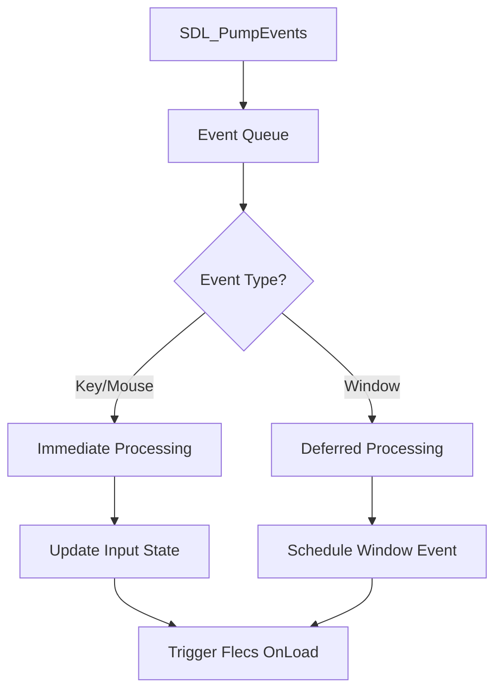
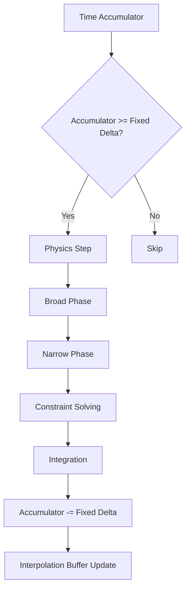
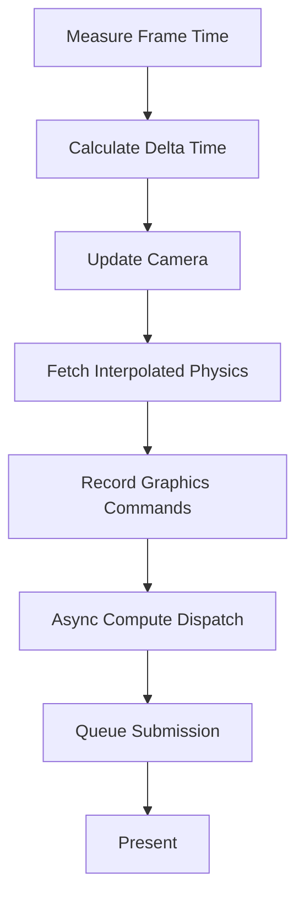
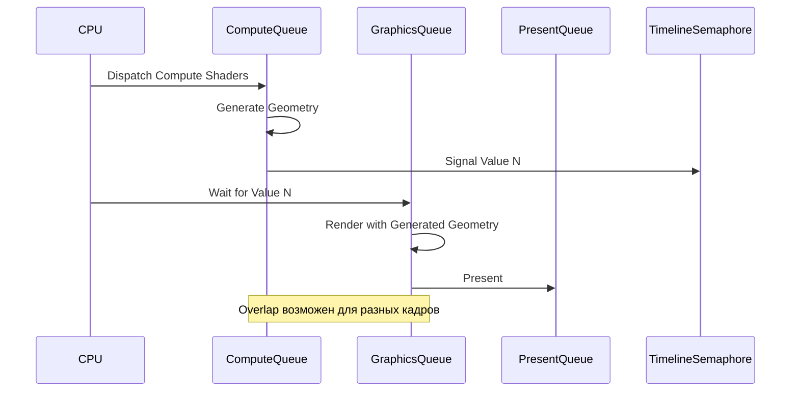
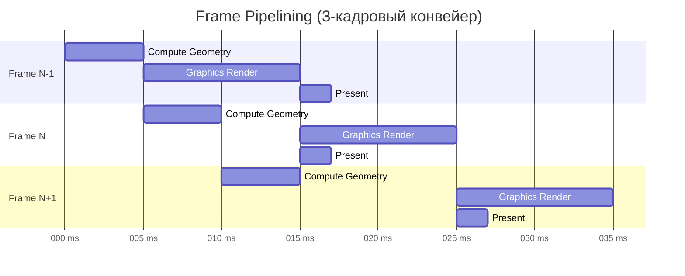
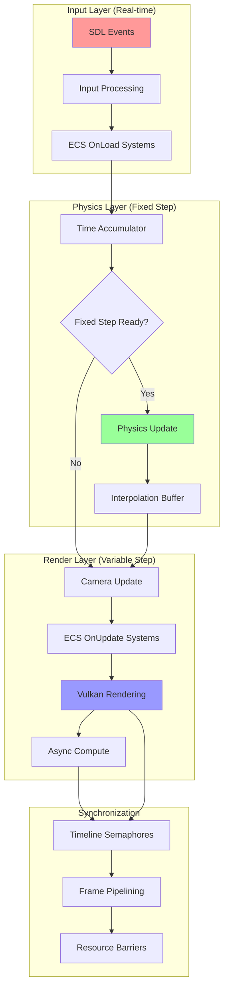
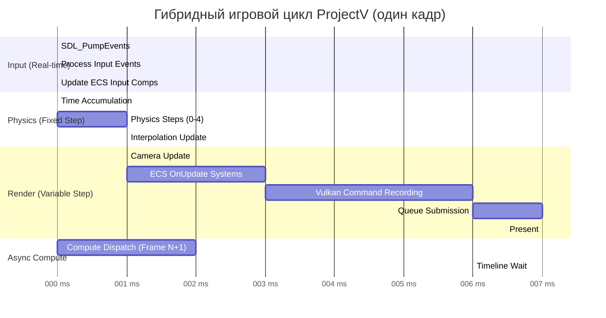

# Гибридный Игровой Цикл ProjectV

**🟡 Уровень 2: Средний** — Архитектурный документ ProjectV

## Введение

ProjectV использует **гибридный игровой цикл**, объединяющий три независимых подсистемы с разными требованиями к
времени:

1. **SDL Input** — обработка ввода в реальном времени (variable rate)
2. **Jolt Physics** — физические вычисления с фиксированным шагом (fixed step)
3. **Vulkan Render** — графический рендеринг с переменным шагом (variable step)

**Проблема традиционных подходов:** Физика, привязанная к частоте рендеринга, приводит к нестабильности симуляции (
особенно при низком FPS).

**Решение ProjectV:** Разделение временных доменов через аккумулятор времени и Timeline Semaphores.

---

## Архитектурные требования

### 1. Независимость подсистем

- **Input**: Должен обрабатываться немедленно (latency-critical)
- **Physics**: Должен работать с фиксированным шагом (stability-critical)
- **Render**: Должен адаптироваться к доступному времени (throughput-critical)

### 2. Предсказуемость

- Физика не должна зависеть от FPS
- Рендеринг не должен блокировать ввод
- Подсистемы должны работать параллельно при возможности

### 3. Синхронизация

- Данные между подсистемами должны быть согласованы
- Минимизация копирования данных
- Избегание race conditions

---

## Компоненты цикла

### SDL Input Handler



**Особенности для ProjectV:**

- Использование `SDL_MAIN_USE_CALLBACKS` для интеграции с Vulkan
- Immediate-mode обработка критичных ко времени событий (ввод)
- Deferred-mode обработка некритичных событий (окно)

### Jolt Physics Engine (Fixed Step)



**Параметры для ProjectV:**

- **Fixed Delta**: 16.67ms (60Hz) для игровой физики
- **Max Accumulation**: 3-4 шага (предотвращение spiral of death)
- **Interpolation**: Линейная интерполяция для высокого FPS мониторов

### Vulkan Renderer (Variable Step)



**Оптимизации для вокселей:**

- GPU-driven rendering через indirect draws
- Compute shaders для генерации геометрии
- Timeline semaphores для async compute

---

## Детальная реализация

### Структура AppState

```cpp
struct AppState {
    // SDL & Window
    SDL_Window* window = nullptr;

    // Flecs ECS
    flecs::world* ecs = nullptr;

    // Jolt Physics
    JPH::PhysicsSystem* physics = nullptr;
    JPH::BodyInterface* bodyInterface = nullptr;

    // Vulkan
    VkInstance instance = VK_NULL_HANDLE;
    VkDevice device = VK_NULL_HANDLE;
    VkQueue graphicsQueue = VK_NULL_HANDLE;
    VkQueue computeQueue = VK_NULL_HANDLE;

    // Timing
    uint64_t frameCounter = 0;
    double lastTime = 0.0;
    double accumulator = 0.0;
    const double fixedDelta = 1.0 / 60.0;  // 60Hz

    // Synchronization
    VkSemaphore graphicsTimelineSemaphore = VK_NULL_HANDLE;
    VkSemaphore computeTimelineSemaphore = VK_NULL_HANDLE;
    uint64_t graphicsTimelineValue = 0;
    uint64_t computeTimelineValue = 0;

    // Interpolation
    std::unordered_map<JPH::BodyID, Transform> prevTransforms;
    std::unordered_map<JPH::BodyID, Transform> currTransforms;
    float interpolationAlpha = 0.0f;
};
```

### Алгоритм гибридного цикла

```cpp
// Псевдокод основного цикла
void hybridGameLoop(AppState& state) {
    while (!shouldQuit) {
        // 1. Input Processing (Real-time)
        processSDLInput(state);

        // 2. Time Management
        double currentTime = getHighResolutionTime();
        double frameTime = currentTime - state.lastTime;
        state.lastTime = currentTime;

        // Clamp frame time to prevent spiral of death
        frameTime = std::min(frameTime, 0.25);

        // 3. Physics Accumulation
        state.accumulator += frameTime;

        // 4. Fixed-step Physics Updates
        while (state.accumulator >= state.fixedDelta) {
            // Сохраняем предыдущие трансформы для интерполяции
            state.prevTransforms = state.currTransforms;

            // Обновляем физику
            updatePhysics(state, state.fixedDelta);

            // Сохраняем текущие трансформы
            state.currTransforms = getPhysicsTransforms(state);

            state.accumulator -= state.fixedDelta;
        }

        // 5. Calculate Interpolation Alpha
        state.interpolationAlpha = state.accumulator / state.fixedDelta;

        // 6. Variable-step Rendering
        updateCamera(state, frameTime);
        renderFrame(state, frameTime);

        // 7. Async Compute (параллельно с рендерингом следующего кадра)
        dispatchAsyncCompute(state);
    }
}
```

---

## Синхронизация через Timeline Semaphores

### Проблема

- Compute shaders (генерация геометрии) и Graphics (рендеринг) должны работать параллельно
- Compute должен завершиться до использования его результатов в Graphics
- Graphics не должен ждать Compute дольше необходимого

### Решение: Timeline Semaphores

```cpp
// Инициализация
VkSemaphoreTypeCreateInfo timelineCreateInfo = {
    .sType = VK_STRUCTURE_TYPE_SEMAPHORE_TYPE_CREATE_INFO,
    .semaphoreType = VK_SEMAPHORE_TYPE_TIMELINE,
    .initialValue = 0
};

VkSemaphoreCreateInfo semaphoreInfo = {
    .sType = VK_STRUCTURE_TYPE_SEMAPHORE_CREATE_INFO,
    .pNext = &timelineCreateInfo
};

vkCreateSemaphore(device, &semaphoreInfo, nullptr, &state.graphicsTimelineSemaphore);
vkCreateSemaphore(device, &semaphoreInfo, nullptr, &state.computeTimelineSemaphore);

// Compute Queue Submission
VkSubmitInfo computeSubmitInfo = {
    .sType = VK_STRUCTURE_TYPE_SUBMIT_INFO,
    .signalSemaphoreCount = 1,
    .pSignalSemaphores = &state.computeTimelineSemaphore
};

uint64_t computeSignalValue = ++state.computeTimelineValue;
VkTimelineSemaphoreSubmitInfo computeTimelineInfo = {
    .sType = VK_STRUCTURE_TYPE_TIMELINE_SEMAPHORE_SUBMIT_INFO,
    .signalSemaphoreValueCount = 1,
    .pSignalSemaphoreValues = &computeSignalValue
};

computeSubmitInfo.pNext = &computeTimelineInfo;
vkQueueSubmit(computeQueue, 1, &computeSubmitInfo, VK_NULL_HANDLE);

// Graphics Queue Submission (ждёт compute)
uint64_t waitValue = state.computeTimelineValue;
VkSemaphoreWaitInfo waitInfo = {
    .sType = VK_STRUCTURE_TYPE_SEMAPHORE_WAIT_INFO,
    .semaphoreCount = 1,
    .pSemaphores = &state.computeTimelineSemaphore,
    .pValues = &waitValue
};

vkWaitSemaphores(device, &waitInfo, UINT64_MAX);

VkSubmitInfo graphicsSubmitInfo = { ... };
vkQueueSubmit(graphicsQueue, 1, &graphicsSubmitInfo, VK_NULL_HANDLE);
```

### Диаграмма синхронизации



---

## Пример кода

### Полная реализация SDL_AppIterate

```cpp
SDL_AppResult SDL_AppIterate(void* appstate) {
    AppState* state = static_cast<AppState*>(appstate);

    // 1. Input Processing
    SDL_Event event;
    while (SDL_PollEvent(&event)) {
        // Обработка немедленных событий
        if (event.type == SDL_EVENT_KEY_DOWN || event.type == SDL_EVENT_MOUSE_MOTION) {
            // Обновляем компоненты ввода в ECS
            flecs::entity inputEntity = state->ecs->entity("input");
            inputEntity.set<InputState>({
                .keys = getKeyboardState(),
                .mousePos = {event.motion.x, event.motion.y},
                .mouseButtons = getMouseButtonState()
            });
        }

        // Обработка отложенных событий
        if (event.type == SDL_EVENT_WINDOW_RESIZED) {
            // Планируем пересоздание swapchain
            scheduleSwapchainRecreation(state);
        }
    }

    // 2. Time Management
    static double lastTime = SDL_GetPerformanceCounter() / (double)SDL_GetPerformanceFrequency();
    double currentTime = SDL_GetPerformanceCounter() / (double)SDL_GetPerformanceFrequency();
    double frameTime = currentTime - lastTime;
    lastTime = currentTime;

    // Clamp для стабильности
    if (frameTime > 0.25) frameTime = 0.25;

    // 3. Physics Accumulation
    state->accumulator += frameTime;
    const double fixedDelta = 1.0 / 60.0;

    // 4. Fixed-step Physics (максимум 4 шага для предотвращения spiral of death)
    int physicsSteps = 0;
    while (state->accumulator >= fixedDelta && physicsSteps < 4) {
        // Обновляем предыдущие трансформы для интерполяции
        updatePreviousTransforms(state);

        // Шаг физики
        state->physics->Update(fixedDelta,
                               state->bodyInterface->GetMaxConcurrentJobs(),
                               state->bodyInterface->GetTempAllocator());

        // Обновляем текущие трансформы
        updateCurrentTransforms(state);

        state->accumulator -= fixedDelta;
        physicsSteps++;

        // Обновляем ECS компоненты физики
        updatePhysicsComponents(state);
    }

    // 5. Interpolation Alpha
    state->interpolationAlpha = state->accumulator / fixedDelta;

    // 6. ECS Systems (Variable-step)
    // Flecs системы выполняются с переменным шагом
    state->ecs->progress(static_cast<float>(frameTime));

    // 7. Rendering (Variable-step)
    renderFrame(state, frameTime);

    // 8. Async Compute для следующего кадра
    if (state->computeQueue != VK_NULL_HANDLE) {
        dispatchVoxelGenerationCompute(state);
    }

    return SDL_APP_CONTINUE;
}
```

### Интерполяция физических трансформов

```cpp
Transform getInterpolatedTransform(const AppState& state, JPH::BodyID bodyId) {
    auto prevIt = state.prevTransforms.find(bodyId);
    auto currIt = state.currTransforms.find(bodyId);

    if (prevIt == state.prevTransforms.end() || currIt == state.currTransforms.end()) {
        return currIt != state.currTransforms.end() ? currIt->second : Transform{};
    }

    // Линейная интерполяция
    const Transform& prev = prevIt->second;
    const Transform& curr = currIt->second;
    float alpha = state.interpolationAlpha;

    return Transform{
        .position = glm::mix(prev.position, curr.position, alpha),
        .rotation = glm::slerp(prev.rotation, curr.rotation, alpha),
        .scale = glm::mix(prev.scale, curr.scale, alpha)
    };
}
```

---

## Производительность и оптимизации

### 1. Memory Locality для ECS

```cpp
// Плохо: разрозненные компоненты
struct GameObject {
    Transform transform;
    PhysicsBody physics;
    RenderMesh mesh;
};

// Хорошо: SoA (Structure of Arrays) через Flecs
world.component<Transform>();
world.component<PhysicsBody>();
world.component<RenderMesh>();

// Системы обрабатывают компоненты в непрерывных массивах
world.system<Transform, PhysicsBody>()
    .kind(flecs::OnUpdate)
    .each( {
        // Обработка в cache-friendly режиме
    });
```

### 2. Parallel Processing

- **SDL Input**: Основной поток (latency-critical)
- **Jolt Physics**: Worker threads (через JPH::JobSystem)
- **Vulkan Compute**: Async compute queue
- **Vulkan Graphics**: Graphics queue

### 3. Frame Pipelining



### 4. Performance Metrics

| Метрика           | Целевое значение           | Мониторинг         |
|-------------------|----------------------------|--------------------|
| Physics Step Time | < 8ms (для 60Hz)           | Tracy CPU Profiler |
| Render Time       | < 16ms (для 60Hz)          | Tracy GPU Profiler |
| Input Latency     | < 16ms                     | SDL Event Timing   |
| CPU Utilization   | < 80% (оставить для ОС)    | System Metrics     |
| Memory Usage      | < 4GB для воксельного мира | VMA Statistics     |

---

## Интеграция с экосистемой ProjectV

### Flecs ECS Integration

```cpp
// Компоненты для игрового цикла
struct TimeComponent {
    double deltaTime;
    double totalTime;
    float interpolationAlpha;
};

struct InputComponent {
    std::array<bool, 512> keys;
    glm::vec2 mousePosition;
    std::array<bool, 8> mouseButtons;
};

// Системы с разными фазами
world.system<InputComponent>("ProcessInput")
    .kind(flecs::OnLoad)  // Выполняется первым
    .each(processInput);

world.system<PhysicsBody, Transform>("FixedUpdate")
    .kind(flecs::OnStore)  // Выполняется с фиксированным шагом
    .iter([fixedDelta](flecs::iter& it) {
        // Только когда требуется фиксированный шаг
        if (shouldDoFixedStep(it.world())) {
            for (auto i : it) {
                auto& pb = it.get<PhysicsBody>(i);
                auto& t = it.get<Transform>(i);
                updatePhysics(pb, t, fixedDelta);
            }
        }
    });

world.system<Transform, RenderMesh>("RenderUpdate")
    .kind(flecs::OnUpdate)  // Выполняется каждый кадр
    .each(updateRender);
```

### Tracy Profiling Integration

```cpp
// В SDL_AppIterate
ZoneScopedN("GameLoop");

{
    ZoneScopedN("InputProcessing");
    processSDLInput(state);
}

{
    ZoneScopedN("PhysicsUpdate");
    // Фиксированные шаги физики
    for (int i = 0; i < physicsSteps; i++) {
        ZoneScopedN("PhysicsStep");
        state->physics->Update(fixedDelta, ...);
    }
}

{
    ZoneScopedN("ECSSystems");
    state->ecs->progress(static_cast<float>(frameTime));
}

{
    ZoneScopedN("Rendering");
    FrameMarkStart("RenderFrame");
    renderFrame(state, frameTime);
    FrameMarkEnd("RenderFrame");
}
```

### Vulkan Timeline Semaphores

```cpp
// Инициализация в SDL_AppInit
void initTimelineSemaphores(AppState* state) {
    VkSemaphoreTypeCreateInfo timelineInfo = {
        .sType = VK_STRUCTURE_TYPE_SEMAPHORE_TYPE_CREATE_INFO,
        .semaphoreType = VK_SEMAPHORE_TYPE_TIMELINE
    };

    VkSemaphoreCreateInfo semaphoreInfo = {
        .sType = VK_STRUCTURE_TYPE_SEMAPHORE_CREATE_INFO,
        .pNext = &timelineInfo
    };

    vkCreateSemaphore(state->device, &semaphoreInfo, nullptr,
                      &state->graphicsTimelineSemaphore);
    vkCreateSemaphore(state->device, &semaphoreInfo, nullptr,
                      &state->computeTimelineSemaphore);
}

// Использование в рендерере
void waitForComputeAndRender(AppState* state) {
    // Ждём завершения compute шейдеров
    VkSemaphoreWaitInfo waitInfo = {
        .sType = VK_STRUCTURE_TYPE_SEMAPHORE_WAIT_INFO,
        .semaphoreCount = 1,
        .pSemaphores = &state->computeTimelineSemaphore,
        .pValues = &state->computeTimelineValue
    };

    vkWaitSemaphores(state->device, &waitInfo, UINT64_MAX);

    // Рендеринг
    renderWithGeneratedGeometry(state);

    // Сигналим graphics очередь
    state->graphicsTimelineValue++;
    VkSemaphoreSignalInfo signalInfo = {
        .sType = VK_STRUCTURE_TYPE_SEMAPHORE_SIGNAL_INFO,
        .semaphore = state->graphicsTimelineSemaphore,
        .value = state->graphicsTimelineValue
    };

    vkSignalSemaphore(state->device, &signalInfo);
}
```

---

## Типичные проблемы и решения

### Проблема 1: Spiral of Death

**Симптомы:** При низком FPS физика пытается "нагнать" время, выполняя множество шагов, что ещё больше снижает FPS.

**Решение:**

```cpp
// Ограничение максимального количества шагов физики
const int MAX_PHYSICS_STEPS_PER_FRAME = 4;

while (accumulator >= fixedDelta && physicsSteps < MAX_PHYSICS_STEPS_PER_FRAME) {
    updatePhysics(fixedDelta);
    accumulator -= fixedDelta;
    physicsSteps++;
}

// Если накопилось слишком много времени - сброс
if (physicsSteps == MAX_PHYSICS_STEPS_PER_FRAME && accumulator > fixedDelta * 4) {
    accumulator = fixedDelta * 2;  // Сохраняем некоторую интерполяцию
    SDL_LogWarn(SDL_LOG_CATEGORY_APPLICATION,
                "Physics falling behind, resetting accumulator");
}
```

### Проблема 2: Input Lag при высокой нагрузке

**Симптомы:** Задержка между нажатием клавиши и реакцией игры.

**Решение:**

```cpp
// Выделение input processing в отдельную высокоприоритетную фазу
void processInputHighPriority(AppState* state) {
    // 1. Немедленная обработка
    SDL_PumpEvents();

    // 2. Обновление состояния ввода до physics/rendering
    updateInputComponents(state);

    // 3. Применение ввода к physics bodies
    applyInputToPhysics(state);
}

// В основном цикле - обрабатываем ввод ДО физики
processInputHighPriority(state);
updatePhysics(state);
renderFrame(state);
```

### Проблема 3: Tearing при variable refresh rate

**Симптомы:** Разрывы изображения при изменении частоты кадров.

**Решение:**

```cpp
// Использование VK_PRESENT_MODE_MAILBOX_KHR для минимальной задержки
// или VK_PRESENT_MODE_FIFO_RELAXED_KHR для VRR

VkPresentModeKHR choosePresentMode(const std::vector<VkPresentModeKHR>& modes) {
    // Предпочтения для ProjectV
    for (VkPresentModeKHR mode : modes) {
        if (mode == VK_PRESENT_MODE_MAILBOX_KHR) {
            return mode;  // Минимальная задержка
        }
    }

    for (VkPresentModeKHR mode : modes) {
        if (mode == VK_PRESENT_MODE_FIFO_RELAXED_KHR) {
            return mode;  // Поддержка VRR
        }
    }

    return VK_PRESENT_MODE_FIFO_KHR;  // Гарантированная работа
}
```

### Проблема 4: Stuttering при загрузке ресурсов

**Симптомы:** Проседание FPS при загрузке текстур/моделей.

**Решение:**

```cpp
// Async resource loading с приоритизацией
class ResourceLoader {
public:
    void loadAsync(const std::string& path, ResourcePriority priority) {
        // Добавляем в очередь с приоритетом
        loadingQueue_.emplace(priority, path);

        // Запускаем worker thread если не запущен
        if (!workerThread_.joinable()) {
            workerThread_ = std::thread(&ResourceLoader::workerThread, this);
        }
    }

    void processCompletedLoads() {
        // Обрабатываем только в начале кадра
        // Ограничиваем время обработки (например, 2ms)
        auto startTime = std::chrono::high_resolution_clock::now();

        while (!completedQueue_.empty()) {
            auto resource = completedQueue_.pop();
            uploadToGPU(resource);

            auto currentTime = std::chrono::high_resolution_clock::now();
            auto elapsed = std::chrono::duration_cast<std::chrono::milliseconds>(
                currentTime - startTime);

            if (elapsed.count() > 2) {
                break;  // Прерываем чтобы не вызывать stutter
            }
        }
    }
};
```

---

## Диаграммы

### Полная архитектура гибридного цикла



### Временная диаграмма кадра



---

## Критерии успешной реализации

### Обязательные

- [ ] Физика работает с фиксированным шагом 60Hz независимо от FPS
- [ ] Ввод обрабатывается с задержкой < 16ms
- [ ] Интерполяция трансформов работает плавно
- [ ] Timeline Semaphores обеспечивают правильную синхронизацию
- [ ] Spiral of death предотвращается (максимум 4 шага физики за кадр)

### Опциональные (рекомендуемые)

- [ ] Frame pipelining (3+ кадра в конвейере)
- [ ] Async compute для генерации геометрии
- [ ] Tracy profiling для всех компонентов цикла
- [ ] Поддержка VRR (Variable Refresh Rate)

