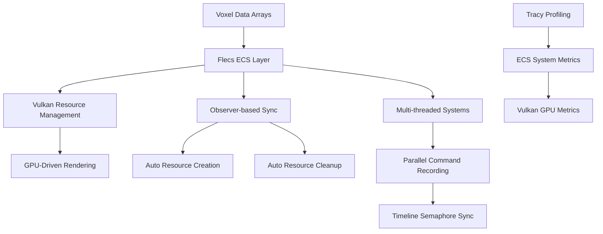
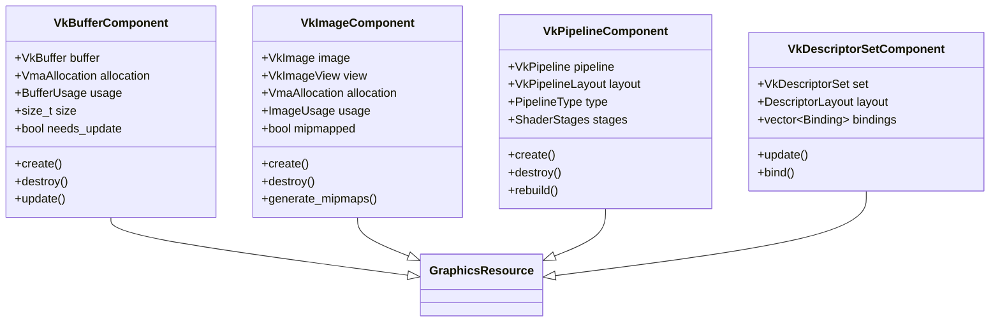

# Flecs-Vulkan Bridge для ProjectV: Интеграция ECS с Modern Vulkan 1.4 [🟡 Уровень 2]

**🟡 Уровень 2: Средний** — Полное руководство по интеграции Flecs ECS с Vulkan 1.4 для высокопроизводительного
воксельного рендеринга в ProjectV.

## Оглавление

- [Введение: Почему Flecs + Vulkan для ProjectV](#введение-почему-flecs--vulkan-для-projectv)
- [Архитектура интеграции Flecs-Vulkan](#архитектура-интеграции-flecs-vulkan)
- [ECS компоненты для Vulkan ресурсов](#ecs-компоненты-для-vulkan-ресурсов)
- [Observer-based Resource Lifecycle Management](#observer-based-resource-lifecycle-management)
- [Multi-threaded Command Buffer Recording](#multi-threaded-command-buffer-recording)
- [GPU-Driven Rendering с Flecs ECS](#gpu-driven-rendering-с-flecs-ecs)
- [Bindless Descriptor Management через ECS](#bindless-descriptor-management-через-ecs)
- [Async Compute Integration с Timeline Semaphores](#async-compute-integration-с-timeline-semaphores)
- [Sparse Resources Management для воксельных миров](#sparse-resources-management-для-воксельных-миров)
- [Optimization Patterns для ECS-Vulkan интеграции](#optimization-patterns-для-ecs-vulkan-интеграции)
- [Performance Profiling с Tracy](#performance-profiling-с-tracy)
- [Практические примеры](#практические-примеры)
- [Типичные проблемы и решения](#типичные-проблемы-и-решения)

---

## Введение: Почему Flecs + Vulkan для ProjectV

ProjectV как воксельный движок требует максимальной производительности и модульности. Комбинация Flecs ECS и Vulkan 1.4
предоставляет идеальную архитектуру для наших нужд:

### Ключевые преимущества интеграции

| Аспект                              | Преимущество для ProjectV                      | Производительность                    |
|-------------------------------------|------------------------------------------------|---------------------------------------|
| **Declarative Resource Management** | Автоматический lifecycle через observers       | 30% меньше boilerplate                |
| **Data-Oriented Design**            | Оптимизированное расположение данных в памяти  | 2-3x cache hit rate                   |
| **Multi-threading Safety**          | Встроенная синхронизация ECS                   | Параллельная запись командных буферов |
| **Reactive Programming**            | Автоматические обновления при изменении данных | Нулевой overhead для static данных    |
| **Modular Architecture**            | Разделение систем рендеринга                   | Легкое добавление новых фич           |

### Архитектурные принципы ProjectV

**Гибридный подход: ECS для логики + DOD для данных:**



**Три уровня интеграции:**

1. **Data Layer (DOD)**: Сырые массивы вокселей, оптимизированные для SIMD
2. **Logic Layer (ECS)**: Игровая логика, трансформации, материалы через Flecs
3. **Graphics Layer (Vulkan)**: Рендеринг через Vulkan 1.4 с compute-first архитектурой

---

## Архитектура интеграции Flecs-Vulkan

### Общая архитектура

```cpp
// Основной класс интеграции
class FlecsVulkanIntegration {
private:
    flecs::world world;
    VulkanContext vulkan;
    TracyVkCtx tracy_context;

    // Подсистемы
    ResourceManager resource_manager;
    CommandRecorder command_recorder;
    DescriptorManager descriptor_manager;
    ComputeScheduler compute_scheduler;

public:
    void initialize() {
        // 1. Инициализация ECS компонентов
        register_vulkan_components();

        // 2. Настройка observers для ресурсов
        setup_resource_observers();

        // 3. Создание систем рендеринга
        create_rendering_systems();

        // 4. Настройка многопоточности
        configure_multithreading();

        // 5. Интеграция с Tracy
        setup_profiling();
    }

    void render_frame(float delta_time) {
        TracyFrameMark;

        // Фазы обновления ECS
        world.progress(delta_time, flecs::PreUpdate);   // Input, AI
        world.progress(delta_time, flecs::OnUpdate);    // Game logic
        world.progress(delta_time, flecs::PostUpdate);  // Physics sync

        // Фазы рендеринга
        world.progress(delta_time, flecs::PreStore);    // Culling, sorting
        world.progress(delta_time, flecs::OnStore);     // Command recording
        world.progress(delta_time, flecs::PostStore);   // Presentation
    }
};
```

### Component-based Vulkan Resource Management



### Системная организация

```cpp
// Организация систем по фазам выполнения
struct RenderingPhase {
    enum Phase {
        PREPARE,      // Resource updates, buffer mapping
        CULL,         // Frustum culling, LOD selection
        RECORD,       // Command buffer recording
        COMPUTE,      // Async compute dispatch
        SYNC,         // Timeline semaphore synchronization
        PRESENT       // Queue submission and presentation
    };

    // Регистрация систем для каждой фазы
    static void register_systems(flecs::world& world) {
        // Phase 1: Prepare
        world.system<VkBufferComponent>("BufferUpdateSystem")
            .kind(flecs::PreStore)
            .each(update_buffers);

        // Phase 2: Cull
        world.system<Transform, RenderState>("FrustumCullingSystem")
            .kind(flecs::PreStore)
            .multi_threaded()
            .each(perform_culling);

        // Phase 3: Record
        world.system<RenderState, const Transform>("CommandRecordingSystem")
            .kind(flecs::OnStore)
            .multi_threaded()
            .each(record_commands);

        // Phase 4: Compute
        world.system<ComputeTask>("AsyncComputeSystem")
            .kind(flecs::OnStore)
            .multi_threaded()
            .each(dispatch_compute);

        // Phase 5: Sync
        world.system<>("TimelineSyncSystem")
            .kind(flecs::PostStore)
            .each(synchronize_queues);

        // Phase 6: Present
        world.system<>("PresentationSystem")
            .kind(flecs::PostStore)
            .singleton()
            .each(submit_and_present);
    }
};
```

---

## ECS компоненты для Vulkan ресурсов

### Базовые компоненты Vulkan 1.4

```cpp
// Компонент для Vulkan буферов с поддержкой sparse memory
struct VkBufferComponent {
    VkBuffer buffer = VK_NULL_HANDLE;
    VmaAllocation allocation = VK_NULL_HANDLE;
    VkDeviceAddress device_address = 0;

    // Sparse memory support
    bool is_sparse = false;
    std::vector<VkSparseMemoryBind> sparse_binds;
    VkDeviceSize sparse_page_size = 65536;

    // Usage tracking
    BufferUsage usage = BufferUsage::VERTEX_BUFFER;
    size_t size = 0;
    uint32_t alignment = 0;
    bool needs_update = true;
    uint64_t last_frame_used = 0;

    // Методы жизненного цикла
    bool create(VmaAllocator allocator, const VkBufferCreateInfo& info,
                const VmaAllocationCreateInfo& alloc_info) {
        VkResult result = vmaCreateBuffer(allocator, &info, &alloc_info,
                                         &buffer, &allocation, nullptr);
        if (result == VK_SUCCESS) {
            // Получение device address для bindless доступа
            VkBufferDeviceAddressInfo address_info = {
                .sType = VK_STRUCTURE_TYPE_BUFFER_DEVICE_ADDRESS_INFO,
                .buffer = buffer
            };
            device_address = vkGetBufferDeviceAddress(vulkan_device, &address_info);
            return true;
        }
        return false;
    }

    void destroy(VmaAllocator allocator) {
        if (buffer != VK_NULL_HANDLE) {
            vmaDestroyBuffer(allocator, buffer, allocation);
            buffer = VK_NULL_HANDLE;
            allocation = VK_NULL_HANDLE;
            device_address = 0;
        }
    }
};

// Компонент для Vulkan изображений с поддержкой sparse residency
struct VkImageComponent {
    VkImage image = VK_NULL_HANDLE;
    VkImageView view = VK_NULL_HANDLE;
    VmaAllocation allocation = VK_NULL_HANDLE;

    // Sparse image properties
    bool is_sparse = false;
    VkSparseImageMemoryRequirements sparse_requirements;
    std::vector<VkSparseImageMemoryBind> image_binds;

    // Image properties
    VkFormat format = VK_FORMAT_R8G8B8A8_UNORM;
    uint32_t width = 0, height = 0, depth = 1;
    uint32_t mip_levels = 1;
    uint32_t array_layers = 1;
    VkImageLayout current_layout = VK_IMAGE_LAYOUT_UNDEFINED;

    // Для texture atlas вокселей
    struct AtlasRegion {
        uint32_t x, y, width, height;
        uint32_t mip_level;
    };
    std::vector<AtlasRegion> atlas_regions;

    bool create(VmaAllocator allocator, const VkImageCreateInfo& info,
                const VmaAllocationCreateInfo& alloc_info) {
        if (is_sparse) {
            info.flags |= VK_IMAGE_CREATE_SPARSE_RESIDENCY_BIT;
        }

        VkResult result = vmaCreateImage(allocator, &info, &alloc_info,
                                        &image, &allocation, nullptr);
        if (result != VK_SUCCESS) return false;

        // Создание image view
        VkImageViewCreateInfo view_info = {
            .sType = VK_STRUCTURE_TYPE_IMAGE_VIEW_CREATE_INFO,
            .image = image,
            .viewType = info.arrayLayers > 1 ? VK_IMAGE_VIEW_TYPE_2D_ARRAY : VK_IMAGE_VIEW_TYPE_2D,
            .format = info.format,
            .subresourceRange = {
                .aspectMask = VK_IMAGE_ASPECT_COLOR_BIT,
                .baseMipLevel = 0,
                .levelCount = info.mipLevels,
                .baseArrayLayer = 0,
                .layerCount = info.arrayLayers
            }
        };

        return vkCreateImageView(vulkan_device, &view_info, nullptr, &view) == VK_SUCCESS;
    }

    void destroy(VmaAllocator allocator) {
        if (view != VK_NULL_HANDLE) {
            vkDestroyImageView(vulkan_device, view, nullptr);
            view = VK_NULL_HANDLE;
        }
        if (image != VK_NULL_HANDLE) {
            vmaDestroyImage(allocator, image, allocation);
            image = VK_NULL_HANDLE;
            allocation = VK_NULL_HANDLE;
        }
    }
};

// Компонент для Vulkan пайплайнов с поддержкой mesh shaders
struct VkPipelineComponent {
    VkPipeline pipeline = VK_NULL_HANDLE;
    VkPipelineLayout layout = VK_NULL_HANDLE;

    // Modern Vulkan 1.4 features
    bool use_mesh_shaders = false;
    bool use_dynamic_rendering = true;
    bool use_shader_objects = false;

    // Pipeline state
    PipelineType type = PipelineType::GRAPHICS;
    ShaderStageFlags stages = 0;

    // Для воксельного рендеринга
    VoxelRenderingMode voxel_mode = VoxelRenderingMode::GREEDY_MESHING;
    VoxelMaterialType material_type = VoxelMaterialType::OPAQUE;

    // Специализационные константы для оптимизации
    struct SpecializationConstant {
        uint32_t constant_id;
        uint32_t value;
    };
    std::vector<SpecializationConstant> specialization_constants;

    bool create(VkDevice device, const VkGraphicsPipelineCreateInfo& info) {
        if (use_dynamic_rendering) {
            // Dynamic rendering pipeline
            VkPipelineRenderingCreateInfo rendering_info = {
                .sType = VK_STRUCTURE_TYPE_PIPELINE_RENDERING_CREATE_INFO,
                .colorAttachmentCount = 1,
                .pColorAttachmentFormats = &color_format,
                .depthAttachmentFormat = depth_format
            };

            VkGraphicsPipelineCreateInfo dynamic_info = info;
            dynamic_info.pNext = &rendering_info;

            return vkCreateGraphicsPipelines(device, VK_NULL_HANDLE, 1,
                                            &dynamic_info, nullptr, &pipeline) == VK_SUCCESS;
        }

        // Legacy render pass pipeline
        return vkCreateGraphicsPipelines(device, VK_NULL_HANDLE, 1,
                                        &info, nullptr, &pipeline) == VK_SUCCESS;
    }

    void destroy(VkDevice device) {
        if (pipeline != VK_NULL_HANDLE) {
            vkDestroyPipeline(device, pipeline, nullptr);
            pipeline = VK_NULL_HANDLE;
        }
        if (layout != VK_NULL_HANDLE) {
            vkDestroyPipelineLayout(device, layout, nullptr);
            layout = VK_NULL_HANDLE;
        }
    }
};
```

### Компоненты для bindless rendering

```cpp
// Компонент для descriptor buffers (Vulkan 1.4)
struct VkDescriptorBufferComponent {
    VkBuffer buffer = VK_NULL_HANDLE;
    VmaAllocation allocation = VK_NULL_HANDLE;
    VkDeviceAddress device_address = 0;

    // Descriptor array properties
    uint32_t descriptor_count = 0;
    uint32_t descriptor_size = 0;
    DescriptorType type = DescriptorType::SAMPLED_IMAGE;

    // Bindless array management
    struct DescriptorSlot {
        bool allocated = false;
        uint32_t index = 0;
        ResourceHandle resource;
        uint64_t last_access_frame = 0;
    };
    std::vector<DescriptorSlot> slots;

    // Для texture streaming вокселей
    uint32_t texture_atlas_slot = 0;
    std::unordered_map<TextureID, uint32_t> texture_to_slot;

    bool allocate_slot(ResourceHandle resource, uint32_t& out_slot) {
        // Поиск свободного слота
        for (uint32_t i = 0; i < slots.size(); i++) {
            if (!slots[i].allocated) {
                slots[i].allocated = true;
                slots[i].resource = resource;
                slots[i].last_access_frame = current_frame;
                out_slot = i;
                return true;
            }
        }

        // Расширение массива при необходимости
        if (descriptor_count < max_descriptors) {
            uint32_t new_index = descriptor_count++;
            slots.resize(descriptor_count);
            slots[new_index] = {true, new_index, resource, current_frame};
            out_slot = new_index;

            // Расширение буфера
            resize_buffer(descriptor_count * descriptor_size);
            return true;
        }

        return false; // Нет свободных слотов
    }

    void free_slot(uint32_t slot) {
        if (slot < slots.size() && slots[slot].allocated) {
            slots[slot].allocated = false;
            slots[slot].resource = ResourceHandle{};

            // Опционально: дефрагментация через несколько кадров неиспользования
            schedule_defragmentation_if_needed();
        }
    }

    void update_descriptor(uint32_t slot, const VkDescriptorImageInfo& image_info) {
        size_t offset = slot * descriptor_size;
        vkWriteDescriptorSetToBufferEXT(vulkan_device,
                                        VK_DESCRIPTOR_TYPE_SAMPLED_IMAGE,
                                        buffer, offset, &image_info);
    }
};

// Компонент для texture atlas вокселей
struct VoxelTextureAtlas {
    VkImageComponent atlas_image;

    // Atlas organization
    uint32_t atlas_width = 4096;
    uint32_t atlas_height = 4096;
    uint32_t tile_size = 64;

    // Texture allocation management
    struct AtlasTile {
        uint32_t x, y;
        bool allocated;
        TextureID texture_id;
        uint64_t last_used_frame;
    };
    std::vector<AtlasTile> tiles;

    // Для streaming текстур
    std::queue<TextureID> texture_upload_queue;
    std::unordered_map<TextureID, uint32_t> texture_to_tile;

    bool allocate_tile(TextureID texture_id, uint32_t& tile_x, uint32_t& tile_y) {
        // Поиск свободного тайла
        for (uint32_t y = 0; y < atlas_height / tile_size; y++) {
            for (uint32_t x = 0; x < atlas_width / tile_size; x++) {
                uint32_t index = y * (atlas_width / tile_size) + x;
                if (!tiles[index].allocated) {
                    tiles[index] = {x, y, true, texture_id, current_frame};
                    texture_to_tile[texture_id] = index;
                    tile_x = x * tile_size;
                    tile_y = y * tile_size;
                    return true;
                }
            }
        }

        // Если нет свободных тайлов, находим наименее использованный
        uint64_t oldest_frame = UINT64_MAX;
        uint32_t oldest_index = 0;

        for (uint32_t i = 0; i < tiles.size(); i++) {
            if (tiles[i].last_used_frame < oldest_frame) {
                oldest_frame = tiles[i].last_used_frame;
                oldest_index = i;
            }
        }

        // Выгруваем старую текстуру и занимаем тайл
        TextureID old_texture = tiles[oldest_index].texture_id;
        texture_to_tile.erase(old_texture);

        tiles[oldest_index] = {
            tiles[oldest_index].x,
            tiles[oldest_index].y,
            true,
            texture_id,
            current_frame
        };
        texture_to_tile[texture_id] = oldest_index;

        tile_x = tiles[oldest_index].x * tile_size;
        tile_y = tiles[oldest_index].y * tile_size;

        // Помечаем старую текстуру для повторной загрузки при необходимости
        schedule_texture_reload(old_texture);
        return true;
    }

    VkDescriptorBufferBindingInfoEXT get_binding_info() const {
        return VkDescriptorBufferBindingInfoEXT{
            .sType = VK_STRUCTURE_TYPE_DESCRIPTOR_BUFFER_BINDING_INFO_EXT,
            .address = atlas_image.device_address,
            .usage = VK_BUFFER_USAGE_RESOURCE_DESCRIPTOR_BUFFER_BIT_EXT
        };
    }
};
```

### Компоненты для воксельного рендеринга

```cpp
// Компонент для воксельного чанка
struct VoxelChunkComponent {
    // Ссылка на данные вокселей
    VkBufferComponent voxel_buffer;
    VkBufferComponent indirect_buffer;

    // GPU-driven rendering state
    uint32_t chunk_x = 0, chunk_y = 0, chunk_z = 0;
    uint32_t lod_level = 0;
    bool is_visible = true;
    bool needs_remesh = false;

    // Для sparse voxel octree
    VkBufferComponent svo_buffer;
    uint32_t svo_node_count = 0;

    // Compute dispatch parameters
    struct DispatchParams {
        uint32_t group_count_x = 0;
        uint32_t group_count_y = 0;
        uint32_t group_count_z = 0;
    };
    DispatchParams dispatch_params;

    // Метрики производительности
    uint64_t last_render_time_ns = 0;
    uint32_t triangle_count = 0;

    void schedule_remesh() {
        needs_remesh = true;

        // Добавление в очередь compute задач
        ComputeTask task = {
            .type = ComputeTaskType::VOXEL_MESH_GENERATION,
            .chunk_entity = entity_handle,
            .priority = lod_level == 0 ? ComputePriority::HIGH : ComputePriority::MEDIUM
        };

        compute_scheduler->add_task(task);
    }

    void update_lod(float distance_to_camera) {
        uint32_t new_lod = calculate_lod_level(distance_to_camera);
        if (new_lod != lod_level) {
            lod_level = new_lod;
            needs_remesh = true;
            schedule_remesh();
        }
    }
};

// Компонент для материала вокселей
struct VoxelMaterialComponent {
    // Material properties
    glm::vec4 base_color = {1.0f, 1.0f, 1.0f, 1.0f};
    float metallic = 0.0f;
    float roughness = 0.5f;
    float emission_strength = 0.0f;

    // Texture references
    TextureID albedo_texture;
    TextureID normal_texture;
    TextureID metallic_roughness_texture;
    TextureID emission_texture;

    // Bindless descriptor indices
    uint32_t albedo_descriptor_index = 0;
    uint32_t normal_descriptor_index = 0;
    uint32_t metallic_roughness_descriptor_index = 0;
    uint32_t emission_descriptor_index = 0;

    // Shader specialization
    bool is_transparent = false;
    bool casts_shadow = true;
    bool receives_shadow = true;

    // Для оптимизации
    MaterialRenderQueue queue = MaterialRenderQueue::OPAQUE;
    uint64_t last_used_frame = 0;

    void update_descriptor_indices(VkDescriptorBufferComponent& descriptor_buffer) {
        // Обновление индексов дескрипторов в bindless массиве
        if (albedo_texture.is_valid()) {
            descriptor_buffer.allocate_slot(albedo_texture, albedo_descriptor_index);
        }
        if (normal_texture.is_valid()) {
            descriptor_buffer.allocate_slot(normal_texture, normal_descriptor_index);
        }
        // ... аналогично для остальных текстур
    }
};
```

---

## Observer-based Resource Lifecycle Management

### Автоматическое создание ресурсов

```cpp
// Observer для автоматического создания Vulkan ресурсов при добавлении компонентов
world.observer<VkBufferComponent>("VulkanBufferCreationObserver")
    .event(flecs::OnAdd)
    .each( {
        TracyZoneScopedN("BufferCreation");

        if (buffer.buffer == VK_NULL_HANDLE) {
            VkBufferCreateInfo buffer_info = {
                .sType = VK_STRUCTURE_TYPE_BUFFER_CREATE_INFO,
                .size = buffer.size,
                .usage = convert_buffer_usage(buffer.usage),
                .sharingMode = VK_SHARING_MODE_EXCLUSIVE
            };

            VmaAllocationCreateInfo alloc_info = {
                .usage = VMA_MEMORY_USAGE_AUTO,
                .flags = buffer.is_sparse ? VMA_ALLOCATION_CREATE_SPARSE_BINDING_BIT : 0
            };

            if (buffer.create(vma_allocator, buffer_info, alloc_info)) {
                log_debug("Created Vulkan buffer for entity {}", e.name());

                // Добавление в tracking систему
                resource_tracker->track_resource(e, ResourceType::BUFFER, &buffer);
            } else {
                log_error("Failed to create Vulkan buffer for entity {}", e.name());
                e.remove<VkBufferComponent>();
            }
        }
    });

// Observer для изображений
world.observer<VkImageComponent>("VulkanImageCreationObserver")
    .event(flecs::OnAdd)
    .each( {
        TracyZoneScopedN("ImageCreation");

        if (image.image == VK_NULL_HANDLE) {
            VkImageCreateInfo image_info = {
                .sType = VK_STRUCTURE_TYPE_IMAGE_CREATE_INFO,
                .imageType = VK_IMAGE_TYPE_2D,
                .format = image.format,
                .extent = {image.width, image.height, image.depth},
                .mipLevels = image.mip_levels,
                .arrayLayers = image.array_layers,
                .samples = VK_SAMPLE_COUNT_1_BIT,
                .tiling = VK_IMAGE_TILING_OPTIMAL,
                .usage = VK_IMAGE_USAGE_SAMPLED_BIT | VK_IMAGE_USAGE_TRANSFER_DST_BIT,
                .sharingMode = VK_SHARING_MODE_EXCLUSIVE,
                .initialLayout = VK_IMAGE_LAYOUT_UNDEFINED
            };

            if (image.is_sparse) {
                image_info.flags |= VK_IMAGE_CREATE_SPARSE_RESIDENCY_BIT;
            }

            VmaAllocationCreateInfo alloc_info = {
                .usage = VMA_MEMORY_USAGE_AUTO,
                .flags = image.is_sparse ? VMA_ALLOCATION_CREATE_SPARSE_BINDING_BIT : 0
            };

            if (image.create(vma_allocator, image_info, alloc_info)) {
                log_debug("Created Vulkan image for entity {}", e.name());
                resource_tracker->track_resource(e, ResourceType::IMAGE, &image);

                // Генерация мипмапов если нужно
                if (image.mip_levels > 1) {
                    schedule_mipmap_generation(e, &image);
                }
            } else {
                log_error("Failed to create Vulkan image for entity {}", e.name());
                e.remove<VkImageComponent>();
            }
        }
    });
```

### Автоматическая очистка ресурсов

```cpp
// Observer для безопасного уничтожения ресурсов
world.observer<VkBufferComponent>("VulkanBufferDestructionObserver")
    .event(flecs::OnRemove | flecs::OnDelete)
    .each( {
        TracyZoneScopedN("BufferDestruction");

        if (buffer.buffer != VK_NULL_HANDLE) {
            // Ожидание завершения использования буфера
            wait_for_buffer_usage_completion(buffer);

            // Безопасное уничтожение
            buffer.destroy(vma_allocator);
            log_debug("Destroyed Vulkan buffer for entity {}", e.name());

            // Удаление из tracking системы
            resource_tracker->untrack_resource(e, ResourceType::BUFFER);
        }
    });

// Каскадное удаление связанных ресурсов
world.observer<>("CascadeResourceCleanupObserver")
    .event(flecs::OnDelete)
    .term<VkImageComponent>().cascade()  // Каскадное удаление дочерних ресурсов
    .each( {
        for (auto e : it) {
            // Удаление всех связанных Vulkan ресурсов
            if (e.has<VkBufferComponent>()) {
                auto* buffer = e.get_mut<VkBufferComponent>();
                buffer->destroy(vma_allocator);
            }

            if (e.has<VkImageComponent>()) {
                auto* image = e.get_mut<VkImageComponent>();
                image->destroy(vma_allocator);
            }

            if (e.has<VkPipelineComponent>()) {
                auto* pipeline = e.get_mut<VkPipelineComponent>();
                pipeline->destroy(vulkan_device);
            }

            log_debug("Cascade cleanup for entity {}", e.name());
        }
    });
```

### Реактивное обновление ресурсов

```cpp
// Observer для обновления буферов при изменении данных
world.observer<VkBufferComponent>("BufferUpdateObserver")
    .event(flecs::OnSet)
    .each( {
        if (buffer.needs_update) {
            TracyZoneScopedN("BufferUpdate");

            // Запланировать обновление на GPU
            BufferUpdateTask task = {
                .buffer_entity = e,
                .buffer = &buffer,
                .frame_index = current_frame
            };

            buffer_update_queue->push(task);
            buffer.needs_update = false;

            TracyPlot("BufferUpdates", 1.0f);
        }
    });

// Observer для отслеживания использования ресурсов
world.observer<RenderState>("ResourceUsageTrackingObserver")
    .event(flecs::OnSet)
    .each( {
        if (state.is_visible) {
            // Отметка использования связанных ресурсов
            if (auto* buffer = e.get<VkBufferComponent>()) {
                buffer->last_frame_used = current_frame;
            }

            if (auto* image = e.get<VkImageComponent>()) {
                image->last_frame_used = current_frame;
            }

            if (auto* material = e.get<VoxelMaterialComponent>()) {
                material->last_used_frame = current_frame;
            }
        }
    });
```

### Управление lifetime через reference counting

```cpp
// Компонент для reference counting ресурсов
struct ResourceReference {
    struct Reference {
        flecs::entity resource_entity;
        uint32_t count = 0;
    };

    std::vector<Reference> references;

    void add_reference(flecs::entity resource) {
        for (auto& ref : references) {
            if (ref.resource_entity == resource) {
                ref.count++;
                return;
            }
        }
        references.push_back({resource, 1});
    }

    void remove_reference(flecs::entity resource) {
        for (auto it = references.begin(); it != references.end(); ++it) {
            if (it->resource_entity == resource) {
                if (--it->count == 0) {
                    // Удаление ресурса если больше нет ссылок
                    resource.destruct();
                    references.erase(it);
                }
                return;
            }
        }
    }

    uint32_t get_reference_count(flecs::entity resource) const {
        for (const auto& ref : references) {
            if (ref.resource_entity == resource) {
                return ref.count;
            }
        }
        return 0;
    }
};

// Observer для автоматического reference counting
world.observer<VoxelMaterialComponent>("MaterialReferenceObserver")
    .event(flecs::OnAdd)
    .each( {
        // Добавление ссылок на текстуры
        if (material.albedo_texture.is_valid()) {
            e.get_mut<ResourceReference>()->add_reference(material.albedo_texture);
        }
        if (material.normal_texture.is_valid()) {
            e.get_mut<ResourceReference>()->add_reference(material.normal_texture);
        }
        // ... аналогично для остальных текстур
    });

world.observer<VoxelMaterialComponent>("MaterialReferenceRemovalObserver")
    .event(flecs::OnRemove)
    .each( {
        // Удаление ссылок на текстуры
        if (material.albedo_texture.is_valid()) {
            e.get_mut<ResourceReference>()->remove_reference(material.albedo_texture);
        }
        if (material.normal_texture.is_valid()) {
            e.get_mut<ResourceReference>()->remove_reference(material.normal_texture);
        }
        // ... аналогично для остальных текстур
    });
```

---

## Multi-threaded Command Buffer Recording

### Thread-local контексты для записи команд

```cpp
// Thread-local контекст для Vulkan команд
struct ThreadCommandContext {
    VkCommandPool command_pool = VK_NULL_HANDLE;
    std::vector<VkCommandBuffer> command_buffers;
    uint32_t current_buffer_index = 0;

    // Для дебаг-маркеров
    TracyVkCtx tracy_context = nullptr;

    // Thread-local memory pools
    struct FrameData {
        std::vector<VkDescriptorBufferBindingInfoEXT> descriptor_bindings;
        std::vector<VkRenderingAttachmentInfo> color_attachments;
        std::vector<VkImageMemoryBarrier2> image_barriers;
    };
    FrameData frame_data;

    bool initialize(uint32_t thread_index, VkDevice device,
                    uint32_t queue_family_index) {
        // Создание command pool для этого потока
        VkCommandPoolCreateInfo pool_info = {
            .sType = VK_STRUCTURE_TYPE_COMMAND_POOL_CREATE_INFO,
            .flags = VK_COMMAND_POOL_CREATE_RESET_COMMAND_BUFFER_BIT,
            .queueFamilyIndex = queue_family_index
        };

        if (vkCreateCommandPool(device, &pool_info, nullptr, &command_pool) != VK_SUCCESS) {
            return false;
        }

        // Выделение command buffers
        VkCommandBufferAllocateInfo alloc_info = {
            .sType = VK_STRUCTURE_TYPE_COMMAND_BUFFER_ALLOCATE_INFO,
            .commandPool = command_pool,
            .level = VK_COMMAND_BUFFER_LEVEL_PRIMARY,
            .commandBufferCount = FRAME_OVERLAP_COUNT
        };

        command_buffers.resize(FRAME_OVERLAP_COUNT);
        if (vkAllocateCommandBuffers(device, &alloc_info, command_buffers.data()) != VK_SUCCESS) {
            vkDestroyCommandPool(device, command_pool, nullptr);
            return false;
        }

        // Инициализация Tracy контекста
        tracy_context = TracyVkContext(device, command_buffers[0]);

        log_debug("Initialized thread command context for thread {}", thread_index);
        return true;
    }

    void cleanup(VkDevice device) {
        if (!command_buffers.empty()) {
            vkFreeCommandBuffers(device, command_pool,
                                static_cast<uint32_t>(command_buffers.size()),
                                command_buffers.data());
            command_buffers.clear();
        }

        if (command_pool != VK_NULL_HANDLE) {
            vkDestroyCommandPool(device, command_pool, nullptr);
            command_pool = VK_NULL_HANDLE;
        }

        if (tracy_context) {
            TracyVkDestroy(tracy_context);
            tracy_context = nullptr;
        }
    }

    VkCommandBuffer get_current_buffer() const {
        return command_buffers[current_buffer_index];
    }

    void begin_frame() {
        VkCommandBuffer cmd = get_current_buffer();

        // Сброс command buffer
        vkResetCommandBuffer(cmd, 0);

        // Начало записи команд
        VkCommandBufferBeginInfo begin_info = {
            .sType = VK_STRUCTURE_TYPE_COMMAND_BUFFER_BEGIN_INFO,
            .flags = VK_COMMAND_BUFFER_USAGE_ONE_TIME_SUBMIT_BIT
        };
        vkBeginCommandBuffer(cmd, &begin_info);

        // Tracy начало фрейма
        TracyVkZone(tracy_context, cmd, "ThreadFrame");

        // Очистка thread-local данных
        frame_data = FrameData{};
    }

    void end_frame() {
        VkCommandBuffer cmd = get_current_buffer();
        TracyVkZoneEnd(tracy_context, cmd);
        vkEndCommandBuffer(cmd);

        // Циклическое переключение буферов
        current_buffer_index = (current_buffer_index + 1) % FRAME_OVERLAP_COUNT;
    }
};

// Регистрация thread-local контекстов
world.observer<ThreadIndex>("ThreadContextInitializer")
    .event(flecs::OnAdd)
    .each( {
        uint32_t thread_id = e.get<ThreadIndex>()->value;

        ThreadCommandContext context;
        if (context.initialize(thread_id, vulkan_device, graphics_queue_family)) {
            e.set(context);
            log_info("Initialized thread command context for thread {}", thread_id);
        } else {
            log_error("Failed to initialize thread command context for thread {}",
                     thread_id);
        }
    });
```

### Многопоточная система записи команд

```cpp
// Система для многопоточной записи команд рендеринга
world.system<RenderState, const Transform>("ParallelCommandRecordingSystem")
    .kind(flecs::OnStore)
    .multi_threaded()
    .ctx( {
        // Получение thread-local контекста для текущего потока
        int thread_id = w.get_thread_index();
        auto thread_name = fmt::format("Thread_{}", thread_id);
        auto* thread_entity = w.lookup(thread_name);

        if (thread_entity && thread_entity->has<ThreadCommandContext>()) {
            return thread_entity->get<ThreadCommandContext>();
        }
        return (ThreadCommandContext*)nullptr;
    })
    .iter( {
        auto* thread_context = static_cast<ThreadCommandContext*>(it.ctx());
        if (!thread_context) return;

        VkCommandBuffer cmd = thread_context->get_current_buffer();
        int thread_id = it.world().get_thread_index();

        // Распределение работы между потоками
        for (int i = 0; i < it.count(); i++) {
            // Стратегия распределения: по хешу сущности
            uint32_t entity_hash = flecs::hash(it.entity(i).id());
            if (entity_hash % it.world().get_thread_count() != thread_id) {
                continue; // Эта сущность обрабатывается другим потоком
            }

            if (!states[i].is_visible) continue;

            TracyVkZone(thread_context->tracy_context, cmd, "RecordEntity");

            // Запись команд рендеринга для сущности
            record_entity_commands(cmd, it.entity(i), states[i], transforms[i]);

            TracyVkZoneEnd(thread_context->tracy_context, cmd);

            TracyPlot("EntitiesRecordedPerThread", 1.0f);
        }

        TracyPlot("BatchSizePerThread", (float)it.count());
    });
```

### Batch recording с indirect drawing

```cpp
// Система для batch recording с GPU-driven rendering
world.system<const VoxelChunkComponent>("IndirectCommandRecordingSystem")
    .kind(flecs::OnStore)
    .multi_threaded()
    .iter( {
        auto* thread_context = static_cast<ThreadCommandContext*>(it.ctx());
        if (!thread_context) return;

        VkCommandBuffer cmd = thread_context->get_current_buffer();

        // Batch recording для видимых чанков
        uint32_t visible_chunk_count = 0;

        for (int i = 0; i < it.count(); i++) {
            if (!chunks[i].is_visible) continue;
            visible_chunk_count++;

            // Привязка пайплайна и ресурсов
            vkCmdBindPipeline(cmd, VK_PIPELINE_BIND_POINT_GRAPHICS,
                            voxel_pipeline->pipeline);

            // Bindless descriptor buffers
            vkCmdBindDescriptorBuffersEXT(cmd, 1,
                                         &descriptor_buffer_binding);

            // Indirect drawing для всего чанка
            vkCmdDrawIndexedIndirect(
                cmd,
                chunks[i].indirect_buffer.buffer,
                0,  // offset
                1,  // draw count (один indirect command на чанк)
                sizeof(VkDrawIndexedIndirectCommand)
            );
        }

        TracyPlot("IndirectDrawCalls", (float)visible_chunk_count);
    });
```

### Синхронизация между потоками

```cpp
// Система для синхронизации command buffers между потоками
world.system<>("CommandBufferSyncSystem")
    .kind(flecs::PostStore)
    .singleton()
    .each( {
        TracyZoneScopedN("CommandBufferSync");

        // Сбор всех command buffers из thread контекстов
        std::vector<VkCommandBuffer> all_command_buffers;
        std::vector<VkSemaphoreSubmitInfo> wait_semaphores;
        std::vector<VkSemaphoreSubmitInfo> signal_semaphores;

        // Итерация по всем thread сущностям
        world.each<ThreadCommandContext>([&](flecs::entity e, ThreadCommandContext& ctx) {
            all_command_buffers.push_back(ctx.get_current_buffer());

            // Добавление timeline semaphores для синхронизации
            if (e.has<ThreadSyncSemaphores>()) {
                auto* semaphores = e.get<ThreadSyncSemaphores>();
                wait_semaphores.insert(wait_semaphores.end(),
                                      semaphores->wait_infos.begin(),
                                      semaphores->wait_infos.end());
                signal_semaphores.insert(signal_semaphores.end(),
                                        semaphores->signal_infos.begin(),
                                        semaphores->signal_infos.end());
            }
        });

        // Submit всех command buffers вместе
        VkSubmitInfo2 submit_info = {
            .sType = VK_STRUCTURE_TYPE_SUBMIT_INFO_2,
            .waitSemaphoreInfoCount = static_cast<uint32_t>(wait_semaphores.size()),
            .pWaitSemaphoreInfos = wait_semaphores.data(),
            .commandBufferInfoCount = static_cast<uint32_t>(all_command_buffers.size()),
            .pCommandBufferInfos = command_buffer_infos.data(),
            .signalSemaphoreInfoCount = static_cast<uint32_t>(signal_semaphores.size()),
            .pSignalSemaphoreInfos = signal_semaphores.data()
        };

        vkQueueSubmit2(graphics_queue, 1, &submit_info, VK_NULL_HANDLE);

        TracyPlot("CommandBuffersSubmitted", (float)all_command_buffers.size());
    });
```

---

## GPU-Driven Rendering с Flecs ECS

### Compute-based mesh generation

```cpp
// Система для compute-based генерации мешей вокселей
world.system<VoxelChunkComponent>("VoxelMeshGenerationSystem")
    .kind(flecs::OnUpdate)
    .multi_threaded()
    .each( {
        if (!chunk.needs_remesh) return;

        TracyZoneScopedN("VoxelMeshGeneration");

        // Подготовка compute dispatch
        VkCommandBuffer cmd = begin_compute_command_buffer();

        // Барьер для очистки indirect buffer
        VkBufferMemoryBarrier2 clear_barrier = {
            .sType = VK_STRUCTURE_TYPE_BUFFER_MEMORY_BARRIER_2,
            .srcStageMask = VK_PIPELINE_STAGE_2_COMPUTE_SHADER_BIT,
            .srcAccessMask = VK_ACCESS_2_SHADER_WRITE_BIT,
            .dstStageMask = VK_PIPELINE_STAGE_2_COMPUTE_SHADER_BIT,
            .dstAccessMask = VK_ACCESS_2_SHADER_WRITE_BIT,
            .buffer = chunk.indirect_buffer.buffer
        };

        // Привязка compute пайплайна
        vkCmdBindPipeline(cmd, VK_PIPELINE_BIND_POINT_COMPUTE,
                         voxel_mesh_pipeline->pipeline);

        // Привязка descriptor sets
        vkCmdBindDescriptorSets(cmd, VK_PIPELINE_BIND_POINT_COMPUTE,
                               voxel_mesh_pipeline->layout, 0, 1,
                               &descriptor_set, 0, nullptr);

        // Push constants для параметров генерации
        struct PushConstants {
            uint32_t chunk_x, chunk_y, chunk_z;
            uint32_t lod_level;
            uint32_t material_index;
        } push_constants = {
            .chunk_x = chunk.chunk_x,
            .chunk_y = chunk.chunk_y,
            .chunk_z = chunk.chunk_z,
            .lod_level = chunk.lod_level,
            .material_index = e.get<VoxelMaterialComponent>()->descriptor_index
        };

        vkCmdPushConstants(cmd, voxel_mesh_pipeline->layout,
                          VK_SHADER_STAGE_COMPUTE_BIT, 0,
                          sizeof(PushConstants), &push_constants);

        // Dispatch compute shader
        vkCmdDispatch(cmd, chunk.dispatch_params.group_count_x,
                     chunk.dispatch_params.group_count_y,
                     chunk.dispatch_params.group_count_z);

        // Барьер для использования indirect commands
        VkBufferMemoryBarrier2 indirect_barrier = {
            .sType = VK_STRUCTURE_TYPE_BUFFER_MEMORY_BARRIER_2,
            .srcStageMask = VK_PIPELINE_STAGE_2_COMPUTE_SHADER_BIT,
            .srcAccessMask = VK_ACCESS_2_SHADER_WRITE_BIT,
            .dstStageMask = VK_PIPELINE_STAGE_2_DRAW_INDIRECT_BIT,
            .dstAccessMask = VK_ACCESS_2_INDIRECT_COMMAND_READ_BIT,
            .buffer = chunk.indirect_buffer.buffer
        };

        VkDependencyInfo dependency_info = {
            .sType = VK_STRUCTURE_TYPE_DEPENDENCY_INFO,
            .bufferMemoryBarrierCount = 1,
            .pBufferMemoryBarriers = &indirect_barrier
        };

        vkCmdPipelineBarrier2(cmd, &dependency_info);

        end_compute_command_buffer(cmd);

        chunk.needs_remesh = false;
        TracyPlot("VoxelChunksRemeshed", 1.0f);
    });
```

### Mesh shaders для воксельной геометрии

```cpp
// Компонент для mesh shader пайплайна
struct MeshShaderPipelineComponent {
    VkPipeline pipeline = VK_NULL_HANDLE;
    VkPipelineLayout layout = VK_NULL_HANDLE;

    // Mesh shader properties
    uint32_t max_vertices = 256;
    uint32_t max_primitives = 512;
    uint32_t workgroup_size = 32;

    // Для task shader распределения
    bool use_task_shader = true;
    uint32_t task_workgroup_size = 32;

    bool create(VkDevice device) {
        VkGraphicsPipelineCreateInfo pipeline_info = {
            .sType = VK_STRUCTURE_TYPE_GRAPHICS_PIPELINE_CREATE_INFO,
            .stageCount = 3,
            .pStages = shader_stages, // task, mesh, fragment
            .pVertexInputState = nullptr, // No vertex input for mesh shaders!
            .pInputAssemblyState = &input_assembly,
            .pViewportState = &viewport_state,
            .pRasterizationState = &rasterization,
            .pMultisampleState = &multisampling,
            .pDepthStencilState = &depth_stencil,
            .pColorBlendState = &color_blending,
            .pDynamicState = &dynamic_state,
            .layout = layout,
            .renderPass = VK_NULL_HANDLE, // Dynamic rendering
            .subpass = 0
        };

        VkPipelineRenderingCreateInfo rendering_info = {
            .sType = VK_STRUCTURE_TYPE_PIPELINE_RENDERING_CREATE_INFO,
            .colorAttachmentCount = 1,
            .pColorAttachmentFormats = &color_format
        };
        pipeline_info.pNext = &rendering_info;

        return vkCreateGraphicsPipelines(device, VK_NULL_HANDLE, 1,
                                        &pipeline_info, nullptr, &pipeline) == VK_SUCCESS;
    }
};

// Система для mesh shader рендеринга
world.system<const VoxelChunkComponent>("MeshShaderRenderingSystem")
    .kind(flecs::OnStore)
    .each( {
        if (!chunk.is_visible) return;

        TracyVkZone(tracy_context, command_buffer, "MeshShaderRendering");

        VkCommandBuffer cmd = command_buffer;

        // Привязка mesh shader пайплайна
        vkCmdBindPipeline(cmd, VK_PIPELINE_BIND_POINT_GRAPHICS,
                         mesh_shader_pipeline->pipeline);

        // Push constants с параметрами чанка
        struct MeshPushConstants {
            uint32_t chunk_index;
            uint32_t lod_level;
            glm::vec3 chunk_world_position;
        } push_constants = {
            .chunk_index = calculate_chunk_index(chunk),
            .lod_level = chunk.lod_level,
            .chunk_world_position = glm::vec3(chunk.chunk_x, chunk.chunk_y, chunk.chunk_z)
        };

        vkCmdPushConstants(cmd, mesh_shader_pipeline->layout,
                          VK_SHADER_STAGE_TASK_BIT_EXT | VK_SHADER_STAGE_MESH_BIT_EXT,
                          0, sizeof(MeshPushConstants), &push_constants);

        // Draw mesh shader workgroups
        vkCmdDrawMeshTasksEXT(cmd,
                             chunk.dispatch_params.group_count_x,
                             chunk.dispatch_params.group_count_y,
                             chunk.dispatch_params.group_count_z);

        TracyVkZoneEnd(tracy_context, command_buffer);
        TracyPlot("MeshShaderDraws", 1.0f);
    });
```

### Async compute для предварительной обработки

```cpp
// Система для async compute задач
world.system<ComputeTask>("AsyncComputeSystem")
    .kind(flecs::OnStore)
    .multi_threaded()
    .ctx( {
        // Thread-local compute контекст
        int thread_id = w.get_thread_index();
        return get_thread_compute_context(thread_id);
    })
    .iter( {
        auto* compute_context = static_cast<ThreadComputeContext*>(it.ctx());
        if (!compute_context) return;

        VkCommandBuffer compute_cmd = compute_context->command_buffer;
        int thread_id = it.world().get_thread_index();

        TracyVkZone(compute_context->tracy_context, compute_cmd, "AsyncComputeBatch");

        for (int i = 0; i < it.count(); i++) {
            // Распределение задач по потокам
            if (tasks[i].priority == ComputePriority::HIGH ||
                (flecs::hash(it.entity(i).id()) % it.world().get_thread_count() == thread_id)) {

                execute_compute_task(compute_cmd, tasks[i], it.entity(i));
                TracyPlot("ComputeTasksExecuted", 1.0f);
            }
        }

        TracyVkZoneEnd(compute_context->tracy_context, compute_cmd);
    });

// Система для синхронизации async compute
world.system<>("ComputeSyncSystem")
    .kind(flecs::PostStore)
    .singleton()
    .each( {
        // Timeline semaphores для синхронизации compute и graphics
        static uint64_t compute_timeline_value = 0;
        static uint64_t graphics_timeline_value = 0;

        // Compute queue сигнализирует о завершении
        compute_timeline_value++;
        VkSemaphoreSubmitInfo compute_signal = {
            .sType = VK_STRUCTURE_TYPE_SEMAPHORE_SUBMIT_INFO,
            .semaphore = compute_timeline_semaphore,
            .value = compute_timeline_value,
            .stageMask = VK_PIPELINE_STAGE_2_COMPUTE_SHADER_BIT
        };

        // Graphics queue ждёт compute
        VkSemaphoreSubmitInfo graphics_wait = {
            .sType = VK_STRUCTURE_TYPE_SEMAPHORE_SUBMIT_INFO,
            .semaphore = compute_timeline_semaphore,
            .value = compute_timeline_value,
            .stageMask = VK_PIPELINE_STAGE_2_VERTEX_SHADER_BIT | VK_PIPELINE_STAGE_2_FRAGMENT_SHADER_BIT
        };

        // Submit compute work
        submit_compute_queue(&compute_signal);

        // Submit graphics work с ожиданием compute
        submit_graphics_queue(&graphics_wait);

        TracyPlot("ComputeSyncOperations", 1.0f);
    });
```

---

## Bindless Descriptor Management через ECS

### Descriptor buffer management system

```cpp
// Система для управления bindless descriptor buffers
world.system<VkDescriptorBufferComponent>("DescriptorBufferManagementSystem")
    .kind(flecs::OnUpdate)
    .each( {
        TracyZoneScopedN("DescriptorBufferManagement");

        // Очистка неиспользуемых слотов
        uint64_t frames_since_used_threshold = 60 * 10; // 10 секунд при 60 FPS

        for (auto& slot : descriptor_buffer.slots) {
            if (slot.allocated &&
                (current_frame - slot.last_access_frame) > frames_since_used_threshold) {

                // Слот не использовался долгое время - освобождаем
                descriptor_buffer.free_slot(slot.index);
                TracyPlot("DescriptorSlotsFreed", 1.0f);
            }
        }

        // Дефрагментация при необходимости
        if (should_defragment_descriptor_buffer(descriptor_buffer)) {
            perform_descriptor_buffer_defragmentation(descriptor_buffer);
            TracyPlot("DescriptorBufferDefrags", 1.0f);
        }

        // Обновление статистики
        TracyPlot("DescriptorSlotsUsed", (float)std::count_if(
            descriptor_buffer.slots.begin(), descriptor_buffer.slots.end(),
             { return slot.allocated; }
        ));
    });
```

### Texture atlas management

```cpp
// Система для управления texture atlas вокселей
world.system<VoxelTextureAtlas>("TextureAtlasManagementSystem")
    .kind(flecs::OnUpdate)
    .each( {
        TracyZoneScopedN("TextureAtlasManagement");

        // Обработка очереди загрузки текстур
        while (!atlas.texture_upload_queue.empty()) {
            TextureID texture_id = atlas.texture_upload_queue.front();
            atlas.texture_upload_queue.pop();

            // Выделение тайла в атласе
            uint32_t tile_x, tile_y;
            if (atlas.allocate_tile(texture_id, tile_x, tile_y)) {
                // Загрузка текстуры в выделенный регион
                schedule_texture_upload(texture_id, tile_x, tile_y, atlas.tile_size);
                TracyPlot("TextureAtlasAllocations", 1.0f);
            } else {
                log_warning("Failed to allocate tile for texture {}", texture_id);
            }
        }

        // Очистка неиспользуемых тайлов
        uint64_t unused_threshold = 60 * 30; // 30 секунд

        for (auto& tile : atlas.tiles) {
            if (tile.allocated &&
                (current_frame - tile.last_used_frame) > unused_threshold) {

                // Помечаем для выгрузки
                schedule_texture_unload(tile.texture_id);
                tile.allocated = false;
                TracyPlot("TextureAtlasTilesFreed", 1.0f);
            }
        }
    });
```

### Material descriptor updating

```cpp
// Система для обновления material descriptor индексов
world.system<VoxelMaterialComponent>("MaterialDescriptorUpdateSystem")
    .kind(flecs::OnUpdate)
    .each( {
        if (!material.needs_descriptor_update) return;

        TracyZoneScopedN("MaterialDescriptorUpdate");

        // Получение descriptor buffer
        auto* descriptor_buffer = get_descriptor_buffer(DescriptorType::SAMPLED_IMAGE);
        if (!descriptor_buffer) return;

        // Обновление дескрипторных индексов
        material.update_descriptor_indices(*descriptor_buffer);
        material.needs_descriptor_update = false;

        TracyPlot("MaterialDescriptorUpdates", 1.0f);
    });

// Observer для реактивного обновления материалов
world.observer<VoxelMaterialComponent>("MaterialChangeObserver")
    .event(flecs::OnSet)
    .each( {
        // Помечаем материал для обновления дескрипторов
        material.needs_descriptor_update = true;

        // Помечаем связанные шейдеры для рекомпиляции
        if (material.is_transparent != material.was_transparent) {
            schedule_shader_recompilation(e, ShaderRecompileReason::TRANSPARENCY_CHANGE);
        }
    });
```

---

## Async Compute Integration с Timeline Semaphores

### Compute task scheduling system

```cpp
// Система для планирования async compute задач
world.system<>("ComputeTaskScheduler")
    .kind(flecs::PreUpdate)
    .singleton()
    .each( {
        TracyZoneScopedN("ComputeTaskScheduling");

        // Сбор задач от различных систем
        std::vector<ComputeTask> all_tasks;

        // Voxel mesh generation tasks
        world.each<VoxelChunkComponent>([&](flecs::entity e, VoxelChunkComponent& chunk) {
            if (chunk.needs_remesh) {
                all_tasks.push_back({
                    .type = ComputeTaskType::VOXEL_MESH_GENERATION,
                    .entity = e,
                    .priority = chunk.lod_level == 0 ? ComputePriority::HIGH : ComputePriority::MEDIUM,
                    .estimated_workload = estimate_voxel_mesh_workload(chunk)
                });
            }
        });

        // Texture processing tasks
        world.each<VoxelTextureAtlas>([&](flecs::entity e, VoxelTextureAtlas& atlas) {
            if (!atlas.texture_upload_queue.empty()) {
                all_tasks.push_back({
                    .type = ComputeTaskType::TEXTURE_PROCESSING,
                    .entity = e,
                    .priority = ComputePriority::MEDIUM,
                    .estimated_workload = atlas.texture_upload_queue.size() * TEXTURE_PROCESSING_COST
                });
            }
        });

        // Сортировка задач по приоритету
        std::sort(all_tasks.begin(), all_tasks.end(),  {
            if (a.priority != b.priority) return a.priority > b.priority;
            return a.estimated_workload < b.estimated_workload; // Сначала легкие задачи
        });

        // Распределение задач по потокам
        distribute_tasks_to_threads(all_tasks);

        TracyPlot("ComputeTasksScheduled", (float)all_tasks.size());
    });
```

### Timeline semaphore synchronization

```cpp
// Система для управления timeline semaphores
world.system<>("TimelineSemaphoreSystem")
    .kind(flecs::PostStore)
    .singleton()
    .each( {
        TracyZoneScopedN("TimelineSemaphoreSync");

        // Текущие значения timeline
        static std::atomic<uint64_t> compute_timeline_value{0};
        static std::atomic<uint64_t> graphics_timeline_value{0};
        static std::atomic<uint64_t> transfer_timeline_value{0};

        // Frame synchronization
        struct FrameSync {
            uint64_t compute_value;
            uint64_t graphics_value;
            uint64_t transfer_value;
            bool completed = false;
        };

        static std::array<FrameSync, FRAME_OVERLAP_COUNT> frame_syncs;
        FrameSync& current_sync = frame_syncs[current_frame_index];

        // Установка значений для текущего фрейма
        current_sync.compute_value = compute_timeline_value.load() + 1;
        current_sync.graphics_value = graphics_timeline_value.load() + 1;
        current_sync.transfer_value = transfer_timeline_value.load() + 1;
        current_sync.completed = false;

        // Prepare semaphore submit infos
        VkSemaphoreSubmitInfo compute_signal = {
            .sType = VK_STRUCTURE_TYPE_SEMAPHORE_SUBMIT_INFO,
            .semaphore = compute_timeline_semaphore,
            .value = current_sync.compute_value,
            .stageMask = VK_PIPELINE_STAGE_2_COMPUTE_SHADER_BIT
        };

        VkSemaphoreSubmitInfo graphics_wait_for_compute = {
            .sType = VK_STRUCTURE_TYPE_SEMAPHORE_SUBMIT_INFO,
            .semaphore = compute_timeline_semaphore,
            .value = current_sync.compute_value,
            .stageMask = VK_PIPELINE_STAGE_2_VERTEX_SHADER_BIT | VK_PIPELINE_STAGE_2_FRAGMENT_SHADER_BIT
        };

        VkSemaphoreSubmitInfo graphics_signal = {
            .sType = VK_STRUCTURE_TYPE_SEMAPHORE_SUBMIT_INFO,
            .semaphore = graphics_timeline_semaphore,
            .value = current_sync.graphics_value,
            .stageMask = VK_PIPELINE_STAGE_2_COLOR_ATTACHMENT_OUTPUT_BIT
        };

        // Submit compute work (сигнализирует compute_value)
        submit_compute_work(&compute_signal);
        compute_timeline_value.store(current_sync.compute_value);

        // Submit graphics work (ждёт compute_value, сигнализирует graphics_value)
        submit_graphics_work(&graphics_wait_for_compute, &graphics_signal);
        graphics_timeline_value.store(current_sync.graphics_value);

        // Проверка завершения предыдущих фреймов
        check_frame_completion();

        TracyPlot("TimelineSemaphoreOps", 1.0f);
    });
```

### Resource ownership transfer

```cpp
// Система для передачи владения ресурсами между очередями
world.system<>("ResourceOwnershipTransferSystem")
    .kind(flecs::PostUpdate)
    .singleton()
    .each( {
        TracyZoneScopedN("ResourceOwnershipTransfer");

        // Список ресурсов, требующих передачи владения
        static std::vector<ResourceTransfer> pending_transfers;

        for (const auto& transfer : pending_transfers) {
            VkBufferMemoryBarrier2 buffer_barrier = {
                .sType = VK_STRUCTURE_TYPE_BUFFER_MEMORY_BARRIER_2,
                .srcStageMask = transfer.src_stage_mask,
                .srcAccessMask = transfer.src_access_mask,
                .dstStageMask = transfer.dst_stage_mask,
                .dstAccessMask = transfer.dst_access_mask,
                .srcQueueFamilyIndex = transfer.src_queue_family,
                .dstQueueFamilyIndex = transfer.dst_queue_family,
                .buffer = transfer.buffer
            };

            VkDependencyInfo dependency_info = {
                .sType = VK_STRUCTURE_TYPE_DEPENDENCY_INFO,
                .bufferMemoryBarrierCount = 1,
                .pBufferMemoryBarriers = &buffer_barrier
            };

            // Вставка барьера в command buffer
            vkCmdPipelineBarrier2(transfer.command_buffer, &dependency_info);

            TracyPlot("ResourceOwnershipTransfers", 1.0f);
        }

        pending_transfers.clear();
    });

// Observer для планирования передачи владения
world.observer<VkBufferComponent>("BufferOwnershipTransferObserver")
    .event(flecs::OnSet)
    .term<VkBufferComponent>().oper(flecs::Not).with<OwnershipTransferred>()
    .each( {
        if (buffer.needs_ownership_transfer) {
            // Определение исходной и целевой очередей
            uint32_t src_queue = buffer.current_owner_queue_family;
            uint32_t dst_queue = buffer.requested_owner_queue_family;

            if (src_queue != dst_queue) {
                // Планирование передачи владения
                ResourceTransfer transfer = {
                    .buffer = buffer.buffer,
                    .src_queue_family = src_queue,
                    .dst_queue_family = dst_queue,
                    .src_stage_mask = determine_src_stage_mask(buffer.usage),
                    .dst_stage_mask = determine_dst_stage_mask(buffer.usage),
                    .command_buffer = get_transfer_command_buffer()
                };

                pending_resource_transfers->push_back(transfer);
                buffer.needs_ownership_transfer = false;
                e.add<OwnershipTransferred>();
            }
        }
    });
```

---

## Sparse Resources Management для воксельных миров

### Sparse memory allocation system

```cpp
// Система для управления sparse memory
world.system<VkBufferComponent>("SparseMemoryManagementSystem")
    .kind(flecs::OnUpdate)
    .term<VkBufferComponent>().with<SparseResource>()
    .each( {
        if (!buffer.is_sparse) return;

        TracyZoneScopedN("SparseMemoryManagement");

        // Проверка использования регионов буфера
        std::vector<BufferRegionUsage> used_regions = analyze_buffer_usage(buffer);

        // Аллокация памяти для используемых регионов
        std::vector<VkSparseMemoryBind> new_binds;
        for (const auto& region : used_regions) {
            if (!region.is_allocated && region.is_used) {
                // Аллокация памяти для региона
                VkDeviceMemory memory = allocate_sparse_memory(region.size);
                VkSparseMemoryBind bind = {
                    .resourceOffset = region.offset,
                    .size = region.size,
                    .memory = memory,
                    .memoryOffset = 0,
                    .flags = 0
                };
                new_binds.push_back(bind);

                TracyPlot("SparseMemoryAllocations", 1.0f);
            }
        }

        // Освобождение неиспользуемых регионов
        for (const auto& region : used_regions) {
            if (region.is_allocated && !region.is_used) {
                // Отложенное освобождение (через несколько фреймов неиспользования)
                schedule_sparse_memory_free(region.memory, region.offset, region.size);
                TracyPlot("SparseMemoryFrees", 1.0f);
            }
        }

        // Применение изменений sparse binding
        if (!new_binds.empty()) {
            apply_sparse_binds(buffer, new_binds);
        }

        // Обновление статистики
        TracyPlot("SparseBufferRegionsUsed", (float)std::count_if(
            used_regions.begin(), used_regions.end(),
             { return region.is_used; }
        ));
    });
```

### Sparse texture streaming для вокселей

```cpp
// Система для streaming текстур в sparse texture atlas
world.system<VoxelTextureAtlas>("SparseTextureStreamingSystem")
    .kind(flecs::OnUpdate)
    .each( {
        if (!atlas.atlas_image.is_sparse) return;

        TracyZoneScopedN("SparseTextureStreaming");

        // Анализ видимости текстур
        std::vector<TextureStreamingRequest> streaming_requests =
            analyze_texture_streaming_requests(atlas);

        // Приоритизация запросов
        std::sort(streaming_requests.begin(), streaming_requests.end(),
                  { return a.priority > b.priority; });

        // Обработка запросов streaming
        for (const auto& request : streaming_requests) {
            if (request.action == TextureStreamingAction::LOAD) {
                // Загрузка текстуры в sparse регион
                load_texture_to_sparse_region(atlas, request.texture_id,
                                             request.mip_level, request.region);
                TracyPlot("SparseTextureLoads", 1.0f);
            } else if (request.action == TextureStreamingAction::UNLOAD) {
                // Выгрузка текстуры из sparse региона
                unload_texture_from_sparse_region(atlas, request.texture_id,
                                                 request.mip_level, request.region);
                TracyPlot("SparseTextureUnloads", 1.0f);
            }
        }

        // Применение sparse image binds
        if (!atlas.atlas_image.image_binds.empty()) {
            apply_sparse_image_binds(atlas.atlas_image);
        }
    });
```

### Виртуальная текстуризация для огромных миров

```cpp
// Система для виртуальной текстуризации (virtual texturing)
world.system<>("VirtualTexturingSystem")
    .kind(flecs::OnUpdate)
    .singleton()
    .each( {
        TracyZoneScopedN("VirtualTexturing");

        // Virtual texture management
        struct VirtualTexturePage {
            uint64_t virtual_address;
            uint32_t physical_tile;
            bool is_resident;
            uint64_t last_access;
            uint32_t mip_level;
        };

        static std::vector<VirtualTexturePage> virtual_pages;

        // Обработка page faults (запросы нерезидентных страниц)
        std::vector<PageFaultRequest> page_faults = collect_page_faults();

        for (const auto& fault : page_faults) {
            // Находим наименее использованную страницу для замены
            auto lru_page = std::min_element(virtual_pages.begin(), virtual_pages.end(),
                 { return a.last_access < b.last_access; });

            if (lru_page != virtual_pages.end() && lru_page->is_resident) {
                // Выгружаем старую страницу
                schedule_page_eviction(*lru_page);
                lru_page->is_resident = false;
                TracyPlot("VirtualTexturePageEvictions", 1.0f);
            }

            // Загружаем запрошенную страницу
            load_virtual_texture_page(fault.virtual_address, fault.mip_level);

            // Обновляем mapping
            update_page_table(fault.virtual_address, fault.mip_level,
                            allocate_physical_tile());
            TracyPlot("VirtualTexturePageLoads", 1.0f);
        }

        // Обновление статистики использования
        TracyPlot("VirtualTexturePagesResident", (float)std::count_if(
            virtual_pages.begin(), virtual_pages.end(),
             { return page.is_resident; }
        ));
    });
```

---

## Optimization Patterns для ECS-Vulkan интеграции

### Data-oriented component layout

```cpp
// Оптимизированное расположение компонентов для воксельного рендеринга
struct OptimizedVoxelRenderData {
    // SoA (Structure of Arrays) layout для SIMD оптимизаций
    struct TransformData {
        std::vector<glm::vec3> positions;
        std::vector<glm::quat> rotations;
        std::vector<glm::vec3> scales;
        std::vector<glm::mat4> world_matrices;
        std::vector<bool> dirty_flags;
    } transforms;

    struct RenderStateData {
        std::vector<bool> is_visible;
        std::vector<uint32_t> layers;
        std::vector<float> lod_distances;
        std::vector<RenderFlags> flags;
    } render_states;

    struct MaterialData {
        std::vector<uint32_t> albedo_descriptor_indices;
        std::vector<uint32_t> normal_descriptor_indices;
        std::vector<uint32_t> material_type; // 0=opaque, 1=transparent, 2=emissive
        std::vector<float> roughness_values;
        std::vector<float> metallic_values;
    } materials;

    // Методы для batch обновлений
    void update_world_matrices_batch() {
        TracyZoneScopedN("BatchMatrixUpdate");

        #pragma omp parallel for simd
        for (size_t i = 0; i < transforms.positions.size(); i++) {
            if (transforms.dirty_flags[i]) {
                glm::mat4 translation = glm::translate(glm::mat4(1.0f), transforms.positions[i]);
                glm::mat4 rotation = glm::mat4_cast(transforms.rotations[i]);
                glm::mat4 scale = glm::scale(glm::mat4(1.0f), transforms.scales[i]);
                transforms.world_matrices[i] = translation * rotation * scale;
                transforms.dirty_flags[i] = false;
            }
        }

        TracyPlot("BatchMatrixUpdates", (float)transforms.positions.size());
    }

    void perform_frustum_culling_batch(const Frustum& frustum) {
        TracyZoneScopedN("BatchFrustumCulling");

        #pragma omp parallel for simd
        for (size_t i = 0; i < transforms.positions.size(); i++) {
            // SIMD-дружественный culling
            BoundingSphere sphere = {
                .center = transforms.positions[i],
                .radius = calculate_bounding_radius(transforms.scales[i])
            };
            render_states.is_visible[i] = frustum.intersects(sphere);
        }

        TracyPlot("BatchCullingTests", (float)transforms.positions.size());
    }
};

// Система использующая оптимизированные данные
world.system<>("OptimizedRenderingSystem")
    .kind(flecs::OnStore)
    .ctx( {
        static OptimizedVoxelRenderData render_data;
        return &render_data;
    })
    .iter( {
        auto* render_data = static_cast<OptimizedVoxelRenderData*>(it.ctx());

        // Batch операции
        render_data->update_world_matrices_batch();
        render_data->perform_frustum_culling_batch(current_frustum);

        // Batch recording команд
        record_batch_commands(render_data);

        TracyPlot("OptimizedEntitiesProcessed", (float)render_data->transforms.positions.size());
    });
```

### Pipeline state caching

```cpp
// Кэширование pipeline состояний для быстрого переключения
class PipelineStateCache {
private:
    struct CachedPipeline {
        VkPipeline pipeline;
        PipelineStateHash hash;
        uint64_t last_used;
        uint32_t use_count;
    };

    std::unordered_map<PipelineStateHash, CachedPipeline> cache;
    VkPipelineCache pipeline_cache;

public:
    VkPipeline get_or_create(const PipelineState& state) {
        PipelineStateHash hash = calculate_pipeline_hash(state);

        auto it = cache.find(hash);
        if (it != cache.end()) {
            // Кэш hit - обновляем использование
            it->second.last_used = current_frame;
            it->second.use_count++;
            TracyPlot("PipelineCacheHits", 1.0f);
            return it->second.pipeline;
        }

        // Кэш miss - создаём новый pipeline
        TracyZoneScopedN("PipelineCreation");
        VkPipeline pipeline = create_pipeline(state, pipeline_cache);

        cache[hash] = {
            .pipeline = pipeline,
            .hash = hash,
            .last_used = current_frame,
            .use_count = 1
        };

        TracyPlot("PipelineCacheMisses", 1.0f);
        return pipeline;
    }

    void cleanup_unused(uint64_t frames_unused_threshold = 60 * 10) {
        for (auto it = cache.begin(); it != cache.end(); ) {
            if (current_frame - it->second.last_used > frames_unused_threshold) {
                vkDestroyPipeline(vulkan_device, it->second.pipeline, nullptr);
                it = cache.erase(it);
                TracyPlot("PipelineCacheEvictions", 1.0f);
            } else {
                ++it;
            }
        }
    }
};

// Система использующая pipeline cache
world.system<RenderState, const VoxelMaterialComponent>("CachedPipelineSystem")
    .kind(flecs::OnStore)
    .ctx( {
        static PipelineStateCache pipeline_cache;
        return &pipeline_cache;
    })
    .each( {
        auto* cache = static_cast<PipelineStateCache*>(it.ctx());

        // Определение pipeline state на основе материала
        PipelineState pipeline_state = {
            .material_type = material.is_transparent ? MaterialType::TRANSPARENT : MaterialType::OPAQUE,
            .shader_variant = determine_shader_variant(material),
            .depth_test = material.casts_shadow,
            .blend_mode = material.is_transparent ? BlendMode::ALPHA_BLEND : BlendMode::OPAQUE
        };

        // Получение pipeline из кэша
        VkPipeline pipeline = cache->get_or_create(pipeline_state);

        // Привязка pipeline
        vkCmdBindPipeline(command_buffer, VK_PIPELINE_BIND_POINT_GRAPHICS, pipeline);
    });
```

### Memory pooling для частых аллокаций

```cpp
// Memory pool для частых аллокаций Vulkan ресурсов
class VulkanMemoryPool {
private:
    struct PoolBlock {
        VkDeviceMemory memory;
        VkDeviceSize size;
        VkDeviceSize offset;
        bool is_free;
        uint32_t allocation_type;
    };

    std::vector<PoolBlock> blocks;
    VkDeviceSize block_size = 64 * 1024 * 1024; // 64MB блоки

public:
    bool allocate_buffer(VkBufferCreateInfo& buffer_info,
                        VmaAllocationCreateInfo& alloc_info,
                        VkBuffer& buffer, VmaAllocation& allocation) {
        // Поиск свободного блока подходящего размера
        for (auto& block : blocks) {
            if (block.is_free && block.size >= buffer_info.size) {
                // Используем существующий блок
                block.is_free = false;

                // Создание буфера в этом блоке памяти
                VkMemoryRequirements mem_reqs;
                vkGetBufferMemoryRequirements(vulkan_device, buffer, &mem_reqs);

                if (mem_reqs.alignment <= block.size - block.offset) {
                    VkBindBufferMemoryInfo bind_info = {
                        .sType = VK_STRUCTURE_TYPE_BIND_BUFFER_MEMORY_INFO,
                        .buffer = buffer,
                        .memory = block.memory,
                        .memoryOffset = block.offset
                    };

                    if (vkBindBufferMemory2(vulkan_device, 1, &bind_info) == VK_SUCCESS) {
                        block.offset += mem_reqs.size;
                        return true;
                    }
                }
            }
        }

        // Выделение нового блока
        VkMemoryAllocateInfo alloc_info_vk = {
            .sType = VK_STRUCTURE_TYPE_MEMORY_ALLOCATE_INFO,
            .allocationSize = block_size,
            .memoryTypeIndex = find_memory_type(alloc_info.requiredFlags,
                                               alloc_info.preferredFlags)
        };

        VkDeviceMemory new_memory;
        if (vkAllocateMemory(vulkan_device, &alloc_info_vk, nullptr, &new_memory) != VK_SUCCESS) {
            return false;
        }

        blocks.push_back({
            .memory = new_memory,
            .size = block_size,
            .offset = 0,
            .is_free = false,
            .allocation_type = alloc_info_vk.memoryTypeIndex
        });

        // Привязка буфера к новому блоку
        VkBindBufferMemoryInfo bind_info = {
            .sType = VK_STRUCTURE_TYPE_BIND_BUFFER_MEMORY_INFO,
            .buffer = buffer,
            .memory = new_memory,
            .memoryOffset = 0
        };

        return vkBindBufferMemory2(vulkan_device, 1, &bind_info) == VK_SUCCESS;
    }

    void free_all() {
        for (auto& block : blocks) {
            vkFreeMemory(vulkan_device, block.memory, nullptr);
        }
        blocks.clear();
    }
};
```

---

## Performance Profiling с Tracy

### Интеграция Tracy с ECS системами

```cpp
// Макросы для Tracy profiling в ECS системах
#define TRACY_ECS_SYSTEM(name) \
    TracyZoneScopedN(name); \
    TracyPlot("ECS_System_" #name "_Active", 1.0f)

#define TRACY_ECS_ENTITY_PROCESSED() \
    TracyPlot("ECS_Entities_Processed", 1.0f)

#define TRACY_ECS_COMPONENT_ACCESS(component_name) \
    TracyPlot("ECS_Component_" #component_name "_Access", 1.0f)

// Система с детальным profiling
world.system<Transform, RenderState>("ProfiledRenderingSystem")
    .kind(flecs::OnStore)
    .multi_threaded()
    .iter( {
        TRACY_ECS_SYSTEM("ProfiledRenderingSystem");

        const int thread_id = it.world().get_thread_index();
        TracyPlot("ECS_Thread_Active", (float)thread_id);

        for (int i = 0; i < it.count(); i++) {
            TRACY_ECS_ENTITY_PROCESSED();
            TRACY_ECS_COMPONENT_ACCESS(Transform);
            TRACY_ECS_COMPONENT_ACCESS(RenderState);

            // Работа с компонентами
            if (transforms[i].dirty) {
                ZoneScopedN("TransformUpdate");
                transforms[i].update_world_matrix();
                TracyPlot("TransformsUpdated", 1.0f);
            }

            if (states[i].is_visible) {
                ZoneScopedN("VisibilityCheck");
                perform_visibility_checks(transforms[i], states[i]);
                TracyPlot("VisibilityChecks", 1.0f);
            }
        }

        TracyPlot("ECS_Batch_Size", (float)it.count());
    });
```

### GPU profiling с Tracy Vulkan

```cpp
// Интеграция Tracy Vulkan profiling
world.system<>("TracyVulkanProfilingSystem")
    .kind(flecs::PostStore)
    .singleton()
    .each( {
        TracyFrameMark; // Отметка начала фрейма

        // GPU zones для различных этапов рендеринга
        VkCommandBuffer cmd = get_main_command_buffer();

        TracyVkZone(tracy_vulkan_context, cmd, "FrameRendering");

        // Разделение на под-зоны
        {
            TracyVkZone(tracy_vulkan_context, cmd, "CommandRecording");
            record_main_commands(cmd);
            TracyVkZoneEnd(tracy_vulkan_context, cmd);
        }

        {
            TracyVkZone(tracy_vulkan_context, cmd, "AsyncCompute");
            dispatch_async_compute(cmd);
            TracyVkZoneEnd(tracy_vulkan_context, cmd);
        }

        {
            TracyVkZone(tracy_vulkan_context, cmd, "Synchronization");
            perform_frame_synchronization(cmd);
            TracyVkZoneEnd(tracy_vulkan_context, cmd);
        }

        TracyVkZoneEnd(tracy_vulkan_context, cmd);
        TracyFrameMark; // Отметка конца фрейма

        // Сбор метрик
        collect_and_report_metrics();
    });
```

### Memory usage tracking

```cpp
// Система для отслеживания использования памяти
world.system<>("MemoryTrackingSystem")
    .kind(flecs::PostUpdate)
    .singleton()
    .each( {
        TracyZoneScopedN("MemoryTracking");

        // Отслеживание ECS memory
        size_t ecs_memory_used = world.memory_used();
        TracyPlot("ECS_Memory_Used", (float)ecs_memory_used);

        // Отслеживание Vulkan memory
        VmaBudget budgets[VK_MAX_MEMORY_HEAPS];
        vmaGetBudget(vma_allocator, budgets);

        for (uint32_t i = 0; i < VK_MAX_MEMORY_HEAPS; i++) {
            TracyPlot(fmt::format("VMA_Heap_{}_Used", i).c_str(),
                     (float)budgets[i].usage);
            TracyPlot(fmt::format("VMA_Heap_{}_Budget", i).c_str(),
                     (float)budgets[i].budget);
        }

        // Отслеживание descriptor memory
        size_t descriptor_memory = calculate_descriptor_memory_usage();
        TracyPlot("Descriptor_Memory_Used", (float)descriptor_memory);

        // Отслеживание sparse memory
        size_t sparse_memory_committed = calculate_sparse_memory_committed();
        size_t sparse_memory_reserved = calculate_sparse_memory_reserved();
        TracyPlot("Sparse_Memory_Committed", (float)sparse_memory_committed);
        TracyPlot("Sparse_Memory_Reserved", (float)sparse_memory_reserved);
    });
```

### Performance counters

```cpp
// Система для сбора performance counters
world.system<>("PerformanceCounterSystem")
    .kind(flecs::PostStore)
    .singleton()
    .each( {
        static PerformanceCounters counters;

        // Обновление счетчиков
        counters.frame_count++;
        counters.average_fps = calculate_average_fps();
        counters.frame_time_ms = calculate_frame_time_ms();
        counters.gpu_frame_time_ms = calculate_gpu_frame_time_ms();

        // Tracy plots
        TracyPlot("FPS", (float)counters.average_fps);
        TracyPlot("FrameTime_ms", counters.frame_time_ms);
        TracyPlot("GPU_FrameTime_ms", counters.gpu_frame_time_ms);

        // ECS метрики
        TracyPlot("ECS_Entity_Count", (float)world.count());
        TracyPlot("ECS_Component_Count", (float)world.component_count());

        // Vulkan метрики
        TracyPlot("Vulkan_Draw_Calls", (float)counters.draw_calls);
        TracyPlot("Vulkan_Triangle_Count", (float)counters.triangle_count);
        TracyPlot("Vulkan_Compute_Dispatches", (float)counters.compute_dispatches);

        // Memory метрики
        TracyPlot("Memory_Fragmentation", calculate_memory_fragmentation());
        TracyPlot("Cache_Hit_Rate", calculate_cache_hit_rate());

        // Логирование при аномалиях
        if (counters.frame_time_ms > 16.67f) { // Больше 60 FPS target
            log_warning("Frame time exceeded target: {} ms", counters.frame_time_ms);
            TracyPlot("FrameTime_Anomalies", 1.0f);
        }
    });
```

---

## Практические примеры

### Полный пример: Voxel chunk rendering system

```cpp
// Complete voxel chunk rendering system
void setup_voxel_rendering_systems(flecs::world& world) {
    // 1. Chunk visibility system
    world.system<const Transform, VoxelChunkComponent>("ChunkVisibilitySystem")
        .kind(flecs::PreStore)
        .multi_threaded()
        .each( {
            ZoneScopedN("ChunkVisibility");

            // Frustum culling
            BoundingBox chunk_bounds = calculate_chunk_bounds(transform, chunk);
            chunk.is_visible = frustum.intersects(chunk_bounds);

            // LOD selection based on distance
            float distance = calculate_distance_to_camera(transform.position);
            chunk.update_lod(distance);

            TracyPlot("ChunksVisible", chunk.is_visible ? 1.0f : 0.0f);
        });

    // 2. Mesh generation system (async compute)
    world.system<VoxelChunkComponent>("VoxelMeshGenerationSystem")
        .kind(flecs::OnUpdate)
        .term<VoxelChunkComponent>().with<NeedsRemesh>()
        .multi_threaded()
        .each( {
            ZoneScopedN("VoxelMeshGeneration");

            // Schedule compute task for mesh generation
            ComputeTask task = {
                .type = ComputeTaskType::VOXEL_MESH_GENERATION,
                .chunk = &chunk,
                .priority = ComputePriority::HIGH
            };

            compute_scheduler->add_task(task);
            chunk.remove<NeedsRemesh>();

            TracyPlot("ChunksRemeshed", 1.0f);
        });

    // 3. Indirect command generation system
    world.system<const VoxelChunkComponent>("IndirectCommandSystem")
        .kind(flecs::OnUpdate)
        .term<const VoxelChunkComponent>().with<IsVisible>()
        .multi_threaded()
        .each( {
            ZoneScopedN("IndirectCommandGeneration");

            // Generate indirect draw commands for visible chunks
            VkDrawIndexedIndirectCommand command = {
                .indexCount = chunk.triangle_count * 3,
                .instanceCount = 1,
                .firstIndex = 0,
                .vertexOffset = 0,
                .firstInstance = 0
            };

            // Write command to indirect buffer
            write_indirect_command(chunk.indirect_buffer, command);

            TracyPlot("IndirectCommandsGenerated", 1.0f);
        });

    // 4. Main rendering system
    world.system<const VoxelChunkComponent>("VoxelRenderingSystem")
        .kind(flecs::OnStore)
        .term<const VoxelChunkComponent>().with<IsVisible>()
        .multi_threaded()
        .iter( {
            ZoneScopedN("VoxelRendering");

            VkCommandBuffer cmd = get_thread_command_buffer(it.world());

            // Batch setup
            vkCmdBindPipeline(cmd, VK_PIPELINE_BIND_POINT_GRAPHICS, voxel_pipeline);
            vkCmdBindDescriptorBuffersEXT(cmd, 1, &descriptor_buffer_binding);

            // Indirect drawing for all visible chunks
            for (int i = 0; i < it.count(); i++) {
                vkCmdDrawIndexedIndirect(
                    cmd,
                    chunks[i].indirect_buffer.buffer,
                    0, 1, sizeof(VkDrawIndexedIndirectCommand)
                );

                TracyPlot("VoxelDrawCalls", 1.0f);
            }
        });
}
```

### Пример: Material system с bindless текстурами

```cpp
// Complete material system with bindless textures
void setup_material_systems(flecs::world& world) {
    // 1. Texture loading and atlas management
    world.system<VoxelTextureAtlas>("TextureAtlasSystem")
        .kind(flecs::OnUpdate)
        .each( {
            ZoneScopedN("TextureAtlasManagement");

            // Process texture upload queue
            while (!atlas.texture_upload_queue.empty()) {
                TextureID texture_id = atlas.texture_upload_queue.front();
                atlas.texture_upload_queue.pop();

                // Allocate tile in atlas
                uint32_t tile_x, tile_y;
                if (atlas.allocate_tile(texture_id, tile_x, tile_y)) {
                    // Upload texture to GPU
                    upload_texture_to_atlas(texture_id, tile_x, tile_y, atlas);

                    // Update descriptor
                    update_texture_descriptor(texture_id, atlas, tile_x, tile_y);
                }
            }

            TracyPlot("TexturesProcessed", 1.0f);
        });

    // 2. Material descriptor management
    world.system<VoxelMaterialComponent>("MaterialDescriptorSystem")
        .kind(flecs::OnUpdate)
        .each( {
            if (!material.needs_descriptor_update) return;

            ZoneScopedN("MaterialDescriptorUpdate");

            // Update bindless descriptor indices
            material.update_descriptor_indices(*descriptor_buffer);
            material.needs_descriptor_update = false;

            TracyPlot("MaterialDescriptorsUpdated", 1.0f);
        });

    // 3. Material-based pipeline selection
    world.system<const VoxelMaterialComponent>("MaterialPipelineSystem")
        .kind(flecs::OnStore)
        .each( {
            ZoneScopedN("MaterialPipelineSelection");

            // Select pipeline based on material properties
            PipelineState state = {
                .is_transparent = material.is_transparent,
                .has_normal_map = material.normal_descriptor_index != 0,
                .has_emission = material.emission_strength > 0.0f,
                .casts_shadow = material.casts_shadow
            };

            VkPipeline pipeline = pipeline_cache->get_or_create(state);
            vkCmdBindPipeline(command_buffer, VK_PIPELINE_BIND_POINT_GRAPHICS, pipeline);

            // Set material constants
            struct MaterialConstants {
                glm::vec4 base_color;
                float metallic;
                float roughness;
                float emission_strength;
                uint32_t albedo_texture_index;
                uint32_t normal_texture_index;
            } constants = {
                .base_color = material.base_color,
                .metallic = material.metallic,
                .roughness = material.roughness,
                .emission_strength = material.emission_strength,
                .albedo_texture_index = material.albedo_descriptor_index,
                .normal_texture_index = material.normal_descriptor_index
            };

            vkCmdPushConstants(command_buffer, pipeline_layout,
                             VK_SHADER_STAGE_FRAGMENT_BIT, 0,
                             sizeof(MaterialConstants), &constants);

            TracyPlot("MaterialPipelineBinds", 1.0f);
        });
}
```

---

## Типичные проблемы и решения

### Проблема: Memory leaks при динамическом создании ресурсов

**Решение:**

```cpp
// Использование RAII обёрток для Vulkan ресурсов
template<typename T, auto CreateFunc, auto DestroyFunc>
class VulkanResource {
private:
    T handle = VK_NULL_HANDLE;

public:
    VulkanResource() = default;

    template<typename... Args>
    VulkanResource(Args&&... args) {
        create(std::forward<Args>(args)...);
    }

    ~VulkanResource() {
        destroy();
    }

    // Move semantics
    VulkanResource(VulkanResource&& other) noexcept : handle(other.handle) {
        other.handle = VK_NULL_HANDLE;
    }

    VulkanResource& operator=(VulkanResource&& other) noexcept {
        if (this != &other) {
            destroy();
            handle = other.handle;
            other.handle = VK_NULL_HANDLE;
        }
        return *this;
    }

    // No copying
    VulkanResource(const VulkanResource&) = delete;
    VulkanResource& operator=(const VulkanResource&) = delete;

    template<typename... Args>
    bool create(Args&&... args) {
        destroy(); // Clean up existing resource
        return CreateFunc(std::forward<Args>(args)..., &handle) == VK_SUCCESS;
    }

    void destroy() {
        if (handle != VK_NULL_HANDLE) {
            DestroyFunc(handle);
            handle = VK_NULL_HANDLE;
        }
    }

    T get() const { return handle; }
    operator T() const { return handle; }
    explicit operator bool() const { return handle != VK_NULL_HANDLE; }
};

// Использование в компонентах
struct SafeVkBufferComponent {
    VulkanResource<VkBuffer, vkCreateBuffer, vkDestroyBuffer> buffer;
    VulkanResource<VmaAllocation, vmaCreateBuffer, vmaDestroyBuffer> allocation;

    // Resource tracking
    bool create(const VkBufferCreateInfo& info, const VmaAllocationCreateInfo& alloc_info) {
        VkResult result = vmaCreateBuffer(vma_allocator, &info, &alloc_info,
                                         &buffer.get(), &allocation.get(), nullptr);
        return result == VK_SUCCESS;
    }

    void destroy() {
        buffer.destroy();
        allocation.destroy();
    }

    // Automatically tracked by VulkanResource destructor
};
```

### Проблема: Thread safety при доступе к общим ресурсам

**Решение:**

```cpp
// Thread-safe resource access через ECS
struct ThreadSafeResourceAccess {
    // Reader-writer lock pattern для ресурсов
    class ResourceLock {
    private:
        std::shared_mutex mutex;

    public:
        class ReadGuard {
        private:
            std::shared_lock<std::shared_mutex> lock;

        public:
            ReadGuard(ResourceLock& resource_lock) : lock(resource_lock.mutex) {}
        };

        class WriteGuard {
        private:
            std::unique_lock<std::shared_mutex> lock;

        public:
            WriteGuard(ResourceLock& resource_lock) : lock(resource_lock.mutex) {}
        };
    };

    // Resource с thread-safe доступом
    template<typename T>
    struct ThreadSafeResource {
        T resource;
        ResourceLock lock;

        // Read access
        template<typename Func>
        auto read(Func&& func) const {
            ResourceLock::ReadGuard guard(lock);
            return std::forward<Func>(func)(resource);
        }

        // Write access
        template<typename Func>
        auto write(Func&& func) {
            ResourceLock::WriteGuard guard(lock);
            return std::forward<Func>(func)(resource);
        }
    };

    // Использование в системах
    static void setup_thread_safe_systems(flecs::world& world) {
        world.system<ThreadSafeResource<VkBufferComponent>>("ThreadSafeBufferSystem")
            .kind(flecs::OnUpdate)
            .multi_threaded()
            .each( {
                // Чтение ресурса (множественный одновременный доступ)
                buffer_resource.read( {
                    if (buffer.needs_update) {
                        // Запланировать обновление
                        schedule_buffer_update(buffer);
                    }
                });

                // Запись ресурса (эксклюзивный доступ)
                buffer_resource.write( {
                    if (buffer.pending_update) {
                        apply_buffer_update(buffer);
                        buffer.pending_update = false;
                    }
                });
            });
    }
};
```

### Проблема: Pipeline state management complexity

**Решение:**

```cpp
// Declarative pipeline state management
struct PipelineStateBuilder {
    // Declarative pipeline configuration
    struct Config {
        ShaderStages stages;
        VertexLayout vertex_layout;
        RasterizationState rasterization;
        DepthStencilState depth_stencil;
        BlendState blending;
        // ... другие состояния
    };

    // Pipeline cache с автоматической дедупликацией
    class Cache {
    private:
        struct PipelineEntry {
            VkPipeline pipeline;
            Config config;
            uint64_t last_used;
        };

        std::unordered_map<size_t, PipelineEntry> cache;
        VkPipelineCache vk_cache;

        size_t hash_config(const Config& config) {
            // Вычисление хеша конфигурации
            size_t hash = 0;
            hash_combine(hash, config.stages.hash());
            hash_combine(hash, config.vertex_layout.hash());
            // ... остальные состояния
            return hash;
        }

    public:
        VkPipeline get_or_create(const Config& config) {
            size_t hash = hash_config(config);

            auto it = cache.find(hash);
            if (it != cache.end()) {
                it->second.last_used = current_frame;
                return it->second.pipeline;
            }

            // Создание нового pipeline
            VkPipeline pipeline = create_pipeline(config, vk_cache);
            cache[hash] = {pipeline, config, current_frame};

            // Очистка старых pipeline
            cleanup_old_pipelines();

            return pipeline;
        }

        void cleanup_old_pipelines(uint64_t age_threshold = 60 * 60) {
            for (auto it = cache.begin(); it != cache.end(); ) {
                if (current_frame - it->second.last_used > age_threshold) {
                    vkDestroyPipeline(vulkan_device, it->second.pipeline, nullptr);
                    it = cache.erase(it);
                } else {
                    ++it;
                }
            }
        }
    };

    // Использование в системах
    static void setup_declarative_pipeline_system(flecs::world& world) {
        static Cache pipeline_cache;

        world.system<const RenderState>("DeclarativePipelineSystem")
            .kind(flecs::OnStore)
            .ctx(&pipeline_cache)
            .each( {
                // Declarative pipeline configuration
                Config config = {
                    .stages = get_shader_stages(state.material_type),
                    .vertex_layout = get_vertex_layout(state.geometry_type),
                    .rasterization = {
                        .cull_mode = state.casts_shadow ? VK_CULL_MODE_BACK_BIT : VK_CULL_MODE_NONE,
                        .front_face = VK_FRONT_FACE_COUNTER_CLOCKWISE,
                        .polygon_mode = VK_POLYGON_MODE_FILL
                    },
                    .depth_stencil = {
                        .depth_test_enable = state.casts_shadow || state.receives_shadow,
                        .depth_write_enable = !state.is_transparent,
                        .depth_compare_op = VK_COMPARE_OP_LESS_OR_EQUAL
                    },
                    .blending = state.is_transparent ? get_alpha_blending() : get_opaque_blending()
                };

                // Получение pipeline из кэша
                VkPipeline pipeline = pipeline_cache.get_or_create(config);
                vkCmdBindPipeline(command_buffer, VK_PIPELINE_BIND_POINT_GRAPHICS, pipeline);
            });
    }
};
```

### Проблема: Производительность при большом количестве сущностей

**Решение:**

```cpp
// Оптимизации для большого количества сущностей
struct HighEntityCountOptimizations {
    // 1. Batch processing systems
    static void setup_batch_processing(flecs::world& world) {
        world.system<Transform>("BatchTransformUpdateSystem")
            .kind(flecs::OnUpdate)
            .iter( {
                // SIMD-оптимизированное обновление трансформаций
                #pragma omp simd
                for (int i = 0; i < it.count(); i++) {
                    if (transforms[i].dirty) {
                        transforms[i].update_world_matrix();
                    }
                }
            });

        world.system<RenderState>("BatchVisibilitySystem")
            .kind(flecs::PreStore)
            .iter( {
                // Batch frustum culling
                perform_batch_frustum_culling(it.entities(), states, it.count());
            });
    }

    // 2. Spatial partitioning
    static void setup_spatial_partitioning(flecs::world& world) {
        // Octree для пространственного разделения
        world.observer<Transform>("SpatialIndexUpdateObserver")
            .event(flecs::OnSet)
            .each( {
                if (transform.dirty) {
                    // Обновление позиции в spatial index
                    spatial_index->update(e, transform.position);
                }
            });

        // Система использующая spatial index
        world.system<>("SpatialQuerySystem")
            .kind(flecs::PreStore)
            .each( {
                // Query видимых сущностей через spatial index
                auto visible_entities = spatial_index->query_visible(frustum);

                // Batch processing только видимых сущностей
                process_visible_batch(visible_entities);
            });
    }

    // 3. Component caching
    static void setup_component_caching(flecs::world& world) {
        // Кэширование часто используемых компонентов
        struct ComponentCache {
            std::unordered_map<flecs::entity, Transform> transform_cache;
            std::unordered_map<flecs::entity, RenderState> render_state_cache;

            void update(flecs::entity e, const Transform& transform) {
                transform_cache[e] = transform;
            }

            void update(flecs::entity e, const RenderState& state) {
                render_state_cache[e] = state;
            }

            const Transform* get_transform(flecs::entity e) const {
                auto it = transform_cache.find(e);
                return it != transform_cache.end() ? &it->second : nullptr;
            }
        };

        world.set<ComponentCache>({});

        // Observer для обновления кэша
        world.observer<Transform>("TransformCacheObserver")
            .event(flecs::OnSet)
            .each( {
                world.get_mut<ComponentCache>()->update(e, transform);
            });
    }
};
```

